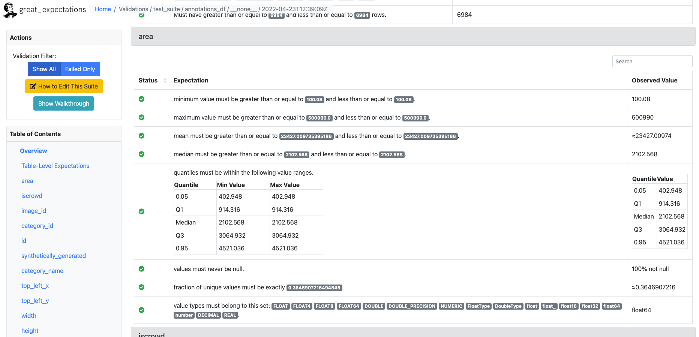

---
aliases:
- /tools/redactionmodel/computervision/datavalidation/2022/04/26/data-validation-great-expectations-part-2
author: Alex Strick van Linschoten
categories:
- tools
- redactionmodel
- computervision
- datavalidation
date: '2022-04-26'
description: In this second post on data validation for the computer vision context,
  I show how you can use the automatic profiling feature of the Great Expectations
  library to get you started with increasing your confidence in your object detection
  annotations.
image: great_expectations/g_e_logo.jpeg
layout: post
title: 'How to trust the data you feed your model: data validation with Great Expectations
  in a computer vision context (part 2)'
toc: true

---

_(This is part of a series of blog posts documenting my work to train a model that detects redactions in documents. To read other posts, check out [the `redactionmodel` taglist](https://mlops.systems/categories/#redactionmodel).)_

In [the first part](https://mlops.systems/tools/redactionmodel/computervision/datavalidation/2022/04/19/data-validation-great-expectations-part-1.html) of this series, I made the case for why you might want to include some kind of data validation if you're working on training a model in general, and if your working on object detection in specific. There are many things that can go wrong with your data inputs and you ought to have some kind of safeguards in place to prevent some tricky failures and bugs.

## TL;DR for data validation with Great Expectations

- 👀 Data validation helps give you confidence in the raw ingredients that feed into your models, especially in scenarios where you retrain or fine-tune regularly.

- ✅ For object detection problems, there are many ways your data can fail in some silent way. You should want to be aware of when your training data isn't meeting your assumptions of what it should look like.

- 🛠 Great Expectations is a general purpose data validation tool that goes a long way to restoring trust in your data, and their automatic profiling feature is really useful when getting started.

- 💪 In this second post on data validation for the computer vision context, I show how you can use the automatic profiling feature of Great Expectations to get you started with increasing your confidence in your object detection annotations. I will show you a concrete example where I created some validation rules for my manually-annotated dataset. I then applied those rules to my synthetic dataset in order to validate it.

## Initial notebook-based setup

In [the last post](https://mlops.systems/tools/redactionmodel/computervision/datavalidation/2022/04/19/data-validation-great-expectations-part-1.html) I showed how you can easily use the Great Expectations library directly on a Pandas `DataFrame`, manually specifying values you expect to be the case for your data. For example, perhaps your data should always have certain columns, or the values of a certain column should always be a certain type or mostly range between certain values. You can [define all these fairly easily](https://docs.greatexpectations.io/docs/guides/expectations/how_to_create_and_edit_expectations_based_on_domain_knowledge_without_inspecting_data_directly), leveraging your domain knowledge of the data.

If you know you're going to want to use Great Expectations as a more fully-fledged part of your pipeline or workflow, you'll probably want to go through the more extensive setup stages and create a dedicated 'context' which can be longer-lasting than just length of your script runtime. Think of the 'context' as somewhere all your expectations and configuration of how to access your data is stored.

Full instructions on how to set all this up can be found [in the docs](https://docs.greatexpectations.io/docs/guides/setup/setup_overview/), but for the most part it's a matter of `pip` installing Great Expectations, running `great_expectations init` , and then `great_expectations datasource new`.

That final command will take you through an interactive setup that has you fill in and amend Jupyter notebooks. (I'm not fully sold on the prominence of this workflow that has you spinning up a Jupyter runtime, dynamically editing notebooks and so on, but I found doing it for my project wasn't as inconvenient as I'd expected. Plus, there are non-interactive and pure Pythonic ways to get everything configured if you need or prefer that.)

Once you have your context created and your data sources connected, you can move on to the main course: using [the Profiler](https://docs.greatexpectations.io/docs/terms/profiler).

## Using the Great Expectations Profiler

Setting up your validations (i.e. your 'expectations') for your data can be done in a number of different ways. We saw [last time](https://mlops.systems/tools/redactionmodel/computervision/datavalidation/2022/04/19/data-validation-great-expectations-part-1.html) how you can define these manually, but in this post I want to show how you can follow another recommended workflow by allowing the profiler to review your data and to make an initial set of assumptions about the boundaries and patterns embedded in those values.

Note, [as the docs mention](https://docs.greatexpectations.io/docs/guides/expectations/how_to_create_and_edit_expectations_with_a_profiler/), the expectations that are automatically generated from your dataset are "deliberately over-fitted on your data". This means that if your `DataFrame` has 10,321 rows, one of the expectations generated will be that datasets due for validation with this suite of expectations will also have exactly 10,321 rows:

> "The intention is for this Expectation Suite to be edited and updated to better suit your specific use case - it is not specifically intended to be used as is." ([source](https://docs.greatexpectations.io/docs/guides/expectations/how_to_create_and_edit_expectations_with_a_profiler/))

You'll want and have to do a decent amount of manual checking through, amending and updating any expectations that get created during this process. That said, I am finding that it makes a lot of sense to start with some kind of initial baseline of assumptions that can be corrected versus starting from complete zero and building things up purely based on your domain knowledge of the data.

Needless to say, this whole process assumes you have a decent grasp on the domain context and have explored your data already. You probably wouldn't go to the trouble of setting up Great Expectations if you were doing something that required only a quick solution, but it bears repeating that the expectations you define are only as good as your understanding of the limits and underlying realities of your data. This is probably why something like Great Expectations lends itself quite well to a data-centric approach.

Getting the profiler to work requires a few interlocking abstractions to be created or instantiated:

```python
expectation_suite_name = "redaction_annotations_suite"

main_batch_request = RuntimeBatchRequest(
    datasource_name="redaction_data",
    data_connector_name="default_runtime_data_connector_name",
    data_asset_name="main_annotations_df",  # This can be anything that identifies this data_asset for you
    runtime_parameters={"batch_data": main_annotations_df},  # df is your dataframe
    batch_identifiers={"default_identifier_name": "default_identifier"},
)

context.create_expectation_suite(
    expectation_suite_name=expectation_suite_name, overwrite_existing=True # toggle this as appropriate
)
validator = context.get_validator(
    batch_request=main_batch_request, expectation_suite_name=expectation_suite_name
)

profiler = UserConfigurableProfiler(profile_dataset=validator)
suite = profiler.build_suite()
context.save_expectation_suite(suite) # use this to save your suite in the context for reuse
```

The above code perhaps seems like a lot, but really all you're doing is getting your data, making the relevant connections between Great Expectations and your context, and then running the profiler so it can work its magic.

` call that looks something like this.")

You can't yet see the specific values that were imputed from your data, but even this high-level output shows you some of the expectations that it's thinking would be useful to create.

At this stage, you'll want to take some time to review the specific expectations. You'll want to:

- ensure that they make sense for your dataset
- remove any of the really rigid expectations (e.g. that any dataset must have exactly the same number of rows)
- use the inputed expectations as a springboard for any other ideas that might come to mind

Note that this is an essential step to complete before moving forward. You could use the unedited auto-generated expectations suite as your data validation, but it would almost certainly have little use or value for you. *The auto-generated suite is a starting place that you need to amend and tailor to your specific situation.*

In my case, I was able to amend some of the `min` / `max` values to more suitable defaults. (You amend these expectations in the `.json` file that was created inside the `expectations` subfolder within your context.) I also included some other domain-driven expectations that the profiler couldn't have known to include. For example, I know from having immersed myself in this data for several months now that most annotations should have a 'horizontal' or 'square' orientation. Great Expectations doesn't create this expectation automatically, so I add it to the list of basic assumptions already generated.

## Viewing Data Docs reports on validated data

Once you have a suite of expectations set up to your liking, you can run a checkpoint against your original data just to make sure you haven't introduced or amended something that doesn't match up with the original data. You should get no errors at this point.

```python
checkpoint_config = {
    "name": "my_checkpoint",
    "config_version": 1,
    "class_name": "SimpleCheckpoint",
    "validations": [
        {
            "batch_request": {
                "datasource_name": "redaction_data",
                "data_connector_name": "default_runtime_data_connector_name",
                "data_asset_name": "main_annotations_df",
            },
            "expectation_suite_name": expectation_suite_name,
        }
    ],
}
context.add_checkpoint(**checkpoint_config)

results = context.run_checkpoint(
    checkpoint_name="my_checkpoint",
    batch_request={
        "runtime_parameters": {"batch_data": main_annotations_df},
        "batch_identifiers": {
            "default_identifier_name": "default_identifier"
        },
    },
)

context.build_data_docs() # builds data docs to inspect the results
```

What you really want, however, is to run your expectations suite against *new* data. That's the real value of what Great Expectations brings, i.e. to check that incoming data due to be added to your larger base dataset conforms to the broad realities of that base dataset.

In my case, the first thing I was interested to check was whether [the synthetic images](https://mlops.systems/redactionmodel/computervision/python/tools/2022/02/10/synthetic-image-data.html) [I created](https://mlops.systems/tools/redactionmodel/computervision/2022/04/06/synthetic-data-results.html) would match the expectations suite I'd created based off my core hand-annotated data. (Quick context if you haven't been following the project so far: I have a core dataset which is manually annotated for the objects inside images. I also created two sets of synthetic data to supplement the manual annotations, which [boosted my model performance](https://mlops.systems/tools/redactionmodel/computervision/2022/04/06/synthetic-data-results.html) considerably.)



The web UI is where you can go to get a visual overview of where your data is passing and failing to meet your (great) expectations. You will want (and I will need) to configure your expectations suite to meet the core assumptions you make about your data derived from your particular domain.

For my case, some expectations I will add that are specific to my use case:

- redaction annotations should mostly be of horizontal orientation
- content annotations should mostly be of portrait orientation
- most images should have only one content annotation
- annotations shouldn't be larger than the associated image, or positioned outside the boundaries of that image. (Because of how you define them, in reality this is several expectations, but conceptually it's just one or two).
- the area taken up by most annotations should be less than half that taken up by the total image

…and so on. I hope it's clear now how Great Expectations can be a tremendous asset that can give you confidence in your data.

In the next and final post of the series, I will explore some other tools that you can consider when performing these kinds of validation. I will also offer my take on when each tool would be appropriate, as well as where they would be appropriate to use within the machine learning workflow and lifecycle.
