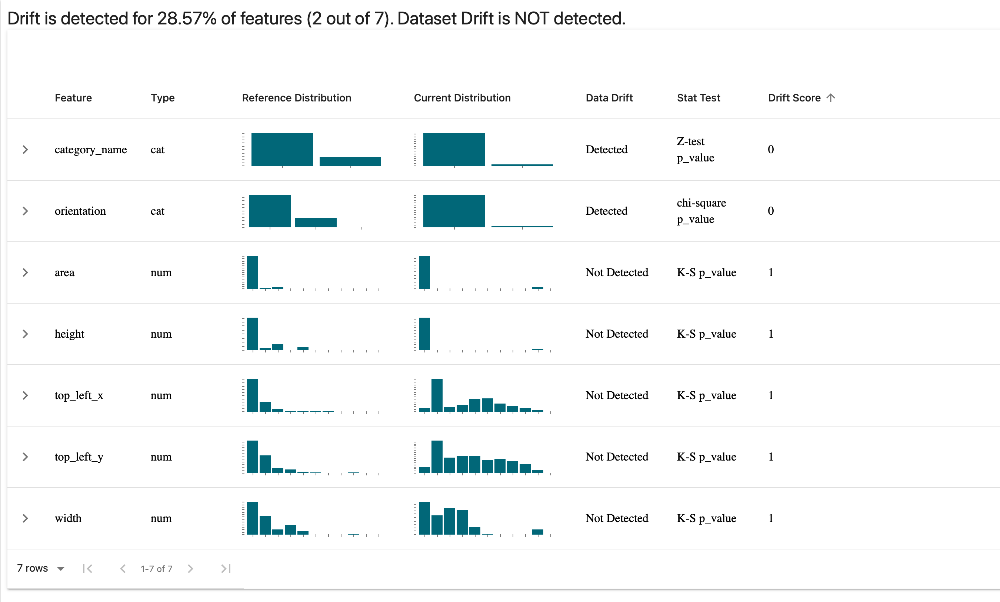
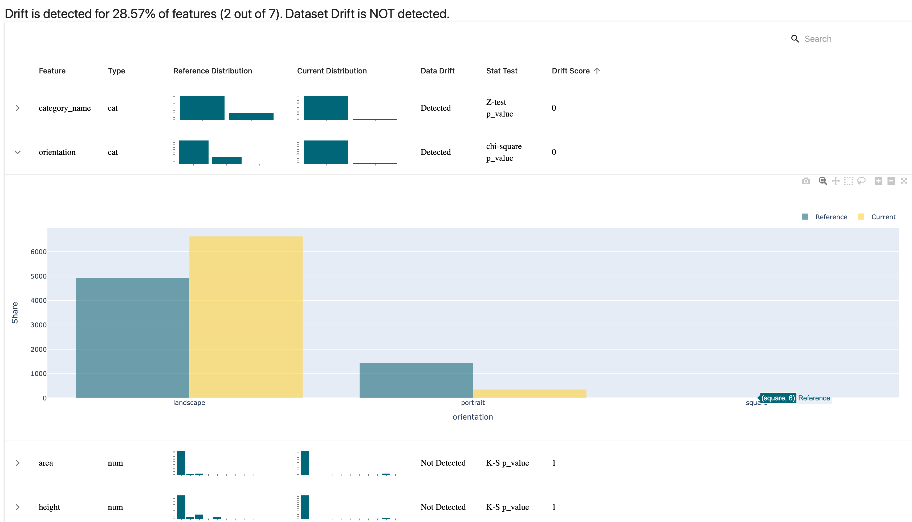

---
aliases:
- /tools/redactionmodel/computervision/datavalidation/2022/04/28/data-validation-great-expectations-part-3.html
author: Alex Strick van Linschoten
categories:
- tools
- redactionmodel
- computervision
- datavalidation
date: '2022-04-28'
description: In this third and final post on data validation for the computer vision
  context, I cover some alternative tools that you might want to consider, from Evidently
  to the humble 'assert' statement. I conclude by setting out some guidelines for
  when you might want to be doing data validation and which tools might be more or
  less appropriate for your specific problem.
image: great_expectations/evidently_ai_logo_fi.png
layout: post
title: 'How to trust the data you feed your model: alternative data validation solutions
  in a computer vision context (part 3)'
toc: true

---

_(This is part of a series of blog posts documenting my work to train a model that detects redactions in documents. To read other posts, check out [the `redactionmodel` taglist](https://mlops.systems/#category=redactionmodel).)_

The [previous](https://mlops.systems/tools/redactionmodel/computervision/datavalidation/2022/04/19/data-validation-great-expectations-part-1.html) [two](https://mlops.systems/tools/redactionmodel/computervision/datavalidation/2022/04/26/data-validation-great-expectations-part-2.html) posts in this series have made the case for why you might want to consider adding a Great Expectations step or stage to your computer vision project, particularly once it becomes something you're going to want to iterate on a few times.

This post begins by showcasing how you can use Evidently's open-source library to calculate and visualise comparisons between your data. I list some of the lighter alternatives to Great Expectations and Evidently, concluding with some thoughts on when you might use it as part of your computer vision pipeline.

## TL;DR: Alternatives for data validation using Python

- 🛠 Data validation tools come in many flavours, from full-featured libraries like Great Expectations down to the humble `assert` statement in Python.

- ⚠️ The tool you choose should be appropriate to your particular use case and situation. You might not need or want to add a large dependency or take on extra code / project complexity, in which case there are alternative options available to you.

- ⏰ You'll also want to think about *when* you're doing your validation. Two key moments stand out for machine learning projects: when you're ingesting data prior to training or fine-tuning a model, and at the moment where you're doing inference on a trained model.

- 📃 For my project, I'm using a variety of tools as part of my process because I've found it gives me confidence in the predictions my model is making and it gives me freedom to experiment and iterate, without needing to also worry that I'm silently breaking something with downstream effects on my model performance.

## Alternatives: Using Evidently for drift detection

I've [previously written](https://blog.zenml.io/zenml-loves-evidently/) about why [Evidently](https://evidentlyai.com) is a great tool to use for drift detection and data monitoring over [on the ZenML blog](https://blog.zenml.io/zenml-loves-evidently/). At its core, Evidently takes two chunks of data and compares them. The statistical comparisons going on under the hood are quite sophisticated, but as an interface to be used it is extremely trivial to get going.

In the case of my redaction project data, I did the work of transforming my annotation and image metadata into Pandas DataFrames for Great Expectations already, so using it with Evidently at this point is trivial:

```python
from evidently.dashboard import Dashboard
from evidently.dashboard.tabs import DataDriftTab
from evidently.pipeline.column_mapping import ColumnMapping

real_annotations = main_annotations_df[['area', 'category_name', 'top_left_x', 'top_left_y', 'width', 'height', 'orientation']]
easy_synth_annotations = easy_synth_annotations_df[['area', 'category_name', 'top_left_x', 'top_left_y', 'width', 'height', 'orientation']]
hard_synth_annotations = hard_synth_annotations_df[['area', 'category_name', 'top_left_x', 'top_left_y', 'width', 'height', 'orientation']]

column_mapping = ColumnMapping(
    numerical_features=["area", "width", "height", 'top_left_x', 'top_left_y'],
    categorical_features=["category_name", 'orientation'],
)

drift_report = Dashboard(tabs=[DataDriftTab()])
drift_report.calculate(real_annotations, hard_synth_annotations, column_mapping=column_mapping)
drift_report.save("reports/my_report.html")
```

In this code, I'm comparing between the real (i.e. manually annotated) annotations and the 'hard' synthetic annotations that I created (and [blogged about recently](https://mlops.systems/tools/redactionmodel/computervision/2022/04/06/synthetic-data-results.html)). I choose the columns I care about, tell Evidently which columns are numerical vs categorical features and save the report. (I can also display the report directly within a Jupyter notebook.) When I open the report, I see this:



You can unfold the graphs to dive into the details for specific features, as in the following example where I take a look at the orientation of my annotations and see the difference between my manual annotations and the synthetically generated 'hard' batch:



It doesn't surprise me too much that we have this disparity, since the only annotations that are portrait in the synthetically-generated set are those for the content box around the whole page. All the rest are landscape, and that's by design. (Note: you can make the comparisons using different statistical tests depending on your use case. I'm told that the next Evidently release will increase the number of available options for this.)

I can repeat the same test for the image DataFrame. I've included some metadata for each image such as how many annotations are associated with the image, or how many redaction vs content annotations are associated and so on. The code is basically the same, except now taking into account the different columns and their types:

```python
# comparing between real images and hard_synth images

column_mapping = ColumnMapping(
    numerical_features=["area", "width", "height", 'annotation_count', 'content_annotation_count', 'redaction_annotation_count', 'area', 'file_size_bytes'],
    categorical_features=['orientation', 'format', 'mode'],
)

drift_report = Dashboard(tabs=[DataDriftTab()])
drift_report.calculate(main_images, hard_synth_images, column_mapping=column_mapping)
drift_report.save("reports/my_report-real-vs-hard-images.html")
```

And we get this report:


You can immediately see how certain things like the number of annotations and the number of redactions in an image was a bit different when comparing the two. We also seem to have a far more even distribution of file sizes in the synthetically generated images and that makes sense since that was essentially randomly determined.

Note that all the data that goes into making these reports can be accessed programatically as a Python object or `JSON` through [Evidently's `Profile` feature](https://docs.evidentlyai.com/features/profiling), which is probably what you're going to want when assessing for drift as part of a continuous training / continuous deployment cycle.

If you change just a few things once more, you get a really useful [data quality report](https://docs.evidentlyai.com/reports/data-quality) showing distributions, correlations, and various other features of your data at a single glance:

```python
# profiling data quality

from evidently.dashboard.tabs import DataQualityTab

quality_dashboard = Dashboard(tabs=[DataQualityTab()])
quality_dashboard.calculate(main_images, hard_synth_images, column_mapping=images_column_mapping)
quality_dashboard.save("reports/quality-report.html")
```

You can get an idea of the report that it produces in the following screen recording from my browser:


As a place to get started with understanding a dataset, this is a pretty nice visualisation and report to have in your toolkit, but even after immersion in your data it can be useful to take a step back with something like this data quality overview. For instance, it reveals quite clearly how the average number of annotations in my manually annotated dataset is quite a bit lower than that of my synthetically generated examples. Of course, that was by intention, but it is nice to see that confirmed in the data.

Once you have your model ready, there are other reports that Evidently offers which perhaps I'll return to in a subsequent blogpost but for now I hope this has given you a flavour of the tool and how easy it is to get going with it.

(As a side-note, [Evidently's community](https://evidentlyai.com/community) is friendly, welcoming and filled with interesting people thinking about these issues. I find it a welcome breath of fresh air when compared with some other tools' forums or chat platforms, so it also has that going for it!)

## Alternatives: some other options

With Evidently, we drifted a little into the 'visualise your data' territory which wasn't really the point of this post, but you can see how they combined clear visualisation with the statistical validation working underneath to calculate whether data was drifting. The following are some other tools I've come across that might help you in validating data in a computer vision context. I haven't found a use for them in my project, but it's possible that they might gel with what you're doing:

- [TensorFlow Data Validation (TFDV)](https://github.com/tensorflow/data-validation) — This is a part of TensorFlow and `tfx` which uses schemas to validate your data. If you're using TensorFlow, you might have heard of this and might even be using it already, but I don't get the sense that this is often much recommended. I include it as it is a prominent option available to you.
- [Deepchecks](https://deepchecks.com) — Deepchecks is adjacent to what Great Expectations offers, albeit with an emphasis on the kinds of tests you might want to do for ML model training code. It has some features and documented use cases for computer vision (object detection and classification) but I haven't used it myself. Feels like a tool worth keeping your eye on, however. (Works on Pandas dataframes and numpy arrays.)
- [pandera](https://pandera.readthedocs.io/en/latest/index.html) — This is a statistical tool for validating data inside dataframes, and it overlaps quite a bit in its functionality with Great Expectations, particularly with the [hypothesis testing](https://pandera.readthedocs.io/en/latest/hypothesis.html#hypothesis) functionality. Worth checking out.
- [Cerberus](https://docs.python-cerberus.org/en/stable/index.html) — Offers a lightweight schema-based validation functionality for Python objects.
- [jsonschema](https://python-jsonschema.readthedocs.io/en/latest/) — similar in approach to Cerberus, above, this is a lightweight way to test your JSON files based on how they conform to a defined schema. Useful in the case of annotations files, perhaps, if you really want something minimal.
- [schema](https://github.com/keleshev/schema) — More of the same: a Pythonic way to validate JSON or YAML files based on schema.
- `assert` — We shouldn't forget [the humble assert statement](https://docs.python.org/3/reference/simple_stmts.html#the-assert-statement), which I have sprinkled in various places within my code where it makes sense to make sure that data flowing through conforms to whatever implicit or explicit contracts exist.

I mention these various options not to suggest that you should use them all, but rather to state that you have options ranging the whole spectrum of complexity and dependency.

## When to do data validation in your project

Regularly! I've written previously about how you can think about data validation as testing for your data. Just like many (most?) engineering teams run their tests every time you add a new commit to the codebase, it's worth thinking of these kinds of tests as something that get run at any point where the underlying data gets updated.

There are three points where it might make sense to do some data validation:

- at the point of data ingestion
- at the point just prior to training a model, i.e. after your data has been split into training and validation sets
- at the point of inference (i.e. using the data being passed into the trained model)


The first (at data ingestion) is essential, especially if you have any kind of continuous training or continuous deployment loop going on. You don't want to be training on data that clearly is unsuitable for training, or where the distribution has shifted so much that it's going to cause hidden problems down the line.

The second (at training-validation split time) may or may not be important depending on your use case. For my redaction project I don't think there is a great deal of benefit from this and so haven't incorporated it as such.

The third (at inference time) is quite important to have, even though the behaviour when an anomaly is detected might be different from if you were to detect issues earlier on in the process. You might choose to just log the result of your validation check internally, or you could potentially also feed the result back to a user in the terms of some sort of warning (i.e. if the image that they were uploading was a very different kind of image from the data that had been used to train the model).

## What I'm using for my redaction project

I don't have any general advice as to which tool you should use as part of your computer vision model training pipeline. It's likely to be heavily context-dependent and will differ based on the particular use case or problem you're trying to solve. For my own project, however, I can be more specific.

I'm using plain `assert` statements liberally scattered through my code, in part leftover from when writing the code but also as a failsafe should strange or anomalous data make its way into my functions. I'm not sure if this is a best practice or not — I could imagine someone telling me that it's not advised — but for now it's helpful, especially as I continue to change things in the innards of various parts of the process.

I'm using [Great Expectations](https://greatexpectations.io/) as a general-purpose validation tool to lay out my 'expectations' of my data in a assertive and declarative way, and even though it took a little longer to wrap my head round how it worked, I'm glad I made the effort as it seems really helpful.

I'm using [Evidently](https://evidentlyai.com/) to do similar things as Great Expectations, but I find they have different strengths and benefits even as they serve the same purpose. Evidently is a bit more of a lighter piece in the process, I feel, and as such it's a bit more flexible and you can iterate faster with it. I am not quite at the point where I'm serving my model to accept inference requests from outside, but Evidently will be part of that process when I do, for sure.

Finally, [FiftyOne](https://voxel51.com/docs/fiftyone/) is also somehow part of the validation process. (I've [written about that previously](https://mlops.systems/redactionmodel/computervision/tools/debugging/jupyter/2022/03/12/fiftyone-computervision.html).) Having visual tools that allow you to quickly test out a hypothesis or debug something unexpected in your training results is an essential part of the work of developing computer vision models.

This brings my short series on data validation for computer vision to a close. I'm fully conscious that I might have missed some obvious opportunities, tricks or workflows that may be widely used in this field, so I welcome any comments and feedback that you might have.
