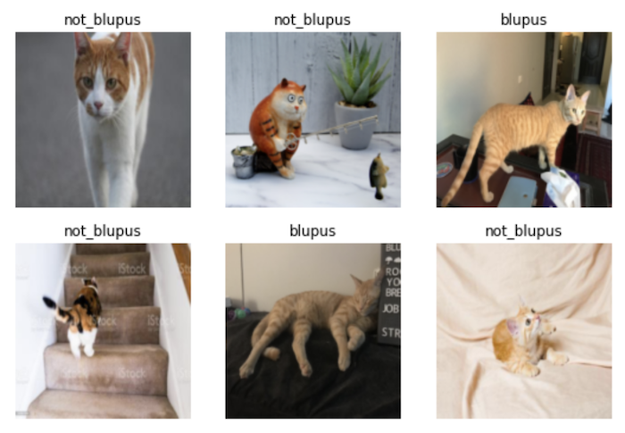

---
aliases:
- /fastai/computervision/2022/05/02/pet-cat-image-classifier-fastai.html
author: Alex Strick van Linschoten
categories:
- fastai
- computervision
date: '2022-05-02'
description: I learn a valuable lesson about how a model often will 'cheat' when training
  and sometimes the solution is a separate held-out set of 'test' data which can give
  a more accurate assessment of how well the model is performing.
image: blupus_detection/blupus-training.png
layout: post
title: How my pet cat taught me a lesson about validation data for image classification
toc: true

---

I'm participating in [the latest iteration](https://itee.uq.edu.au/event/2022/practical-deep-learning-coders-uq-fastai) of [the fastai course](https://www.fast.ai) as taught by Jeremy Howard. This past week we got a very high-level overview of some of the ways deep learning is proving very powerful in solving problems as well as how we can use its techniques to fairly quickly get great results on image classification problems.

I've done the earlier parts of the course before, so some of these demonstrations were less mind-blowing than the first time I saw them. For this iteration of the course, Jeremy showcased [a Kaggle notebook](https://www.kaggle.com/code/jhoward/is-it-a-bird-creating-a-model-from-your-own-data) which trains a model to distinguish whether an image is of a bird or not.

Last time I did the course, I [trained an image classifier model](https://mlops.systems/fastai/redactionmodel/computervision/datalabelling/2021/09/06/redaction-classification-chapter-2.html#fn:3) to distinguish whether an image was redacted or not to around 95% accuracy. (This actually was the genesis of [my larger redaction object detection project](https://mlops.systems/categories/#redactionmodel) that I've been blogging about for the past few months.)

# The key ingredients: what goes into a model?

The course teaches things top-down, so we start off with both the practical experience of training state-of-the-art models as well as the overall context to what goes into these high-level functions. These pieces include:

- your input data — this style of programming differs from traditional software engineering where your functions take data in order to 'learn' how to make their predictions
- the 'weights' — when we're using pre-trained models, you can think of these as an initial set of variables that are already pretty useful in that configuration and can do a lot of things.
- your model — this is what you're training and, once trained, you can think of it as a function in and of itself that takes in inputs and outputs predictions.
- the predictions — these are the guesses that your model makes, based on whatever you pass in as inputs. So if you pass in an image of a cat to a model (see below), the prediction could be whether that cat is one particular kind or another.
- your 'loss' — this is a measure of checking how well your model is doing as it trains.
- a means of updating your weights — depending on how well (or badly) the training goes, you'll want a way of updating the weights so that each time it gets a bit better at optimising for whatever you've set up your model to do. In lesson one we learn about *stochastic gradient descent*, a way of optimising and updating these weights automatically.
- your labels — these are the ground truth assertions that get used to determine how well the model is doing as it trains.
- transformations & augmentations — more on this will come in lesson two, but these allow you to squeeze more value out of your data. This is especially valuable when you're fine-tuning a model and don't have massive amounts of data to use for training.

Represented in code, the classic fastai example where you train a model to distinguish between cats and dogs is as follows:

```python
from fastai.vision.all import *
path = untar_data(URLs.PETS)/'images'

def is_cat(x): return x[0].isupper()
dls = ImageDataLoaders.from_name_func(
    path, get_image_files(path), valid_pct=0.2, seed=42,
    label_func=is_cat, item_tfms=Resize(224))

learn = vision_learner(dls, resnet34, metrics=error_rate)
learn.fine_tune(1)
```

This small code snippet contains all the various parts just mentioned. The high-level API and abstractions that fastai provides allows you to work with these concepts in a way that is fast and flexible, though if you need to dive into the details you can do so as well.

# Image classification isn't just about images

One of the parts of the first chapter I enjoy the most is the examples of projects where image classification was applied to problems or scenarios where it doesn't first appear that the problem has anything to do with computer vision.

We see [malware converted into images](https://ieeexplore.ieee.org/abstract/document/8328749) and distinguished using classification. We see [sounds in an urban environment](https://medium.com/@etown/great-results-on-audio-classification-with-fastai-library-ccaf906c5f52) converted into images and classified with fastai. In [the study group](https://www.meetup.com/delft-fast-ai-study-group/) I host for some student on the course, one of our members presented [an initial proof of concept](https://kurianbenoy.com/ml-blog/fastai/fastbook/2022/05/01/AudioCNNDemo.html) of using images of music to distinguish genre:



I like the creativity needed to think of how to turn problems and data into a form such that they can become computer vision problems.

# My own efforts: classifying my cat

True story: a few years ago my cat escaped from the vet and a reward was mentioned for anyone who found our cute ginger cat.  Throughout the course of the day, the vets were perplexed to see people coming in with random ginger cats that they'd found in the neighborhood, but none of them were ours! With this iteration of the course, therefore, I was curious to try out this simple but slightly silly example and see how well a deep learning model could do at recognising distinguishing Mr Blupus — don't ask! — from other random photos of ginger cats.

Training the model was pretty easy. Like any cat owner, I have thousands of photos of our cat so an initial dataset to use was quick to assemble. I downloaded a few hundred random ginger cat photos via DuckDuckGo using some code Jeremy had used in [his bird vs forest Kaggle notebook](https://www.kaggle.com/code/jhoward/is-it-a-bird-creating-a-model-from-your-own-data). A few minutes and ten epochs later, I had achieved 96.5% accuracy on my validation data after fine-tuning `resnet50`!



After the initial excitement died down, I realised that the result was probably an illusion. Our cat is an indoor cat and we have a relatively small house. Couple that with the fact that the backdrops to the photos of Mr Blupus are relatively distinctive (particular kinds of sheets or carpets) and it seems pretty clear that the model wasn't learning how to identify our cat, but rather it was learning how to distinguish photos of our house or our carpets.

☹️

Luckily, chapter one gets into exactly this problem, showing an example of how exactly this validation issue can give you a false sense of confidence in your model. When I evaluated my model on the validation data it wasn't a fair test, since in all likeliness may model had already seen a similar backdrop to whatever was found inside the validation set.

I discussed this when I presented this to those at the study group / meetup yesterday and we agreed that it'd be best if I held out some settings or locations from the training entirely. I took 30 minutes to do that in the evening and had a third 'test' dataset which consisted of 118 images of our cat in certain locations that the model wasn't trained on and thus couldn't use to cheat. I added a few more photos to the training data so that there were enough examples from which to learn.



I was supposedly getting 98% accuracy now, but I knew that number to be false. I then needed to figure out how to get the accuracy for my held-out test set. With a lot of help from [Francesco](https://twitter.com/Fra_Pochetti) and [a really useful blogpost](https://benjaminwarner.dev/2021/10/01/inference-with-fastai#batch-prediction) on doing batch inference with fastai, I first got the predictions for my test data:

```python
test_files = [fn for fn in sorted((Path("/path/to/test_set_blupus_photos")).glob('**/*')) if fn.is_file()]
test_dl = learn.dls.test_dl(test_files)
preds, _ = learn.get_preds(dl=test_dl)
```

I then created a tensor with the ground truth predictions for my test set and compared them with what my model had predicted:

```python
gts = torch.tensor([0 for _ in range(118)])
accuracy = (gts == preds.argmax(dim=1))
```

At this point, getting the final accuracy was as simple as getting the proportion of correct guesses:

```python
sum([1 for item in accuracy if item]) / len(preds)
```

This gave me an accuracy on my held-out test set of 93.2% which was surprisingly good.

I half wonder whether there is still some cheating going on somehow, some quality of the photos or the iPhone camera I used to take them that is being used to distinguish the photos of my cat vs other ginger cats.

Nevertheless, this was a useful lesson for me to learn. I realised while working with the tensors in the final step above that I'm not at all comfortable manipulating data with PyTorch so luckily that'll get covered in future lessons.

**UPDATE:**

Following some discussion in the fastai forums, it was suggested that I take a look at [Grad-CAM](http://gradcam.cloudcv.org) in chapter 18. This is a technique to visualise the activations which allows you to see which parts of the image it is paying the most attention to (sort of). I ran the code using a sample Blupus image and this was the result. I don't understand how most (any?) of this works, but it was really cool to have a working result of sorts nonetheless!


