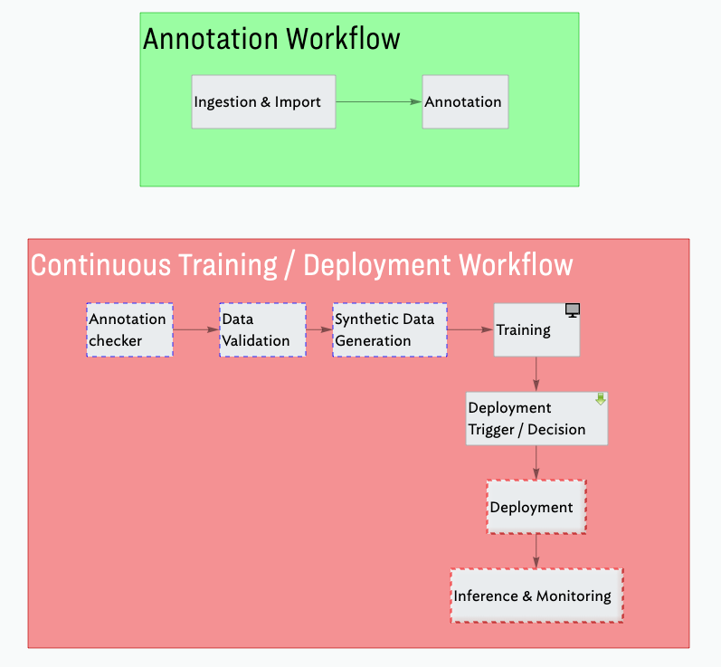
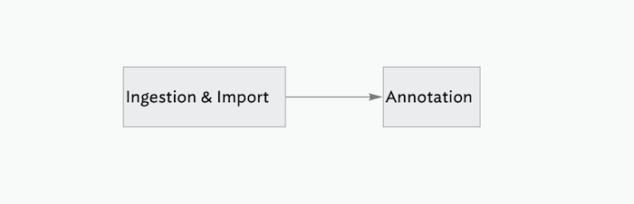
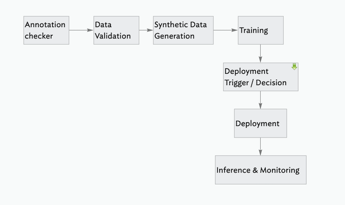

---
aliases:
- /tools/redactionmodel/computervision/mlops/2022/05/31/redaction-production-introduction.html
author: Alex Strick van Linschoten
categories:
- tools
- redactionmodel
- computervision
- mlops
date: '2022-05-31'
description: There are many pieces involved when deploying a model. This post covers
  the ones that relate to my object detection model and I explain how I'm going to
  put together the pipelines that will drive a continuous training loop once it's
  all up.
image: production-introduction/blemish-pipelines.png
layout: post
title: 'It takes a tribe: how I''m thinking about putting my object detection model
  into production'
toc: true

---

_(This is part of a series of blog posts documenting my work to train a model that detects redactions in documents. To read other posts, check out [the `redactionmodel` taglist](https://mlops.systems/categories/#redactionmodel).)_

So we've trained our model… now what? Are we done?

If we're just exercising our curiosity or have a tight focus for our work, then we might well be done with our work. Our responsibility within a larger team might only be for this specific step of training the model, for example. For many cases, however, we're going to want to do something with our model, perhaps making it available to others via some web interface or an online API.

The next blog posts in this series will focus on the challenges and practicalities of getting a model 'in production'. I'll sidestep the nuances of exactly what we mean by 'in production' for the moment, but suffice it to say that the end goal is to have a way to not only make our model available to other consumers but also to deal with re-training and/or re-deploying new models to take the place of older or stale models. There is a whole spectrum of variety in this context that goes by the name "MLOps". This blog post will try to provide a high level overview of some of the basic elements relevant to getting my redaction model into production.

## 🚦 TL;DR: What will you learn?

- 🤖 Deploying a model and automating everything on the way requires a decent number of steps and tools to do it properly.
- 👀 I take you through the core steps you need to think about when working with a continuously deployed object detection model.
- 💪 I end by outlining the specific pieces I will need to build as I get my own model out into the world and 'in production'.

## 🚀 What is 'in production' for the redaction model?

"Production" relates heavily to the use case. An image classification model used across the United States to identify dents on rental cars is going to have a very different profile to a privately hosted language model being used as part of an internal company chatbot interface. In the case of our redaction model, there are two main scenarios that I'm interested in supporting:

- an online API which can power other services building on top of the functionality the model enables, albeit document-by-document. A user could upload a specific document and they'd receive specific predictions and results for just that document.
- an offline-first model which handles large volumes of input data and that does not require internet connectivity. For example, legal teams trying to get a sense of what kinds of documents are redacted as part of a case (and to what extent) could run an extended inference process over an entire set of documents.

These two scenarios have different requirements. Of the two, the online version is perhaps slightly more complex given the more complex serving needs and potential guarantees around speed of execution and so on. The second use offline / on-prem scenario has its own challenges around making sure that inference is fast enough to be able to work over massive document collections, but I'm not sure I'd consider that an MLOps challenge so I will mostly be focusing on the online deployment in this series.

## ⚖️ Handling failure and success

One way to think about what's required to get a model in production is to think of the answers to the following two questions: 

- what could go wrong with my deployed online model?
- what are the possible consequences if everything went really *well*?

In terms of the redaction model, there are lots of potential complications:

- our model could be slow and therefore users wouldn't want to  hang around for inference to take place
- the data on which our model was originally trained could start to show its age and so maybe our model wouldn't perform as well on newer documents being released (perhaps with a different style or method of redaction)
- some software bug or managed infrastructure outage could bring our hosting down and we'd have to redeploy everything
- there could be a legal or ethical challenge to our deployed model, and we'd perhaps be required to show the exact process used that resulted in a particular model
- maybe the way we choose to make our model available is expensive and/or unreliable
- and so on…

If things went really well, we have a different set of problems: perhaps a million people would be interested in using the service at the same time. This scalability problem could bring down the model inference service completely. Or perhaps the model would be adopted for use in a legal setting and people would start to trust its predictions blindly without taking into account the fact that its performance was starting to decline the further away we got from when it was originally trained. Maybe some legal institution would start using it to make decisions making assumptions about the accuracy of the model's predictions, or maybe even the various government departments responsible for *creating* and *applying* the redactions in the first place would use it as a way of more efficiently or voluminously adding redactions, an unintended consequence that could potentially be harmful.

All the above scenarios and more are some of the reasons why MLOps exists. We care about having repeatable and robust processes for getting our models out in the world because the use cases are themselves often complex. We also care that our models are actually a net positive when released into the world rather than just some process that happens after model training is completed from which we're completely disconnected.

## 🧱 Basic MLOps building blocks

These are some of the tools available to those trying to put their models into production. This ['landscape'](https://landscape.lfai.foundation) showcases both the explosion of options for various parts of the full lifecycle as well as the way that this space hasn't yet settled on a set of best-in-class tools. For my redaction project, there are a few basics that will seek to have in place in order to meet the needs of the use case(s):

### ⎂ Code standardisation

Perhaps not even worth mentioning, but having some standards around how the code looks and having processes to enforce this is important. Using [`pre-commit`](https://pre-commit.com) alongside tools like [`black`](https://black.readthedocs.io), [`isort`](https://pycqa.github.io/isort/), [`darglint`](https://github.com/terrencepreilly/darglint), [`pydocstyle`](http://www.pydocstyle.org) and so on will take you a long way in this direction.

This would be especially important if I were working as part of a team. These tools would ensure some kinds of standards and baseline uniformity within the codebase. In my case, I'm doing everything on my own so it matters less, but these tools all help me collaborate with my future self, several months from now, perhaps when I need to fix some bug or add a new feature. Having code that reads clearly and cleanly goes a long way to getting started on that work.

### 📸 Code Versioning

Versioning your code with a tool like `git` is also another basic requirement of any process involving software. I'd almost say this barely requires mentioning, but I know that the use of regular atomic git commits is by no means standard practice in the world of data science so it bears restating here.

We version our code because we want to be able to go back to earlier points in our code's history. If we wanted to see the difference between the code used to train our model today and the code used last week, we'd require a tool like `git` to help us with that. (Code versioning tools also help tremendously when collaborating with a larger team or to an open-source community project.)

There are various options for what tool to use but the vast majority of people use `git` for this as of 2022.

### 🧳 Data, Model and Artifact Versioning

Last week I wrote about [DVC](https://dvc.org/) and the ways it can be used as a lightweight way to add data versioning to a project. Since data is as important to a model as the code used to train it, we want ways to step backwards and forwards with our data. This will not only enable us to debug and retrain older models but it will help in general with managing our assets such that we don't just have a sprawling series of folders with names like `training_data_FINAL_july_2021` or `validation_data_minus_synthetic_FINAL_FINAL_march_2020`.

Not only does this make sense from the perspective of productivity, but for sensitive or popular ML applications there are [increasing legal requirements](https://digital-strategy.ec.europa.eu/en/policies/regulatory-framework-ai) around this kind of flexibility to introspect how you trained your models.

DVC is commonly used for this kind of use case, but there are other alternatives such as [Pachyderm](https://www.pachyderm.com) or [LakeFS](https://lakefs.io) that might be worth considering if you have larger amounts of data.

### 🧪 Testing

This testing is primarily around ensuring that the code does what you think it's doing, but we also care about preventing regressions in one part of the codebase when you change something somewhere else.

There isn't much in the way of rocket science to testing, but it is a whole world unto its own. For my project, there is a decent amount of code that handles somewhat complicated conversions between different kinds of image formats, multiple competing ideas for how bounding boxes or `BBox`es should be handled as data structures and so on. Having a way to be sure that my code is actually doing what I intended is a surefire way to letting me sleep better at night if I intend my model to be used by others.

### 👁 Data Validation

Just like our code needs to have some kinds of checks and balances, so does the lifeblood of our project: our data. I recently finished [a three-part series](https://mlops.systems/categories/#datavalidation) on data validation in the context of this project, and both [Great Expectations](https://greatexpectations.io) and [Evidently](https://evidentlyai.com) are excellent options worth considering, depending on your exact requirements.

### 📝 Experiment Tracking



When starting a project from scratch, you want to iterate quickly, trying out lots of training options or combinations of features and/or data. Not only do you want to be able to replicate the precise combination of data and code used to train a particular model, but you also want to be able to compare these various efforts with one another.

Experiment trackers like [Weights & Biases](https://wandb.ai), [MLflow](https://mlflow.org), [Tensorboard](https://www.tensorflow.org/tensorboard/) and [Neptune](https://neptune.ai) enable you to compare the results of your models as well as practically any combination of the hyperparameters used to train them. I've [used](https://mlops.systems/redactionmodel/computervision/tools/2022/03/03/model-improvements.html) [charts](https://mlops.systems/tools/redactionmodel/computervision/2022/04/06/synthetic-data-results.html) from my own (Weights & Biases-powered) experiment tracker to showcase the different results obtained as part of my process. Not only is it useful for outward-facing engagement with users, stakeholders or other third-parties, but it can be useful to step back from your experiments and evaluate where your model is performing well and how you might improve it.

### 📺 Monitoring

There's a lot of potential complexity packed into the simple term 'monitoring'. (I'd recommend you check out Shreya Shankar's [four-part series on monitoring](https://www.shreya-shankar.com/tags/machine-learning/) if you're curious to learn more.) For our purposes, this will mainly involve making sure our model doesn't drift or become stale. We'll need to make sure that the data used to periodically (re)train or fine-tune our model is somewhat within the original parameters of the original training data. We'll also want to be monitoring the kinds of predictions that our deployed model is making to make sure that they're more or less within the reasonable ranges of values that we'd expect. If we start to regularly diverge from these kinds of boundary values it probably should prompt an examination of what's going on and why we're overstepping. This is an essential part of what it means to robustly deploy a model in production; you need to know when things are going wrong.

### 🏁 Automated Model Deployment

Automation is a big part of what people generally consider to be 'mature' MLOps practices. It is useful to have an automated way to take your model from when training is complete to having it deployed and user-facing. Perhaps you know you need to retrain or fine-tune your model once a week because the data context is continually changing. Perhaps (or likely!) you have rigorous monitoring processes and in the event of a failure or series of non-sensical / out-of-bounds predictions you want a way to revert the model used in production to something more stable.

This is where the process of putting a model in production resembles the processes and values of DevOps most closely. For my redaction model, I'll want to have a way to handle the two cases mentioned above as a starting point along with more complex versions of those cases. I'll also want to automate the process of converting my IceVision VFNet model into something that can be used in the offline 'on-prem' use case I described at the beginning of this post.

### 🃏 DAG Cards, Model Cards, Data Cards, All the Cards

The basic idea is that you write some notes on the context surrounding your data, or your model or the pipelines you're using as part of your overall workflow. Your processes and artifacts will likely change with the project, and I know from bitter experience that it's easy to forget the reasoning behind why you chose to do one thing or another. So you write notes to describe what you were thinking when you created or modified this or that asset. You describe the decisions you made and what tradeoffs and downstream effects this might have. Not only is this a good practice that benefits FutureYou™️ and your project, but anything developed in the open will maybe have users or contributors and they'll also benefit from these notes.

This is the only part of my 'requirements' that is (at least currently) [a bit more of a 'fad'](https://towardsdatascience.com/dag-card-is-the-new-model-card-70754847a111) and I wouldn't say was commonly found. Even five years from now, I imagine that we'll have more sophisticated or standardised ways of achieving what cards bring, but for now they resonate strongly with some processes I used when working as a historian, archivist and researcher in [my previous life](https://foreignpolicy.com/2009/10/16/see-you-soon-if-were-still-alive/). Some tools like the Huggingface Model Hub offer this [as a built-in standard](https://huggingface.co/docs/hub/model-repos#what-are-model-cards-and-why-are-they-useful).

## 👴 MLOps Maturity Models

The pieces I described above relate to my particular use case. Different project will require different levels of automation, or even potentially other additional stages or toolkits. There is a vast spectrum of options and decisions to be made and now is probably a good time to mention that various players have tried to define what it means to do the whole 'putting a model into production and keeping it healthy' thing in a good way. These "MLOps Maturity Models" are not completely without value, but remember that what works for Google may not be (or [is probably not](https://blog.bradfieldcs.com/you-are-not-google-84912cf44afb)) applicable to you as an individual working on a small side-project. I wrote [an overview of the two most commonly cited maturity models](https://blog.zenml.io/mlops-maturity-models/) (from Microsoft and Google) over on the ZenML blog and I encourage you to give that a read if you want to learn more.

But what does this all mean for my project? What specifically will it all look like and how am I implementing it? I'll get into some of the details in the coming weeks, but for now let me just outline my two main workflows.

## ✍️ Redaction Project Workflow #1: Annotation

There are two main pieces to this pipeline that happens before we train our model. My model is still thirsty for annotations and data, so from the very beginning I want to integrate the annotation process in as part of how I set up the workflows. This way, I make it as easy as possible to annotate data and use that data for subsequent training or fine-tuning.

- Ingestion / Import

Here I will check a series of pre-defined URLs to see if there are any new PDF files available for download. If new files are available (and we've confirmed that we haven't already downloaded them, I can download those files. Those PDFs then get converted into image files and the metadata for each image gets saved centrally so we have that to hand when annotating the files. This point is a good one to save a checkpoint version of our data using DVC.

- Annotation

We only want to annotate images that haven't been annotated, so that check is the first to be performed before spinning up Prodigy to randomly select pages from the PDFs (now in the format of image files) to be annotated. 10% of the images that are annotated get saved in a separate 'test data' location. This test data is *never* used in training and is simply held out for a more realistic final validation of the project. We version the annotations file whenever we are done annotating for the day.

## 🐙 Redaction Project Workflow #2: Continuous Training, Continuous Deployment

This longer pipeline contains the core value and most compute-intensive processes like training. We take the data from the raw state as annotations and go all the way to deployment.

- Annotation Checker

We first check to see if there are any new annotations available since we last ran the pipeline. We will probably need some kind of threshold number of annotations which will make it worth our while to trigger the retraining process.

- Data Validation

We'll use Great Expectations to validate the incoming new annotation data.

- Synthetic Data Generation

If / as we hit certain thresholds, we might want to generate more synthetic data and add it to the dataset.

- Training

We train or fine-tune the model for a certain number of epochs. We log our experiment metadata with Weights & Biases.

- Deployment Trigger / Decision

At this point we need to decide whether to deploy the model or not, based on some evaluation criteria. Our decision will determine the path of the rest of the workflow.

- Deployment

We take the trained model and make it available for online inference. We save a version of the model using DVC, and we also package it up for use in on-prem / offline settings.

- Inference & Monitoring

This step is crucial. We monitor the performance of our deployed model along with the predictions it is making. We want to be able to catch any cases where we notice the predictions to start to drift, or be aware of sluggish response times from our server and so on.

## Final Thoughts

Nice work on making it all the way to the end! We took a long tour through the various considerations you need to bear in mind when deploying a model, and finished off with a preview of the kinds of things I'll be building over the coming weeks to actually put my own object detection model in production.

If you have parts of this that you'd like me to cover in more detail, or questions based on what you read here today, please leave a comment below!
