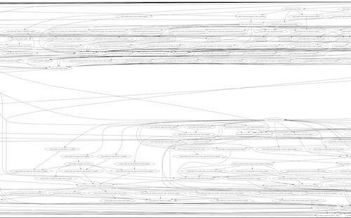
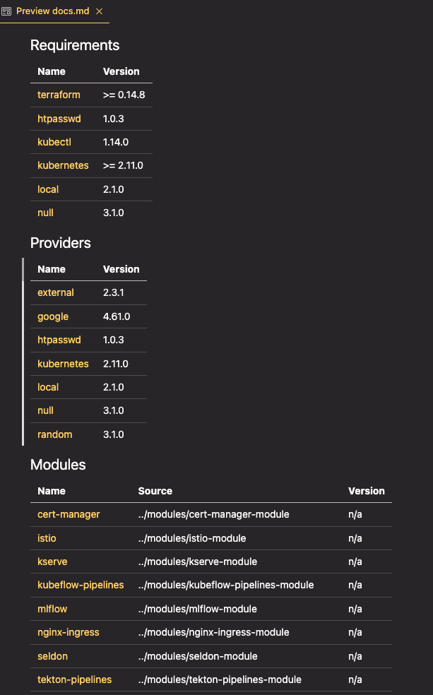

I've taken on some different responsibilities at work and part of this involves me diving into a repository filled with Terraform HCL code. I have some idea of how Terraform work, how the declarative paradigm is different and how things connect to one another, but getting up to speed and effective in a somewhat complex codebase is the goal here so I'll need more than just high-level talking points.

In this post, I share my journey of understanding and working with an existing Terraform codebase, focusing on initial exploration, key concepts, and useful commands. I start with an introduction to basic Terraform commands like init, plan, apply, and destroy. Then, I dive into the structure of a Terraform codebase, discussing root modules, entry points, providers, variables, outputs, and data blocks. I also cover validation and formatting commands, as well as tools to help visualize and document your infrastructure. This guide is ideal for those who, like me, are new to Terraform or tasked with diving into a complex codebase, providing a roadmap for learning and making changes effectively.

# 🏁 Getting started

At its most basic, Terraform is easy to use. A few commands will get you started in a practical sense with the new codebase.

- `terraform init` — do this first. It downloads any information it needs about the providers (i.e. AWS or GCP or whatever) it needs to use for deploying infrastructure. This command doesn't deploy anything. It will also check whether the code all checks out and is 'sound'.
- `terraform plan` — this is one way to see what infrastructure will be spun up as a consequence of running `terraform apply` (see below). It will come up with its plan for what will be deployed (by resolving or reading through all the code). There are options to export this plan as JSON and more, but to start with just the basic command will serve you well.
- `terraform apply` — This is the bread and butter of deploying infrastructure with Terraform. It will run `terraform plan` first, and then query you if you really want it to make whatever deployments and changes it says that are set to take place. The first time you run this command it might just be deploying infrastructure (if it's not relating to pre-existing infrastructure), but for other contexts it may not actually do anything since the infrastructure is already deployed. More on this later.
- `terraform destroy` — This is how you delete and destroy code deployed previously with terraform. Just like with `apply`, you'll get the `plan` output and a confirmation message to check that you actually want to remove this infrastructure. Remember that destroying your infrastructure will likely delete data as well, so *be careful* with this one.

Armed with these basic commands, a good first place to start with a new codebase might just be `terraform plan`. It does nothing in terms of actually changing or deploying infrastructure and might give you a sense of whether things are already deployed or what would be deployed if nothing was already deployed.

In my case, the codebase involves several separate modules, none of which are deployed, so running `terraform plan` in one of these base folders tells me that 70 resources would be spun up and gives me specific details of those. This is somewhat useful, but it's still a bit high-level and doesn't help me really understand the codebase.

If you have the option, now might actually be the time to deploy that infrastructure. Potentially you could inspect some of it in the AWS console (or wherever it's deployed), comparing notes between the output of `terraform plan` or `apply` and what you see on the screen in front of you.

Note, too, that terraform CLI commands don't use double hyphens (`--`) but just single hyphens (`-`) which can be a bit confusing at first.

# 👀 Places to look first

These are some things to consider as you look through your code. It's structured sequentially for the most part, i.e. you'll probably want to start at the entrypoint before you look at outputs.

## 🎬 Start at the root & Modules

Most Terraform code is structured into modules, which are simply groups of multiple `.tf` and/or `.tf.json` files in the same directory. The root module is where you'll want to start, as specified [in the docs](https://developer.hashicorp.com/terraform/language/modules):

> "Every Terraform configuration has at least one module, known as its root module, which consists of the resources defined in the .tf files in the main working directory."

You can have child modules within that root module (i.e. local files that define other separate modules) or you can load modules from a registry (like the [Terraform Registry](https://registry.terraform.io/browse/modules)).

## 🚪 Finding our entrypoint

Most root modules will have a `main.tf` which we can think of as the main entrypoint for the logic of the code. (Child modules can and will likely have their own set of `main.tf` as well as variable definitions (see below).)

I found it hard to reason about declarative code of the kind that you find in terraform codebases, because it's not simply a question of procedurally running through a series of steps one by one. The work that terraform is actually doing is resolving all the interconnections, dependencies and diffs between the entirety of the code all at once, so it's counterproductive to try to think of it as happening sequentially.

## 🏥 Providers

You'll likely see some providers being defined in your `main.tf` file. These are the infrastructure providers that you're interfacing with when you run `apply` for your terraform code. The specific logic and definitions for those providers are what gets loaded when you initialise your repository with `terraform init`. These will look something like this:

```hcl
provider "kubernetes" {
		...details go here...
}
```

## ✏️ Variables

Input variables are usually defined in a `variables.tf` file, which can specify their type, any tags needed to be applied as well as optional defaults. If you define them without any defaults, then running `terraform apply` will see you being queried about what the values for those variables should be.

You can pass them in via the command line, for example:

```shell
terraform apply -var "server_port=8080"
```

With more than a few variables it's unwise to have that be the way you pass those values in, so you can also optionally set those variables using a `terraform.tfvars` file. This file is where you'd set specific assignments and you can then pass that in via the command line explicitly or (if it's named `terraform.tfvars`) these will just get automatically loaded and applied.

```shell
terraform apply -var-file="testing.tfvars"
```

To use these variables elsewhere in the code, simply reference the variable name after `var.`. For example, if your variable is called `server_port` as mentioned earlier, you would reference `var.server_port` when you wanted to access the value for that variable.

You can also specify and declare local variables (accessed through the `local.` prefix) by declaring a `locals` block within a specific file. For example:

```hcl
locals {
  service_name = "forum"
  owner        = "Community Team"
}
```

## 📤 Finding our outputs

Outputs are values that will be printed in the console output at the end of whatever happens as part of `terraform apply`. They will also be accessible and available to you later on to query. For example, let's say you spin up an instance of a Linux machine somewhere. You'll want to have the IP address of that machine if you want to SSH into it, so you could set that as one of the outputs. Most likely your terraform codebase will have some outputs, usually stored in an `outputs.tf` file that is pretty straightforward to read.

## 🧱 Data blocks

Data blocks are special kinds of resource that allow you to access (read-only) information from some source. It is a way to query a provider's API for some data. Most providers expose various pieces of data, and these can range from simple things to IP address ranges or AMI IDs and so on. Even the current user's identity can be accessed through `data` blocks.

These are defined inside a `data` block. For example, if you're using the `aws` provider you could get the data for your default VPC with the following:

```hcl
data "aws_vpc" "default" {
	default = true
}
```

Then to use that data elsewhere, you can just reference it using the `data.` prefix.

# 🧐 Checks and balances

The above pointers should give you most of what you need to dive into your actual codebase. Specifics will vary based on the specific providers used and the infrastructure types being defined, but that will relate to your specific use case or application. Hopefully you'll have a sense of that prior to approaching the codebase and those two things together will allow you to do a bit of detective work as to what's going on.

At a certain point you'll maybe start changing things. At that point it's worth learning two extra commands that will check that what you're writing is proper HCL.

- `terraform fmt` — This is the same command as is used in Golang to format the files and ensure that everything follows the same canonical format and style. Running the command will auto-format the spacing and potentially make many other minor tweaks. Get into the habit of running this before you commit any updates to your repository.
- `terraform validate` — This checks that your local files are all valid and don't violate any syntax or consistency rules. It's something that will also happen when you run `terraform apply` or `terraform plan` but sometimes you might just want to validate your local code.

# 🗺️ Overview tricks

There are some other commands and tools that can help you if you're dealing with a particularly unwieldy codebase, listed in no particular order.

## 📦 Listing State

The [`terraform state list`](https://developer.hashicorp.com/terraform/cli/commands/state/list) command shows the resource addresses for every resource Terraform knows about in a configuration, optionally filtered by partial resource address.

These values are managed and stored in a `terraform.tfstate` file which is either stored locally or in a shared location (perhaps inside an S3 bucket that your team all have configured to connect to). I won't get into all the details that surround how to handle state (shared or otherwise); for that, see chapter 3 of Brikman's excellent *[Terraform Up & Running](https://www.terraformupandrunning.com)*.

The CLI command is your way to access information about resources without needing to wade through the raw state file itself, and might be interesting to inspect at some point once you have something deployed.

## 📈 Graphing your infrastructure

To view a diagram of the infrastructure defined in your code, run the following:

```shell
terraform graph -draw-cycles | dot -Tpng > graph.png
```

You'll probably also need [Graphviz](https://graphviz.org/download/) to be installed for this to work.

This will create a PNG file which allows you to visualise the infrastructure defined in all your terraform code. For simple deployments this can be useful, but in my case this was less useful, as you can see from the following section of the image:



As with all these things, try it out and see if it works for you. You can also just export the data in other formats and manipulate them using your preferred graph data structure visualisation tools.

## 📄 Auto-generated deployment documentation

If you're lucky and whoever wrote the terraform code has taken care to write descriptions for variables and the various modules being used, the next tool might prove quite useful. [`terraform-docs`](https://terraform-docs.io) is a way to generate module documentation via a CLI command. Once you've installed it, running the following will give you a markdown file that you can preview to learn more about your codebase:

```shell
terraform-docs markdown . --output-file docs.md
```



The file that gets output links to the code and underlying files, so it's a handy way to sort through exactly what is defined from your root module. I've personally found this to be really useful and it's even more so if the `description` parameters are defined.

# Onwards!

I wrote this mostly as a reference and an excuse to learn about the topic myself. I hope it might be useful for someone else who is diving into a new codebase without much terraform experience. If you have any other tips or experience with this, please do use the comments below to make those suggestions!

[Many thanks to [Suvash](https://www.linkedin.com/in/suvash/), [Jayesh](https://www.linkedin.com/in/wjayesh/), and the commenters over on [this reddit thread](https://www.reddit.com/r/Terraform/comments/115jonp/how_to_understand_existing_code/) for ideas and guidance.]