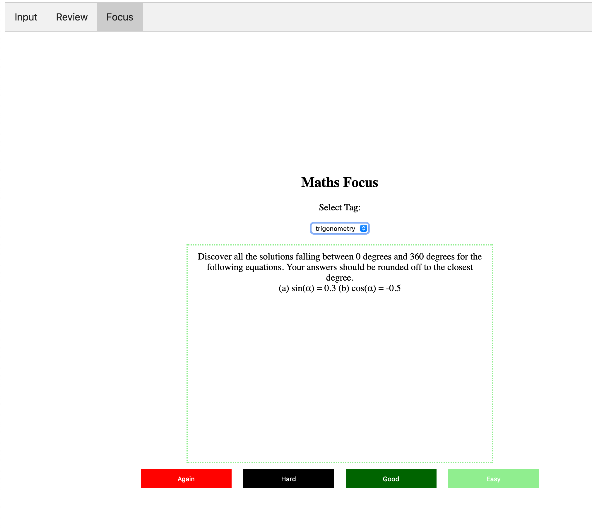

**TL;DR:**

- I built a little app in Rust to help me revise and practice mathematics exercises.
- I input questions I've already studied / completed and the app gets more questions autogenerated via OpenAI's GPT-4 API.
- All of this populates a database which is then queried to show me the questions and topic areas where I'm least confident.
- It's just v0.1 but I was surprised at how much I could get done in an evening.

Last week I received the results for the MU123 module of [my Open University Maths degree](https://www.open.ac.uk/courses/maths/degrees/bsc-mathematics-q31). I was really happy to have achieved a distinction. The course starts off slowly — one of the reasons I went with the OU — but there was still a lot of work that went into that grade. I used a combination of study techniques to revise and cement my understanding along the way, but a core tenet of how I study anything is spaced repetition. (I actually care so much about spaced repetition that I'm one of the co-founders of the [Spaced Repetition Foundation](https://www.spacedrepfoundation.org/about) and have [written about it a fair bit over on my other blog](https://www.alexstrick.com/blog/tag/spaced+repetition#show-archive).) For my maths work thus far this has meant creating a not insignificant quantity of [Anki](http://ankisrs.net) cards. (Just checked and I have 673 cards that I created for that first module.)

When I posted about my degree on LinkedIn, Matt Squire from the always-worth-following [FuzzyLabs](https://www.fuzzylabs.ai) (seriously, [check out their blog](https://www.fuzzylabs.ai/blog)!) replied:


He was referring to [CoachBot](http://www.languagecoach.io/coachbot), another web tool I built to scratch a personal itch around getting study prompts when learning a language outside a classroom/group environment.

Alongside my use of Anki to cement the more fact-y parts of the things that I'm studying, I've been a consistent user of ChatGPT to supplement the practice questions that my course gives me. As part of the Open University course, you get access to some practice questions that (I think) are generated from templates. The advantage of using those is that the system will grade your answer, but it's pretty rigid / inflexible to use and you can only practice in the sandbox of one particular unit or topic so you miss out on all the very real benefits of interleaved practice. (Interleaved practice is making sure that you mix up the topics and things that you're studying so that you switch e.g. from your Chinese vocabulary to your maths to whatever else it is that you're studying. You'll learn the materials far better if you do your retrieval practice using interleaving than if you study just one topic in isolation, then another topic in isolation and so on.)

There was also no way in the OU system to really get a sense of how strong you are in the different areas beyond just the static once-done-instantly-forgotten end of unit exams and tests. Thus the tool available to me didn't handle spaced repetition or interleaving, two core parts of what have been shown to be good study techniques / foundations.

What I really wanted was:

- a way to get practice questions for things that I've studied in maths already
- a service that would show me the things that I found most difficult more often than the things I found really easy
- some way to encourage me to *do* maths instead of just read about it. (Lots of the skills vanish fairly quickly if you don't regularly solve problems using them, I discovered.)

## 🧮 Introducing MathsPrompt

So that's what I built :) MathsPrompt has three core modes. Firstly we have the core, a place you go to review the problems you're studying:


This pretty closely replicates the interface you see when using Anki. You get a question to solve and then when you've solved it you grade how easy you found the exercise. (Note that all we have here are prompts for things to solve. There aren't any generated solutions to check against; most of the time all of this can be looked up fairly easily if need be.) Then depending on how easy or hard you found it, you'll see that prompt or exercise later or sooner. More on that later.

To populate the database of questions / prompts, we have the input screen which was actually the first thing I built.


You type or copy-paste in some maths exercise, give it some tags (per topic name or unit) and it'll add that question to the database. Then it'll send that question (embedded in a lovingly-crafted prompt) to [ChatGPT](https://chat.openai.com) to get 5 more similar questions (but with different values / variables) and it'll then add those (with an `autogenerated` flag) to the database as well. This adds a little bit of variation into the mix and ensures that I'm actually getting to practice things I haven't seen before.

Finally, we have a 'Focus' mode where you can pick one of the tags that you want to specifically focus on (in a non-interleaved way) and you'll just get infinite random questions relating to that particular topic area:



There are ways I'd like to improve this going forward (see below for those) but for now I'm happy with having this functional prototype to use in my studies. The data (in the form of my database) is completely separated out from the web interface so I can update and improve this without worrying that the questions I've created and the answers I've inputted will need to be restarted from scratch going forward.

# 🔨 My tool cabinet

## Why Rust?

I chose to build the project using [Rust](https://www.rust-lang.org) as I've been reading a couple of books over the past few months and I wanted a way to get my hands dirty. (Those two books, [Rust in Action](https://www.amazon.com/Rust-Action-TS-McNamara/dp/1617294551?tag=soumet-20) by Tim McNamara and [Command-Line Rust](https://www.amazon.com/-/en/Ken-Youens-Clark/dp/1098109430/ref=d_pd_sim_sccl_2_3/259-8491770-0412405?tag=soumet-20&pd_rd_r=c7e5134c-8cea-4954-acab-1eead741381c&psc=1&content-id=amzn1.sym.5cdc78f1-a757-4b8d-989e-a305d0a3dfbe&pf_rd_r=FR7GR5R1YC93V3C51T7X&pf_rd_p=5cdc78f1-a757-4b8d-989e-a305d0a3dfbe&pd_rd_wg=k8Of0&pd_rd_w=PDA2A&pd_rd_i=1098109430) by Ken Youens-Clark, were really great in getting me going / started.) Rust comes with a considerable reputation for its steep learning curve but I found that the passive understanding of syntax / workflows I'd developed by reading in those books coupled with ChatGPT was enough to get this project off the ground at a fast pace.

It certainly helped that I knew what I wanted to build and had thought through what the database schema as well as the core functionality on a few long train journeys recently with paper and pen in hand. It also probably helped that I'd had some previous exposure to and experience with [Golang](https://go.dev/learn/) and that our Python development [at work](https://github.com/zenml-io/zenml) happens in the context of [`mypy`](https://mypy.readthedocs.io) strict mode which is as close as Python gets to being forced to think through your code in terms of types.

## 🤖 ChatGPT to generate question variations

I considered going down the path of generating question templates for every question, and then having some random numbers get inserted into those templates, but for a lot of questions that wouldn't have worked. For instance, within trigonometry there are lots of ways that the variables are somehow interrelated or some values wouldn't make sense at all. The angles inside a triangle still need to sum up to 180 degrees, for example.

Despite a few misgivings and hesitations around GPT-4's mathematical abilities (which have been [widely](https://www.cantorsparadise.com/gpt-4-is-amazing-but-still-struggles-at-high-school-math-competitions-cbc2e73738e) [noted](https://www.reddit.com/r/singularity/comments/12bgsfu/mathematical_level_of_gpt4/)) I figured it's a quicker way to get going with this project than any other. Moreover, if I find I'm having issues with the quality of the autogenerated questions I can also just remove them from the set that get shown to me. It also added an extra piece of complexity to the project (and thus something new to learn) since I had to make those calls to the OpenAI API as part of the app.

# 👷 What I Built 

There are three main pieces to what I put together, all interacting in the form / shape of the web app showcased above. All the code is [available online in my public GitHub repository](https://github.com/strickvl/mathsprompt) so feel free to check that out!

## Frontend / Web UI

I studied web development / engineering for 3 years at [Launch School](https://launchschool.com) yet have very little interest in importing some framework behemoth into this project. Where possible I'm pragmatically and philosophically aligned towards simplicity so I chose just to make my site in [raw HTML, CSS and JavaScript](https://github.com/strickvl/mathsprompt/tree/main/frontend). Really nothing special there. Probably lots of things I could do to make the site look unique, but that can come later if at all. I was pleased that I got to use many of the things I'd learnt in the past for the JavaScript part, however!

## 🖥️ Rust Server / Backend

All the server logic is captured [in a single file](https://github.com/strickvl/mathsprompt/blob/main/src/main.rs) and this was a strong GPT-4 collaboration piece. I knew enough to tweak things once I had some basic code, but writing it from scratch is far beyond my personal abilities right now so I just iterated *many* times to get to this.

It's all pretty simple. Most of the logic is around sending the text of the input question to OpenAI and then parsing whatever gets returned back. The server logic is all standard. I have no idea if `actix` is the standard for web servers in the Rust world but it was what ChatGPT recommended so I went with it and it was easy to get my heard round setting up the endpoints and plugging in the logic for what happens when requests came in.

## 💾 PostgreSQL Database

I started out with SQLite but then I wanted a few extras that I knew weren't built in with SQLite (particularly some types) so I just created a local Postgres database, [created the tables](https://github.com/strickvl/mathsprompt/blob/main/database/create_tables.sql) and populated it all with some dummy data to get started.

Again, nothing fancy here. Four tables to hold the questions, the tags for the questions as well as metadata around how well I did when answering each question.

I considered hosting this online somewhere but that wasn't necessary either and keeping everything local kept my iteration speed fast. Towards the end I refactored the Rust code to allow you to use any database you want (local or managed/hosted) so this gives me a way to put it all online should I want.

# 🤔 Which cards to review?

The core bit of functionality that I wanted to make sure this enabled was the spaced repetition part. Which is to say: I mainly want to see problems for areas or topics that I know I struggle to complete the problems; I don't want to regularly get tested on things that I am generally finding easy to complete. This is the spaced repetition way in a nutshell.

The way I've coded this so far is represented by the following SQL query:

```sql
SELECT q.id, q.text FROM questions q
    INNER JOIN (
        SELECT question_id, AVG(ease) as avg_ease FROM question_answers
        GROUP BY question_id
    ) qa ON qa.question_id = q.id
    WHERE q.next_due <= NOW() AND qa.avg_ease <= 1
    ORDER BY RANDOM()
    LIMIT 1
```

Here I'm returning a random question from a set of questions where I have a low ease of answering (averaged over the particular topic area). I also don't want to see cards that have been set to 'due' at some point in the future.

It's a super naive way of implementing what I wanted. There's a reason [Ebbinghaus](https://en.wikipedia.org/wiki/Hermann_Ebbinghaus) is famous for his research on the forgetting curve and there's [a fairly long history of people working on building out](https://supermemo.guru/wiki/History_of_SuperMemo_algorithm) from that original kernel of insight.

This will be one of the first things I revisit going forward. I want to be doing more than just this naive implementation. But I'll come back to that below.

# 💡 What I learned

First and most importantly, **fundamentals really matter**! I wouldn't have been able to put this together as quickly as I did without a basic understanding of how generally these kinds of things are developed. Similarly with setting up the database, without previous experience of this and getting the data layer well-grounded this would have been much more painful.

**You'll rarely regret thinking something through** before you start typing / building. I wanted to start work on this a bit earlier, but the extra time I spent away from the computer designing and thinking things through was time really well spent. I'm sure this saved me time for this project.

**Rust is nice**, and not as scary as people keep saying! This is probably yet another reminder to take things that people say on the internet with a pinch of salt, but there are actually really good learning materials and ways of learning Rust (like [Rust By Example](https://doc.rust-lang.org/rust-by-example/index.html)!) such that so long as you're not trying to implement something super complicated involving distributed process or whatever you'll probably be fine. Of course, there's a lot of complexity that I've just hand-waved away there, but there's a time and a place to dive into all that in due course. Building this project gave me a feel for the workflow and put to rest any idea that developing ideas using Rust needed to be slow.

Truism-alert: **ChatGPT-enabled coding makes you fast**! Probably doesn't even bear stating, but I was surprised how much faster it enabled me to move through the various tasks needed in this project. A combination of Copilot and ChatGPT really was a winning combination here and I was able to stay at the implementation layer instead of getting lost in syntactical details. Of course, and again, I'm sure my code could be improved, but as an experience this was one I'd be happy to repeat. As a corollary to this, it's easy to move fast and break things with ChatGPT, but it was often clear to me that I was walking over large chasms where someone with skill and wisdom would have had a better sense of the tradeoffs being made at any particular moment. Building that up takes more time.

I also used the OpenAI API in conjunction with my prompt as if it's a static API I can somehow trust. (I know we now have [Function Calling](https://platform.openai.com/docs/guides/gpt/function-calling) but I haven't dug into the details of that yet.) Just trusting that the LLM is going to follow the (sometimes loud and forceful) instructions of my prompt is probably a losing game. Not only is the model changing out under our feet in [a wholly unpredictable way](https://www.aisnakeoil.com/p/is-gpt-4-getting-worse-over-time), but different inputs might cause outputs to be in unexpected formats. For the purposes of this project it keeps me fast and nimble, but I wouldn't want to use this in production without many (many) guardrails and safeguards. (I'm also watching the emergence of tools like [jsonformer](https://github.com/1rgs/jsonformer) or the structured prompting of [LMQL](https://lmql.ai) but feel it's not quite there yet.)

Prompting really is an art, probably best suited to people who are creative in how they write / express themselves and not necessarily to engineers. The experimentation I did to get the model to reliably return my data in the format / way I wanted was quite fun and creative. I think I'll be sad to see this playful side of the workflow go away, buried under layers of abstraction, as seems inevitable.

# 🧑‍💻 What's next for MathsPrompt

I have bunch of things that feel like obvious next steps to take:

- Figuring out the spaced repetition piece. This will involve diving into the various forms the algorithm takes and implementing something that isn't too onerous to maintain and also that doesn't depart too far from the data schema I've set up on the database end.
- A stats page showing areas where I'm strong and weak. Maybe I can add some charts here as well like Anki has.
- Improvements to the web UI. Probably it can look a bit nicer, and I can implement the 'tab' flow a bit better.
- CLI tool. My original idea was to have this as a CLI tool but then I found the web interface easy to implement so I went down that road. I think I'd appreciate having all the same functionality in the CLI would be useful for me and shouldn't be technically that hard.
- PDF output. I want a way to get 3 pages full of problems, for example, so that if I'm taking a train journey I can print that out and have something to work on offline.
- Mobile app? Alongside or as an alternative to the PDF output, I could just access the questions via a mobile app. This feels like something that would be difficult to put together (it's a whole universe of tooling), but maybe with ChatGPT it's an afternoon of work to hack something together?
- Allow images in the prompt. There are some maths problems which are hard to describe just using language, so potentially I'd want to be able to include an image alongside the text. This isn't essential, as I can already do almost everything I need without, so I imagine I won't get round to this part.

And that's what I wanted to say about MathsPrompt for now! Feel free to [check out the code on my Github repository](https://github.com/strickvl/mathsprompt/) and give me a star ⭐️. There are instructions there if you want to spin it up yourself.