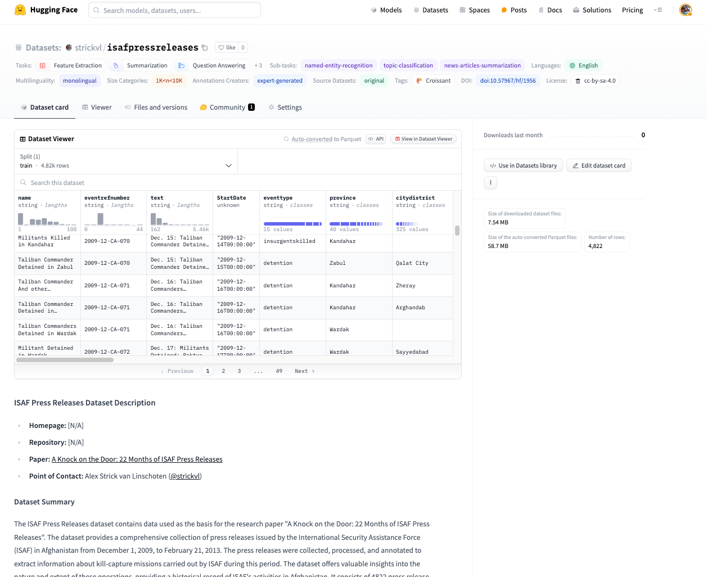

Yesterday I published [two](https://huggingface.co/datasets/strickvl/isafpressreleases) [datasets](https://huggingface.co/datasets/strickvl/isafpressreleasescomplete) to the Hugging Face Hub and I wanted to briefly add some context to them and what they might be useful for.

**TL;DR:**

- I wrote a paper in 2011 that used international military forces' press releases about Afghanistan military operations to gain an understanding of what was going on on the ground.
- The paper was covered in the Guardian and on the BBC and elsewhere and subsequently lead to a significant scaling back of press release coverage.
- The data is hard to come by now since ISAF and NATO took down the original website and files. I've had researchers contact me asking for the data over the years so now I'm making it available as a public dataset on the Hugging Face Hub.
- The core dataset consists of expert-labelled data pairs (an article with the metadata extracted from the article about how many people were killed and captured and so on) so I'm thinking that it might unintentionally be a useful evaluation task for LLMs. The Hugging Face dataset cards provide more information about what tasks might be appropriate.

# The Datasets

The [ISAF Press Releases dataset](https://huggingface.co/datasets/strickvl/isafpressreleases) contains data used as the basis for the research paper "[A Knock on the Door: 22 Months of ISAF Press Releases](https://www.afghanistan-analysts.org/en/special-reports/a-knock-on-the-door-22-months-of-isaf-press-releases/)", originally published in October 2011. The dataset provides a comprehensive collection of press releases issued by the International Security Assistance Force (ISAF) in Afghanistan from December 1, 2009, to February 21, 2013. The press releases were collected, processed, and annotated to extract information about [kill-capture missions](https://www.pbs.org/wgbh/frontline/documentary/kill-capture/) carried out by ISAF during this period. The dataset offers valuable insights into the nature and extent of these operations, providing a historical record of ISAF's activities in Afghanistan. It consists of 4822 press release reports, each labelled with information about the event, including the date, location, target group, and the number of people killed or captured (as represented in the data). The Guardian's datablog team also [published a series of accompanying visualisations](https://www.theguardian.com/news/datablog/2011/oct/12/afghanistan-nato-kill-capture-raids-isaf-petraeus) at the time.

The [second dataset](https://huggingface.co/datasets/strickvl/isafpressreleasescomplete) is a variation on the same data. It contains the raw HTML files of press releases issued by the International Security Assistance Force (ISAF) in Afghanistan, covering a broader period than the original dataset (spanning 2009-2016). In addition to the raw HTML files containing the news reports, the dataset provides a Parquet file that contains all the data parsed from the HTML files and API requests. This Parquet file serves as the primary resource for researchers and organizations interested in using the dataset. The dataset offers a comprehensive collection of press releases. The HTML files are organized by year and month for archival purposes, while the Parquet file provides a structured and easily accessible format for data analysis.

# Motivation for the core dataset

The dataset was created to provide a comprehensive and publicly accessible record of ISAF's kill-capture missions in Afghanistan, as reported in their press releases. The motivation was to enable scholars, legal teams, and others to analyse and understand the nature and extent of these operations, as the original ISAF website no longer exists in the same form. The dataset serves as an important historical artifact for Afghan history and provides a means to reverse-engineer the minimum numbers of people killed and captured by ISAF during the specified period.

The initial data collection involved manually copying the text of press releases from the now defunct ISAF website at [http://www.isaf.nato.int/article/isaf-releases/](http://www.isaf.nato.int/article/isaf-releases/) into [Tinderbox](https://www.eastgate.com/Tinderbox/) software. The press releases were collected from December 1, 2009, to February 21, 2013, covering a period of over 21 months. All available press releases during this period were included in the dataset.

The collected press releases were then processed to split them into individual incident reports. If a press release mentioned multiple incidents, they were separated into distinct entries. The text of the press releases was not modified and remains in its original form.

The annotation process involved reading each press release and evaluating it against a set of variables. The annotations were performed using Tinderbox software. The variables included:

- Basic data: Incident name, reference number, date of the incident.
- Location data: Province, district, village name (if provided).
- Target data: Target group, claimed capture of a "leader" or someone in a leadership position, specific position of the target.
- Numerics: Indication of someone being killed or detained, minimum number killed or detained, exact terms used to refer to those detained or killed, numbers of "leaders" and "facilitators" claimed to be killed or captured, classification as a "capture-or-kill" raid, involvement of an airstrike. The annotator used a fixed list of interpretations for certain terms when estimating the minimum numbers of people killed or detained. Detailed explanations of the annotation process and variable definitions are provided in the associated research paper.

# The report's conclusions

I'll just quote [from the report's press release](https://www.afghanistan-analysts.org/wp-content/uploads/downloads/2012/10/AAN_2011_ISAFPressReleases_AANpressrelease.pdf) for this so as not to get any details wrong:

> "ISAF officials have long presented the recently stepped‐up capture‐or‐kill operations as one of the most effective parts of the military mission in Afghanistan. They regularly release large figures describing the number of 'leaders', 'facilitators' and 'insurgents' that were killed or captured, to illustrate the success of the campaign. A closer examination of the information that is publicly available, however, reveals some important inconsistencies, particularly surrounding the classification of who is considered an insurgent 'leader'. 
> "AAN's latest report, by Alex Strick van Linschoten and Felix Kuehn, is based on an analysis of all ISAF press releases over the last 22 months. The report provides important baseline data, as well as an insight into how ISAF sees the success of their operations. Alex Strick van Linschoten: "Because there is no solid data and no transparency, the debate [with regard to the capture‐or‐kill strategy] tends to be either emotional or anecdotal. If anything goes wrong, ISAF often dismisses the incident as an exception to a successful strategy. Without proper data, you can't really have this discussion."
> "The research covers the period from 1 December 2009 to 30 September 2011 and included 3,771 ISAF press releases, which reported a total of 3,157 incidents (including 2,365 capture‐or‐kill raids). During this period (at least) 3,873 individuals were reported killed and 7,146 detained. The two peaks of ISAF activity were in September 2010 and June 2011. The numbers show a steady general increase in reported kills and captures each month until June 2011, with a slight decrease over the winter (2010—11). The number of 'leaders' and 'facilitators' that were reported killed amounted to approximately 5 per cent of the total number of deaths, while the number of 'leaders' and 'facilitators' detained consists of approximately 13 per cent of the total number of reported detentions."

# Further research using this data

I originally undertook this project and research work because I was sick and unable to do much onerous fieldwork at the time on the ground in Afghanistan. I was surprised at how much value could be extracted from a seemingly benign set of data as a series of press releases. The report I originally wrote (together with [Felix Kuehn](https://www.linkedin.com/in/felix-kuehn-42b5b5132/)) barely scratches the surface in terms of possible analyses, and I hope that, by publishing the raw data, others might follow in my footsteps and produce further analysis. Some possible ideas I had for projects that would be interesting:

- correlate the press releases with the data in the [Wikileaks Afghanistan war logs](https://www.wikileaks.org/wiki/Afghan_War_Diary,_2004-2010) to see the extent to which press releases were reporting the reality of what was going on.
- correlate the press releases to local news stories
- compare the public claims about the kill capture raids with the data shared in press releases. I did a bit of this in the original report, but there's a lot more to be done here.

Since I'm also sharing this data with the view that it's also an interesting machine learning dataset, some further ideas include:

- use it for structured data extraction (fine-tune or train a language model that can reproduce the expert labels that I originally made)
- fine-tune a smaller model that can label [the full dataset](https://huggingface.co/datasets/strickvl/isafpressreleasescomplete), given the labelled subset (i.e. [the original dataset](https://huggingface.co/datasets/strickvl/isafpressreleases))
- fine-tune a model to write the press releases, given some summary of the days' activities
- statistical analysis of the full dataset, esp following LLM-driven labelling
- apply the same methodology to the press releases of the Afghan Ministry of Defence, who took over the mantle of providing these daily summaries of kill-capture missions around the country. (I hope to present a separate dataset containing these press releases soon as well, which is important since these have also been taken offline.)

# Some takeaways from the project

Firstly, data labelling is hard! There are 4822 events/items in the core dataset and I read and labelled every single one of them. This took me weeks to carry out and it's worth reading the report's section on data labelling to get a sense of why labelling this particular data was hard.

Secondly, data loss is a real thing! Even though we have amazing resources like [archive.org](https://archive.org) which preserve old sites, it's still striking that a military operation that took years and that cost so much money and lives didn't see it as important to preserve the archival record of its actions. Publishing these press releases as an open dataset is part of [other work](https://www.firstdraft-publishing.com/) I've done to try to preserve these kinds of documents. I encourage others to do the same.

Finally, there was an unexpected amount of value in data that at first sight was fairly anodyne and mundane. It's a good reminder that small projects with focused datasets can provide a lot of value.