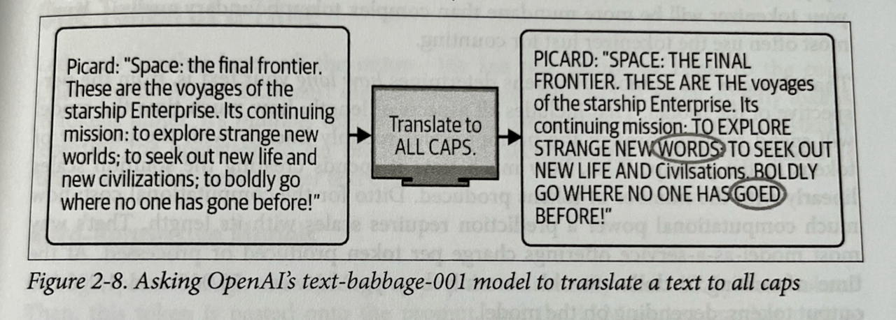

I'm posting some of my summary notes while reading through John Berryman and Albert Ziegler's "Prompt Engineering for LLMs". What follows are my notes from the first two chapters. It was a bit too long for a post to LinkedIn so I'm posting my notes in full here.

## Chapter 1: Introduction to Prompt Engineering

The opening chapter frames prompt engineering as a comprehensive discipline that extends far beyond just crafting individual prompts. It positions prompt engineering as an integral part of the entire lifecycle of LLM-based applications.

### Key Points

* The field of language modeling has seen exponential growth, as evidenced by the GPT series progression from 2018 to 2022:
  - GPT-1 (2018): 117M parameters
  - GPT-2 (2019): 1.5B parameters
  - GPT-3 (2020): 175B parameters
  - Subsequent models showing continued scaling

* Prompt engineering encompasses:
  - The structural design of prompts themselves
  - Strategic thinking about prompt implementation throughout the application lifecycle
  - Integration of prompts into larger systems and workflows

* Historical Context:
  - The chapter provides background on language modeling evolution
  - Places modern LLMs in the broader context of NLP development

This introductory framework suggests that effective prompt engineering requires both technical skill in prompt construction and strategic understanding of how prompts function within larger systems and applications.

## Chapter 2: Understanding LLMs
Chapter two tries to peel back the layers of how LLMs produce their output. If you can understand how they work (at least a bit more than 'it's magic'), you can better guide them to produce outputs that are valuable for you.

A very hard chapter to write, I imagine. It is almost certainly a bit too technical for someone 'non-technical', but a more experienced user might find some of the analogies too simplistic. I thought the balance was well handled but I probably wouldn't recommend this to just anyone..

Some key insights: expect LLMs to respond in a similar way to the training data that went into creating them. (Unfortunately, many model providers are pretty tight-lipped as to the specific composition of that training data, though you can make some guesses...)

> "The better you know the training data, the better the intuition you can form about the likely output of an LLM trained on that training data."

We then get into a section on tokenization and what that means for how LLMs 'see' the world and why this results in certain weaknesses. Most importantly, just remember that LLMs don't process and interact with text in the same way that humans do. Easy to forget when you're interacting through a chat interface, but important nonetheless.

I liked this example about capitalization and how tokenization made it hard for the earlier generations of models to do something as 'simple' as turning words into upper-case versions. 

Even though this isn't a problem with more recent models, it reminds you to be cognisant of how much extra work you're having your model do. The more you can remove extra work, the better responses you'll get. If you try to have your model do too many things at the same time, you'll have poorer results.

The section on LLMs as auto-regressive models was excellent, though, again, probably not the easiest read for a non-technical reader. Key: LLMs move forward through their text as they 'read' the contents. They cannot backtrack, they cannot take things back that they write. They just have to keep moving forward.

This can lead to repetitions, getting lost in certain patterns and behaviours. One solution to this: filtering out after the response is given. Another option: playing with temperature and randomness.

I loved this section on temperatures and how to think about which to choose. Very practical, even amidst a chapter targeted at helping you understand why LLMs behave the way they do.

Also a useful insight that errors often compound when it comes to temperatures greater than 1. I hadn't realised that before.

After tokens and temperature we move on to transformers! I found the explanation worked, though the really technical again are bound to be disappointed and the non-technical might find it a bit too hand-wavy. YMMV. Overall enough information was given to understand the key insight around attention:

> "Information flows from left to right. Information flows from bottom to top."

After we understand this, we can also understand how processing ('reading') text happens much faster than the output: it's ~ an order of magnitude slower to to output than it is to read the input, even with caching and parallelism in the computation.

So the order of the contents of the prompt matters *a lot*, as does the formulation and the extent to which you make the LLM work hard on the problem at hand or other extraneous tasks.

A nice illustrative summation:

> "Could a human expert who knows all the relevant general knowledge by heart complete the prompt in a single go without backtracking, editing or note-taking?" (if not, then you might find the LLM will struggle with the task or completion)

So to sum up:

- LLMs are completion engines
- LLMs mimic their training data
- LLMs produce one token at a time and can't backtrack
- LLMs read through the text a single time, from beginning to end

Simple-seeming insights, but ones with large consequences. Tomorrow we move beyond the static models and on to RLHF, the chat models and the differences that come with using the API.