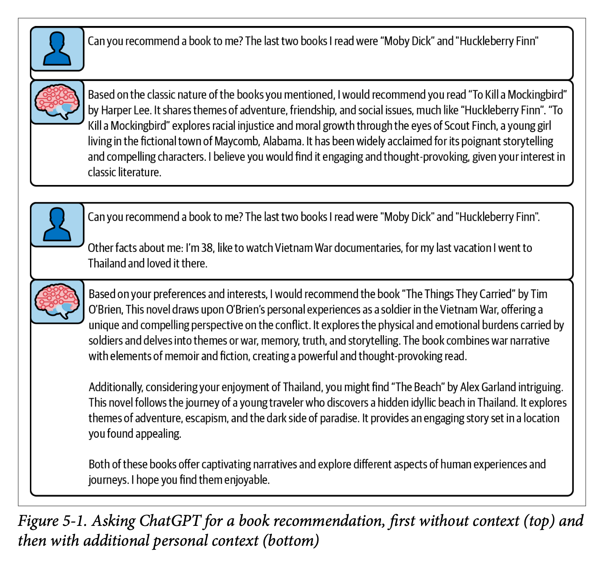

Chapter 5 of '[Prompt Engineering for LLMs](https://www.amazon.com/Prompt-Engineering-LLMs-Model-Based-Applications/dp/1098156153?tag=soumet-20)' tackles the kinds of things you might want to include in your prompt. (Chapter 6 thinks through the order, structuring and weighting of these different pieces of content, so this is purely about the 'what' and not the 'how').

We split the kinds of content up into static and dynamic content. For static you can think of fixed instructions ('always respond politely, and in the first person') whereas dynamic content is assembled on the fly and is (potentially) custom to each user or query. The classic example of dynamic content insertion is your bog standard RAG app.

This was a very tactical chapter and I think the rest of the book will keep this up. Most of what gets discussed usually has a little bitesize example to illustrate which I found helpful. This illustration was used to illustrate the differences between static and dynamic context inclusion.

For static content, the book explores two types: lists of instructions and few-shot prompting. For instructions, we get some useful rules of thumb:

- ask for positives vs negatives and does instead of don'ts.
- give reasons for the things you're asking
- avoid absolutes

(and use the system message for these kinds of instruction as most LLMs have been trained to follow them)

For few-shot prompting, we dive into all the tradeoffs around how many does 'few' mean, what order they should be included, how to get a representative sample and so on. We also consider the tradeoffs and biases that can be subtly introduced with few-shot prompts: issues around scaling the # of examples and accidental picking up of spurious patterns.

One thing I've often done is to have a 'best examples first, then the edge cases' pattern for how I include these examples but we learn how this can bias the LLM to be unduly pessimistic and cautious. (All this stuff is really super tactical / in the weeds, but it's what I was hoping for...)

TL;DR: use static prompting where it's appropriate. use few-shot prompts as well, but be SUPER careful about how these get used and make sure to run evals to see if there are not better orders and amounts of those few-shot examples.

For dynamic context, the chapter first thinks through how we might think through which dynamic examples or context to include. This will be influenced by latency requirements, cost considerations + how much can be prepared ahead of time as well as thinking about how to decide which parts of a theoretically infinite amount of extra context you could provide.

The bulk of the dynamic context discussion focuses around RAG, and we even get a tiny POC RAG implementation using FAISS as vector storage. We read about the tradeoffs of choosing lexical retrieval (e.g. ElasticSearch + some naive algorithm like Jaccard similarity) vs neural search (e.g. embeddings-driven retrieval with cosine similarity).

Finally, the chapter closes with a discussion of summarization. What if, e.g., you have so much context that you want to include but you hit the limit? Then you might want to compress it somehow. We read about hierarchical summarisation (which sometimes has to be recursive if there's too much context).

We also get a nice warning about the 'rumour problem' which I've personally experienced when you summarise a summary (and maybe you summarise a summary of a summary) and things get lost or misrepresented along the way. But for just one level of summarisation that shouldn't be too big an issue with modern LLMs.

We also get into general vs specific summaries. In other words, when you ask the LLM to summarise some text, do you do it with a certain task in mind or do you get a general summary? A general summary is more flexible and can be used in many places, but while specific summaries might give better results for a specific task, you might end up having to rerun your summarization for different tasks.

Next up: chapter six which tackles exactly how you put all these pieces of context and content together in your prompt.