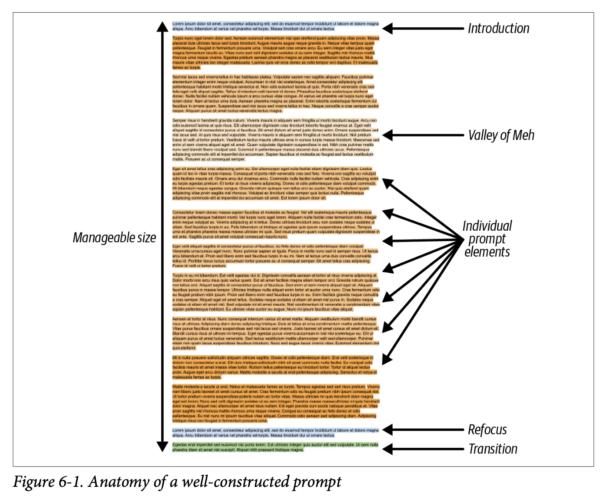

Chapter 6 of "Prompt Engineering for LLMs" is devoted to how to structure the prompt and compose its various elements. We first learn about the different kinds of 'documents' that we can mimic with our prompts, then think about how to pick which pieces of context to include, and then think through how we might compose all of this together.

There's a great figure to give you an idea of 'the anatomy of a well-constructed prompt' early on. The introduction is where you introduce the task, then you have the 'valley of meh' (which the LLM can struggle to recall or obey) and finally you have the refocusing and restatement of the task.

There are two key tips at this point:

- the closer a piece of information is to the end of the prompt, the more impact it has on the model
- the model often struggles with the information stuffed in the middle of the prompt

So craft your prompts accordingly!

A prompt plus the resulting completion is defined as a 'document' in this book, and there are various templates that you can follow: an 'advice conversation', an 'analytic report' (often formatted with Markdown headers), and a 'structured document'.

We learn that analytic report-type documents seem to offer a lighter 'cognitive load' for an LLM since it doesn't have to handle the intricacies of social interaction that it would in the case of an advice conversation. 🤔

Two other tips or possible things to include in the analytic report-style document:

- a table of contents at the beginning to set the scene
- a scratchpad or notebook section for the model to 'think' in

I haven't had much use of either of these myself but I can see why they'd be powerful.

Structured documents can be really powerful, especially when the model has been trained to expect certain kinds of structure (be it JSON or XML or YAML etc). Also TIL that apparently OpenAI's models are very strong when dealing with JSON as inputs.

The context to be inserted into the prompt (usually dynamically depending on use case or needs) can be large or small depending on what is available in terms of context window or latency requirements. There are different strategies to how to select what goes in.

I was curious about the idea of what they call 'elastic snippets', i.e. dynamic decisions that get taken as to what makes it way into the prompt depending on how much space is available etc.

And even then you have to decide about the:

- position (which order do all the elements appear in the prompt)
- importance (how much will dropping this element from the prompt effect the response)
- dependency (if you include one element, can you drop another and vice versa...)

In the end, you have a kind of optimisation problem: given a theoretical unlimited potential prompt length, how to combine all the elements together to get the most value given the space limitations that the LLM dictates.

And then what strategy do you use to get rid of elements that your prompt budget cannot afford; we learn about the 'additive greedy approach' and the 'subtractive greedy approach', all the while bearing in mind that these are all just basic prototypes to play around with.

The next chapter is all about the completion and how to make sure we receive meaningful and accurate responses from our LLM!