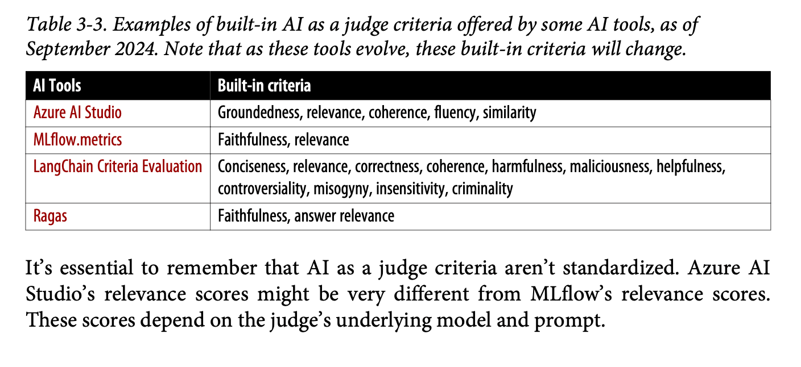

Really enjoyed this chapter. My tidied notes from my readings follow below. 150 pages in and we're starting to get to the good stuff :)

## Overview and Context
This chapter serves as the first of two chapters (Chapters 3 and 4) dealing with evaluation in AI Engineering. While Chapter 4 will delve into evaluation within systems, Chapter 3 addresses the fundamental question of how to evaluate open-ended responses from foundation models and LLMs at a high level. The importance of evaluation cannot be overstated, though the author perhaps takes this somewhat for granted. The chapter provides a comprehensive framework for understanding various evaluation methodologies and their applications.

## Challenges in Evaluating Foundation Models
The evaluation of foundation models presents several unique and complex challenges that make systematic assessment difficult:

- Existing benchmarks become increasingly inadequate as models improve in their capabilities
- As models become better at writing and mimicking human-like responses, evaluation becomes more complex and nuanced
- Many foundation models are API-driven black boxes, limiting access to internal workings
- Models continuously develop new capabilities, requiring constant adaptation of evaluation methods
- There has been notably limited investment in evaluation studies and technologies compared to the extensive resources devoted to enhancing model capabilities
- The improvement in model performance necessitates the continuous development of new benchmarks
- Without a systematic approach to evaluation, progress can be hindered by various headwinds

## Language Model Metrics
The chapter includes a technically detailed section on understanding language model metrics, which while math-heavy, provides fundamental insights into model capabilities:

- Entropy
- Cross-entropy
- Perplexity

These metrics serve as underlying measures to understand what's happening within the models and assess their power and conversational abilities. While this section spans 4-5 pages of technical content, it provides some useful foundational understanding of how we can measure a language model's intrinsic capabilities.

## Downstream Task Performance Measurement
The chapter transitions from intrinsic metrics to evaluating actual capabilities, dividing evaluation into exact and subjective approaches.

### Exact Evaluation
There are two principal approaches to exact evaluation:

1. **Functional Correctness Assessment**
   - Evaluates whether the LLM can successfully complete its assigned tasks
   - Focuses on practical capability rather than theoretical metrics
   - Example: In coding tasks, checking if generated code passes all unit tests
   - Provides clear, objective measures of success

2. **Similarity Measurements Against Reference Data**
   Four distinct methods are identified:

   a) **Human Evaluator Judgment**
      - Requires manual comparison of texts by human evaluators
      - Highly accurate but time and resource-intensive
      - Limited scalability due to human involvement
      - Often considered the gold standard despite limitations
   
   b) **Exact Match Checking**
      - Compares generated response against reference responses for exact matches
      - Most effective with shorter, specific outputs
      - Less useful for verbose or creative outputs
      - Provides binary yes/no results
   
   c) **Lexical Similarity**
      - Employs established metrics like BLEU, ROUGE, and METEOR
      - Focuses on word overlap and structural similarities
      - Known to be somewhat crude in their assessment
      - Widely used despite limitations due to ease of implementation
   
   d) **Semantic Similarity**
      - Utilizes embeddings for comparing textual meaning
      - Less sensitive to specific word choices than lexical approaches
      - Quality depends entirely on the underlying embeddings algorithm
      - May require significant computational resources
      - Generally provides more nuanced comparison than lexical methods

The chapter includes a brief but relevant sidebar on embeddings and their significance in evaluation, though this digression seemed a bit out of place in the overall flow.

## AI as Judge
This section explores the increasingly popular approach of using AI systems to evaluate other AI systems.

### Benefits
- Significantly faster than human evaluation processes
- Generally more cost-effective than human evaluation at scale
- Studies have shown strong correlation with human evaluations in many cases
- AI judges can provide detailed explanations for their decisions
- Offers greater flexibility in evaluation approaches
- Enables systematic and consistent evaluation at scale

### Three Main Approaches

1. **Individual Response Evaluation**
   - Assesses response quality based solely on the original question
   - Often implements numerical scoring systems (e.g., 1-5 scale)
   - Evaluates responses in isolation without comparison

2. **Reference Response Comparison**
   - Evaluates generated response against established reference responses
   - Usually produces binary (true/false) outcomes
   - Helps ensure responses meet specific criteria

3. **Generated Response Comparison**
   - Compares two generated responses to determine relative quality
   - Predicts likely user preferences between options
   - Particularly useful for:
     - Post-training alignment
     - Test-time compute optimization
     - Model ranking through comparative evaluation
     - Generating preference data

### Implementation Considerations

- Table 3-3 (page 139) provides an overview of different AI judge criteria used by various AI tools
- Notable lack of standardization across different platforms and approaches (see above)
- Various scoring systems available, each with their own trade-offs
- Adding examples to prompts can improve accuracy but increases token count and costs
- Careful balance needed between evaluation quality and resource consumption

### Limitations and Challenges
- AI judges can show inconsistency in their judgments
- Costs can escalate quickly, especially when using stronger models or including more context
- Evaluation criteria often remain ambiguous and difficult to standardize
- Several inherent biases identified:
  - Self-bias: Models tend to favor responses generated by themselves
  - Verbosity bias: Tendency to favor longer, more detailed answers
  - Other biases common to AI applications in general

## Specialized Judges
This section presents an innovative challenge to the conventional wisdom of using the strongest available model as a judge. The author introduces a compelling alternative approach:

- Small, specialized judges can be as effective as larger models for specific evaluation tasks
- More cost-effective and efficient than using large language models
- Can be trained for highly specific evaluation criteria
- Demonstrates comparable performance to larger models like GPT-4 in specific domains

Three types of specialized judges are identified:
1. Reward models (evaluating prompt-response pairs)
2. Reference-based judges
3. Preference models

This represents a novel approach that could significantly impact evaluation methodology in the field.

## Comparative Evaluation for Model Ranking

### Methodology
- Focuses on binary choices between two samples
- Simpler for both humans and AI to make comparative judgments
- Used in major leaderboards like LMSIS
- Requires evaluation of multiple combinations to establish rankings
- Various algorithms available for efficient comparison

### Advantages
- More intuitive evaluation process
- Often more reliable than absolute scoring
- Reduces cognitive load on evaluators
- Provides clear preference data

### Challenges
- Highly data-intensive nature affects scalability
- Lacks standardization across implementations
- Difficulty in converting comparative measures to absolute metrics
- Quality control remains a significant concern
- Number of required comparisons can grow rapidly with model count

## Key Takeaways and Future Implications
1. The emergence of smaller, specialized judge models represents a significant shift from the traditional approach of using the largest available models
2. Comparative evaluation offers promising approaches but requires careful consideration of scalability and implementation
3. The field continues to evolve rapidly, requiring flexible and adaptable evaluation strategies
4. Sets up crucial discussion for system-level evaluation in Chapter 4
5. Highlights the ongoing tension between evaluation quality and resource efficiency

The chapter effectively establishes the foundational understanding necessary for the more practical, system-focused evaluation discussions to follow in Chapter 4.