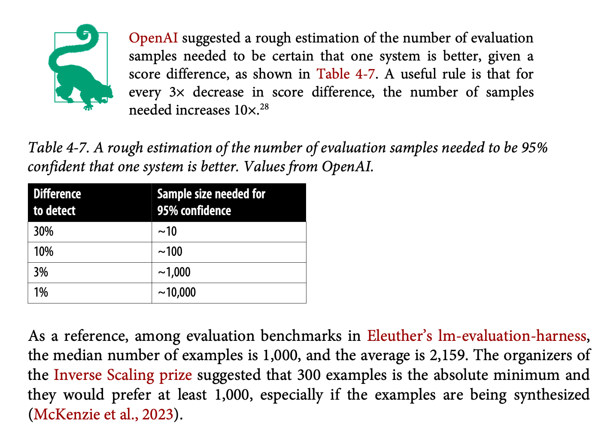

This chapter represents a crucial bridge between academic research and production engineering practice in AI system evaluation. What sets it apart is the Chip's very balanced perspective - neither succumbing to the prevalent hype in the field nor becoming overly academic. Instead, she melds together practical insights with theoretical foundations, creating a useful framework for evaluation that acknowledges both technical and ethical considerations.

## Introduction and Context

> **Key Insight**: The author's approach demonstrates that effective AI system evaluation requires a synthesis of academic rigour and practical engineering concerns, much like how traditional software engineering evolved to balance theoretical computer science with practical development methodologies.

The chapter is structured in three main parts, each building upon the previous to create a complete picture of AI system evaluation:

1. Evaluation criteria fundamentals
2. Model selection and benchmark navigation
3. Practical pipeline implementation

## Part 1: Evaluation Criteria - A Deep Dive

### The Evolution of Evaluation-Driven Development

The author introduces **evaluation-driven development** (EDD), a methodological evolution that adapts the principles of test-driven development to the unique challenges of AI systems.

> **Evaluation-Driven Development**: A methodology where AI application development begins with explicit evaluation criteria, similar to how test-driven development starts with test cases. However, EDD encompasses a broader range of metrics and considerations specific to AI systems.

The fundamental principle here is that AI applications require a more nuanced and multifaceted approach to evaluation than traditional software. Where traditional software might have binary pass/fail criteria, AI systems often operate in a spectrum of performance across multiple dimensions.

### The Four Pillars of Evaluation

#### 1. Domain-Specific Capability

The author presents domain-specific capability evaluation as the foundational layer of AI system assessment. This approach is particularly innovative in its use of **multiple choice evaluation techniques** - a method that bridges the gap between human-interpretable results and machine performance metrics.

*For example*, when evaluating code generation capabilities, presenting a model with multiple implementations where only one is functionally correct serves as both a test and a teaching tool. This mimics how human experts often evaluate junior developers' understanding of coding patterns and best practices.

#### 2. Generation Capability

The section on generation capability draws parallels with the historical development of Natural Language Generation (NLG) in computational linguistics. This historical context provides valuable insights into how we can approach modern language model evaluation.

The author breaks down factual consistency into two crucial dimensions:

> **Local Factual Consistency**: The internal coherence of generated content and its alignment with the immediate context of the prompt. This is analogous to maintaining logical consistency within a single conversation or document.
> 
> **Global Factual Consistency**: The accuracy of generated content when compared against established knowledge and facts. This represents the model's ability to maintain truthfulness in a broader context.

The discussion of hallucination detection is particularly noteworthy, presenting three complementary approaches:

1. **Basic Prompting**: Direct detection through carefully crafted prompts
2. **Self-Verification**: A novel approach using internal consistency checks across multiple generations
3. **Knowledge-Augmented Verification**: Advanced techniques like Google DeepMind's SAFE paper (search augmented factuality evaluator)

The knowledge-augmented verification system represents a fascinating approach to fact-checking that mirrors how human experts verify information:

- It breaks down complex statements into atomic claims
- Each claim is independently verified through search
- The results are synthesised into a final accuracy assessment

Seems pricey, though :)

#### 3. Instruction Following Capability
The author makes a crucial observation about the bidirectional nature of instruction following evaluation. Poor performance might indicate either model limitations or instruction ambiguity - a distinction that's often overlooked in practice.

> **Instruction-Performance Paradox**: The quality of instruction following cannot be evaluated in isolation from the quality of the instructions themselves, creating a circular dependency that must be carefully managed in evaluation design.

The solution proposed is the development of custom benchmarks that specifically target your application's requirements. This approach ensures that your evaluation criteria align perfectly with your practical needs rather than relying solely on generic benchmarks.

#### 4. Cost and Latency Considerations
The author introduces the concept of **Pareto optimization** in the context of AI system evaluation, demonstrating how different performance metrics often involve trade-offs that must be carefully balanced.

> **Pareto Optimization**: A multi-objective optimization approach where improvements in one metric cannot be achieved without degrading another, leading to a set of optimal trade-off solutions rather than a single optimal point.

## Part 2: Model Selection - A Strategic Approach

### The Four-Step Evaluation Workflow

The author presents a sophisticated workflow that combines both quantitative and qualitative factors in model selection. This approach is particularly valuable because it acknowledges the complexity of real-world deployment while providing a structured path forward.

1. **Initial Filtering**
   The first step involves filtering based on hard constraints, which might include:
   
   - Deployment requirements (on-premise vs. cloud)
   - Security and privacy considerations
   - Licensing restrictions
   - Resource constraints

2. **Public Information Assessment**
   This stage involves a systematic review of:
   
   - Benchmark performances across relevant tasks
   - Leaderboard rankings with context
   - Published latency and cost metrics
   
   The author emphasises the importance of looking beyond raw numbers to understand the context and limitations of public benchmarks.

3. **Experimental Evaluation**
   This phase involves hands-on testing with your specific use case, considering:
   
   - Custom evaluation metrics
   - Integration requirements
   - Real-world performance characteristics

4. **Continuous Monitoring**
   The final step acknowledges that evaluation is an ongoing process, not a one-time event. This involves:
   
   - Regular performance monitoring
   - Failure detection and analysis
   - Feedback collection and incorporation
   - Continuous improvement cycles

### The Build vs. Buy Decision Matrix

The author provides an analysis of the build vs. buy decision, going beyond simple cost comparisons to consider factors like:

> **Total Cost of Ownership (TCO)**: The complete cost picture including:
> - Direct costs (API fees, computing resources)
> - Indirect costs (engineering time, maintenance)
> - Opportunity costs (time to market, feature development)
> - Risk costs (security, reliability, vendor lock-in)

This section particularly shines in its discussion of the often-overlooked aspects of model deployment, such as the hidden costs of maintaining self-hosted models and the true value of vendor-provided updates and improvements.

## Part 3: Building Evaluation Pipelines - Practical Implementation

### System Component Evaluation

The author advocates for a **dual-track evaluation approach**:

1. End-to-end system evaluation
2. Component-level assessment

This approach allows organisations to:

- Identify bottlenecks and failure points
- Understand component interactions
- Make targeted improvements
- Maintain system reliability during updates

### Creating Effective Evaluation Guidelines

The author emphasises the importance of creating clear, actionable evaluation guidelines that bridge technical and business metrics. This section introduces the concept of **metric alignment** - ensuring that technical evaluation metrics directly correspond to business value.

> **Metric Alignment**: The process of mapping technical performance metrics to business outcomes, creating a clear connection between model improvements and business value.

### Data Management and Sampling

Chip provides valuable insights into data management for evaluation, including:

> **Data Slicing**: The strategic separation of evaluation data into meaningful subsets to:
> - Identify performance variations across different use cases
> - Detect potential biases
> - Enable targeted improvement efforts
> - Avoid Simpson's paradox in performance analysis

The discussion of sample size is particularly practical, providing concrete guidelines based on statistical confidence levels and desired detection thresholds. The author cites OpenAI's research suggesting that sample sizes between 100 and 1,000 are typically sufficient for most evaluation needs, depending on the required confidence level.

### Meta-Evaluation: Evaluating Your Evaluation

The chapter concludes with a crucial discussion of meta-evaluation - the process of assessing and improving your evaluation pipeline itself. This includes considerations of:

- Signal quality and reliability
- Metric correlation and redundancy
- Resource utilisation and efficiency
- Integration with development workflows

## Conclusion

The author concludes around the inherent limitations of AI system evaluation: no single metric or method can fully capture the complexity of these systems. However, this acknowledgment leads to a constructive approach: combining multiple evaluation methods, maintaining awareness of their limitations, and continuously iterating based on real-world feedback.

This chapter ultimately provides a solid framework for AI system evaluation that is both theoretically sound and practically applicable. It serves as a valuable resource for organisations working to implement effective evaluation strategies for their AI systems, while maintaining a clear-eyed view of both the possibilities and limitations of current evaluation methods.