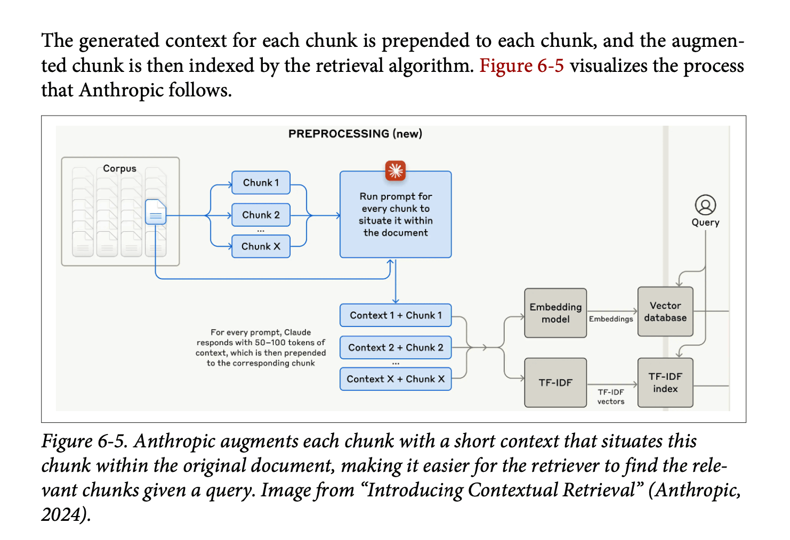

This chapter was all about RAG and agents. It's only 50 pages, so clearly there's only so much of the details she can get into, but it was pretty good nonetheless and there were a few things in here I'd never really read. Also Chip does a good job bringing the RAG story into the story about agents, particularly in terms of how she defines agents. (Note that [the second half of this chapter](https://huyenchip.com/2025/01/07/agents.html), on agents, is available [on Chip's blog](https://huyenchip.com/2025/01/07/agents.html) as a free excerpt!)

As always, what follows is just my notes on the things that seemed interesting to me (and a high-level overview of the main points of the chapter just for future reference). YMMV!

## Chapter Structure and Framing

This chapter undertakes the ambitious task of unifying two major paradigms in AI engineering: Retrieval-Augmented Generation (RAG) and Agents. At first glance, combining these topics might seem surprising given their scope and complexity. However, Chip creates a compelling framework that positions both as sophisticated approaches to *context construction*.

The unifying thesis presents RAG as a specialised case of the agent pattern, where the retriever functions as a tool at the model's disposal. Both patterns serve to transcend context limitations and maintain current information, though agents ultimately offer broader capabilities. This framing provides an elegant theoretical bridge between these technologies while acknowledging their distinct characteristics.

## Retrieval-Augmented Generation (RAG)

### Core Concepts and Context Windows

The discussion begins with a fundamental examination of RAG's purpose: enhancing model outputs with query-specific context to produce more grounded and useful results. Chip introduces a fascinating variation on Parkinson's Law:

> **Context Expansion Law**: Application context tends to expand to fill the context limits supported by the model.

This observation challenges the common assumption that RAG might become obsolete with infinite context models. Chip argues that larger context windows don't necessarily solve the fundamental challenges RAG addresses, particularly noting that models often struggle with information buried in the middle of large context windows.

### Retrieval Architecture and Algorithms

The retrieval architecture discussion introduces two primary paradigms:

> **Sparse Retrieval**: Term-based approaches that rely on explicit matching of terms between queries and documents. The primary example is the **TFIDF** (Term Frequency-Inverse Document Frequency) algorithm, which evaluates term importance based on frequency patterns.

> **Dense Retrieval**: Embedding-based approaches that transform text into vector representations, requiring specialised vector databases for storage and sophisticated nearest-neighbour search algorithms for retrieval.

### Cost Considerations and Trade-offs

A striking revelation emerges regarding the cost structure of RAG systems: vector database expenses often consume between one-fifth to half of a company's total model API spending. This cost burden becomes particularly acute for systems requiring frequent embedding updates due to changing data. Chip notes that both vector storage and vector search queries can be surprisingly expensive operations.

### Retrieval Optimisation Techniques

The chapter presents several sophisticated approaches to optimisation:

**Chunking Strategies**: While the section is brief, it addresses the critical trade-offs in how documents are segmented for retrieval.

**Query Rewriting**: A powerful but potentially complex technique that enhances initial queries with contextual information. For example, transforming a query like "how about her?" into "how about Aunt Mabel from the previous question?" Chip notes this can introduce latency issues and suggests careful consideration before implementation.

**Contextual Retrieval**: Introduces the innovative "chunks-for-chunks" approach, where each retrieved chunk triggers additional retrievals for supplementary context. This might include retrieving related tags or associated metadata to enrich the initial results.

**Hybrid Search**: Combines term-based and embedding-based retrieval, typically implementing a re-ranking process. A common pattern involves using term-based retrieval (like Elasticsearch) to obtain an initial set of ~50 (or however many!) documents, followed by embedding-based re-ranking to identify the most relevant subset.

### Evaluation Framework

The evaluation framework centres on two primary metrics:

> **Context Precision**: The percentage of retrieved documents that are relevant to the query. Generally easier to measure and optimise.

> **Context Recall**: The percentage of all relevant documents that are successfully retrieved. More challenging to measure as it requires comprehensive dataset annotation.

## Agents

### Foundational Definition

Chip provides a clear definition of an agent:

> **Agent Definition**: An entity capable of perceiving its environment and acting upon it, characterised by:
> - The environment it operates in (defined by use case)
> - The set of actions it can perform (augmented by tools)

### Tool Types and Capabilities

The chapter delineates three primary categories of tools:

**Knowledge Augmentation Tools**:
- RAG systems
- Web search capabilities
- API calls for information retrieval

**Capability Extension Tools**:
- Code interpreters
- Terminal access
- Function execution capabilities
These have been shown to significantly boost model performance compared to prompting or fine-tuning alone.

**Write Actions**:
- Data manipulation capabilities
- Storage and deletion operations

### Planning Architecture

The planning process emerges as a four-stage cycle:

1. **Plan Generation**: Task decomposition and strategy development
2. **Initial Reflection**: Plan evaluation and potential revision
3. **Execution**: Implementation of planned actions, often involving specific function calls
4. **Final Reflection**: Outcome evaluation and error correction

Chip includes an interesting debate about foundation models as planners, noting Yan LeCun's assertion that autoregressive models cannot truly plan, though this remains a point of discussion in the field.

### Plan Execution Patterns

The execution of agent plans reveals a fascinating interplay between computational patterns and practical implementation. Chip identifies several fundamental execution patterns that form the backbone of agent behaviour, each offering distinct advantages and trade-offs in different scenarios.

> **Execution Paradigms**: The core patterns through which agents transform plans into actions, ranging from simple sequential execution to complex conditional logic.

The primary execution patterns include:

**Sequential Execution**: The most straightforward pattern, where actions are performed one after another in a predetermined order. This approach offers predictability and simplicity but may not maximise efficiency when actions could be performed concurrently.

**Parallel Execution**: Enables multiple actions to be performed simultaneously when dependencies permit. While this pattern can significantly improve performance, it introduces complexity in managing concurrent operations and handling potential conflicts.

**Conditional Execution**: Implements decision points through `if` statements, allowing agents to adapt their execution path based on intermediate results or environmental conditions. This pattern introduces crucial flexibility but requires careful handling of branch logic and state management.

**Iterative Execution**: Utilises `for` loops to handle repetitive tasks or process collections of items. This pattern is particularly powerful when dealing with datasets or when similar actions need to be performed multiple times with variations.

> **Pattern Selection**: The choice of execution pattern often emerges from the intersection of task requirements, system constraints, and performance goals.

The effectiveness of these patterns depends heavily on the underlying system architecture and the specific requirements of the task at hand. For instance, parallel execution might offer theoretical performance benefits but could introduce unnecessary complexity for simple, linear tasks. Similarly, conditional execution provides valuable flexibility but requires robust error handling and state management to maintain system reliability.

Chip emphasises that these patterns aren't mutually exclusive - sophisticated agent systems often combine multiple patterns to create more complex and capable execution strategies. This hybrid approach allows for the development of highly adaptable agents that can handle a wide range of tasks while maintaining system stability and performance.

### Planning Optimisation

The chapter provides several practical tips for improving agent planning:

1. Enhance system prompts with more examples
2. Provide better tool descriptions and parameter documentation
3. Simplify complex functions through refactoring
4. Consider using stronger models or fine-tuning for plan generation

### Function Calling Implementation

The function calling architecture requires:

1. Tool inventory creation, including:
   - Function names and entry points
   - Parameter specifications
   - Comprehensive documentation
2. Tool usage specification (required vs. optional)
3. Version control for function names, parameters, and documentation

### Planning Granularity

Chip introduces an important discussion of planning levels, analogous to temporal planning horizons (yearly plans vs. daily tasks). This presents a fundamental trade-off:

> **Planning Trade-off**: Higher-level plans are easier to generate but harder to execute, while detailed plans are harder to generate but easier to execute.

### Tool Selection and Evaluation

The chapter provides a systematic approach to tool selection:

1. Conduct ablation studies to measure performance impact
2. Monitor tool usage patterns and error rates
3. Analyze tool call distribution
4. Consider model-specific tool preferences (noting that GPT-4 tends to use a wider tool set than ChatGPT)

### Memory Systems

The memory architecture comprises two core functions:

> **Memory Functions**:
> - Memory management
> - Memory retrieval

The system supports three types of memory:

- Internal knowledge
- Short-term memory
- Long-term memory

These systems prove crucial for:

- Managing information overflow
- Maintaining session persistence
- Ensuring model consistency
- Preserving data structural integrity

### Evaluation and Failure Modes

The comprehensive evaluation framework considers:

- Planning effectiveness
- Tool execution accuracy
- System latency
- Overall efficiency
- Memory system performance

## Conclusion

The unifying thread of context construction provides a compelling framework for understanding these technologies not as separate entities, but as complementary approaches to extending model capabilities.