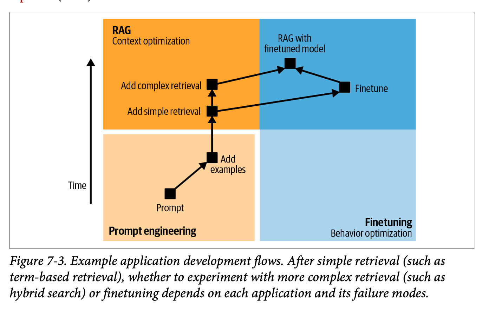
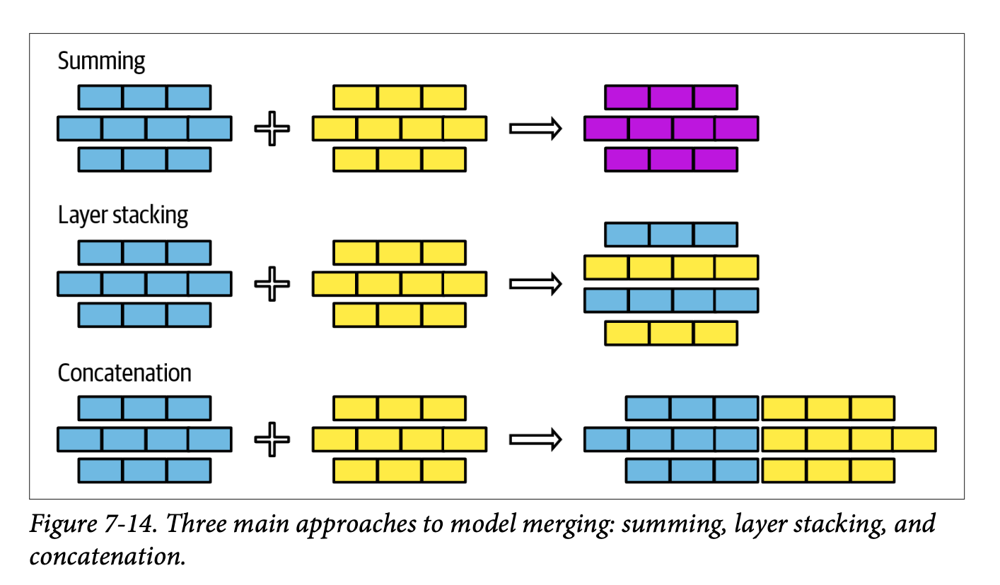

I enjoyed chapter 7 on finetuning. It jams a lot of detail into the 50 pages she takes to explain things. Some areas had more detail than you'd expect, and others less, but overall this was a solid summary / review.

> **Core Narrative**: Fine-tuning represents a significant technical and organisational investment that should be approached as a last resort, not a first solution.

The chapter's essential message can be distilled into three key points:

1. The decision to fine-tune should follow exhausting simpler approaches like prompt engineering and RAG. At the end she sums it up: *fine-tuning is for form, while RAG is for facts*.
2. Memory considerations dominate the technical landscape of fine-tuning, leading to the emergence of techniques like PEFT (particularly LoRA) that make fine-tuning more accessible. The chapter emphasises that while the actual process of fine-tuning isn't necessarily complex, the surrounding infrastructure and maintenance requirements are substantial.
3. A clear progression pathway emerges: start with prompt engineering, move to examples (up to ~50), implement RAG if needed, and only then consider fine-tuning. Even then, breaking down complex tasks into simpler components might be preferable to full fine-tuning.

So fine-tuning can be incredibly powerful when applied judiciously, but it requires careful consideration of both technical capabilities and organisational readiness.

## Chapter Overview and Context

This long chapter (approximately 50 pages, much like the others) was notably one of the most challenging for Chip to write. It presents fine-tuning as an advanced approach that moves beyond basic prompt engineering, covering everything from fundamental concepts to practical implementation strategies.

The depth and breadth of the chapter reflect the complexity of fine-tuning as both a technical and organisational challenge, though the things she writes about doesn't really cover the reality of what it's like to work on these kinds of initiatives within a team.

## Core Decision: When to Fine-tune

The decision to fine-tune should never be taken lightly. While the potential benefits are significant, including improved model quality and task-specific capabilities, the chapter emphasises that fine-tuning should be considered a last resort rather than a default approach.

> **Notable Case Study**: Grammarly achieved remarkable results with their fine-tuned T5 models, which outperformed GPT-3 variants despite being 60 times smaller. This example illustrates how targeted fine-tuning can sometimes achieve better results than using larger, more general models.

### Reasons to Avoid Fine-tuning

The chapter presents several compelling reasons why organisations might want to exhaust other options before pursuing fine-tuning:

1. Performance Degradation: Fine-tuning can actually degrade model performance on tasks outside the specific target domain
2. Engineering Complexity: The process introduces significant technical overhead
3. Specialised Knowledge Requirements: Teams need expertise in model training
4. Infrastructure Demands: Self-serving infrastructure becomes necessary
5. Ongoing Maintenance: Requires dedicated policies and budgets for monitoring and updates

### Fine-tuning vs. RAG: A Critical Distinction

One of the most important conceptual frameworks presented is the distinction between fine-tuning and RAG:

- Fine-tuning focuses on form - how the model expresses information
- RAG specialises in facts - what information the model can access and use

This separation provides a clear decision framework, though the chapter acknowledges there are exceptions to this general rule.

## Progressive Implementation Workflow

The chapter outlines a thoughtful progression of implementation strategies, suggesting organisations should:

1. Begin with prompt engineering optimisation
2. Expand to include more examples (up to approximately 50)
3. Implement dynamic data source connections through RAG
4. Consider advanced RAG methodologies
5. Explore fine-tuning only after exhausting other options
6. Consider task decomposition if still unsuccessful

## Memory Bottlenecks and Technical Considerations

### Critical Memory Factors

The chapter emphasises three key contributors to a model's memory footprint during fine-tuning:

- Parameter count
- Trainable parameter count
- Numeric representations

> **Technical Note**: The relationship between trainable parameters and memory requirements becomes a key motivator for PEFT (Parameter Efficient Fine Tuning) approaches.

### Quantisation Strategies

The chapter provides a detailed examination of quantisation approaches, particularly noting the distinction between:

1. Post-Training Quantisation (PTQ)
   - Most common approach
   - Particularly relevant for AI application developers
   - Supported by major frameworks with minimal code requirements

2. Training Quantisation
   - Emerging approach gaining traction
   - Aims to optimise both inference performance and training costs

## Advanced Fine-tuning Techniques

### PEFT Methodologies

The chapter identifies two primary PEFT approaches:

1. Adapter-based methods (Additive):
   - LoRA emerges as the most popular implementation
   - Includes variants like Dora and qDora from Anthropic
   - Involves adding new modules to existing model weights

2. Soft prompt-based methods:
   - Less common but growing in popularity
   - Introduces trainable tokens for input processing modification
   - Offers a middle ground between full fine-tuning and basic prompting, so maybe interesting for teams who don't *really* want to go too deep into finetuning (?)

### Model Merging and Multitask Considerations

The chapter presents model merging as an evolving science, requiring significant expertise. Three primary approaches are discussed:

- Summing
- Layer stacking
- Concatenation (generally not recommended due to memory implications)

There's a lot of detail in this section (much more than I'd expected) but it was interesting to read about something that I haven't much practical expertise with.

## Core Approaches to Model Merging

The chapter outlines three fundamental approaches to model merging, each with its own technical considerations and trade-offs:

> **Technical Architecture**: The three primary merging strategies
> 
> 1. **Summing**: Direct weight combination
> 2. **Layer stacking**: Vertical integration of model components
> 3. **Concatenation**: Horizontal expansion (though notably discouraged due to memory implications)

The relative simplicity of these approaches belies their potential impact on model architecture and performance. Particularly interesting is how these techniques interface with the broader challenge of multitask learning.

## Multitask Learning: A New Paradigm

Traditional approaches to multitask learning have typically forced practitioners into one of two suboptimal paths:

1. **Simultaneous Training**
   - Requires creation of a comprehensive dataset containing examples for all tasks
   - Necessitates careful balancing of task representation
   - Often leads to compromise in per-task performance

2. **Sequential Training**
   - Fine-tunes the model on each task in sequence
   - Risks catastrophic forgetting as new tasks overwrite previous learning
   - Requires careful orchestration of task order and learning rates

> **Key Innovation**: Model merging introduces a third path - parallel fine-tuning followed by strategic combination. This approach fundamentally alters the landscape of multitask learning optimisation.

## The Parallel Processing Advantage

Model merging enables a particularly elegant solution to the multitask learning challenge through parallel processing:

1. Individual models can be fine-tuned for specific tasks independently
2. Training can occur in parallel, optimising computational resource usage
3. Models can be merged post-training, preserving task-specific optimisations

This approach brings several compelling advantages:

> **Strategic Benefits**:
> - Parallel training efficiency
> - Independent task optimisation
> - Flexible deployment options
> - Reduced risk of inter-task interference

## Practical Implications

While the implementation details remain somewhat experimental, the potential applications are significant. Organisations can:

- Develop specialised models in parallel
- Optimise individual task performance without compromise
- Maintain flexibility in deployment architecture
- Scale their multitask capabilities more efficiently

## Implementation Pathways

The chapter concludes with two distinct development approaches:

### Progression Path
1. Begin with the most economical and fastest model
2. Validate with a mid-tier model
3. Push boundaries with the optimal model
4. Map the price-performance frontier
5. Select the most appropriate model based on requirements

### Distillation Path
1. Start with a small dataset and the strongest affordable model
2. Generate additional training data using the fine-tuned model
3. Train a more cost-effective model using the expanded dataset

## Final Observations

The chapter emphasises that while the technical process of fine-tuning isn't necessarily complex, the surrounding context and implications are highly nuanced. Success requires careful consideration of business priorities, resource availability, and long-term maintenance capabilities. This holistic perspective is crucial for organisations considering fine-tuning as part of their AI strategy.