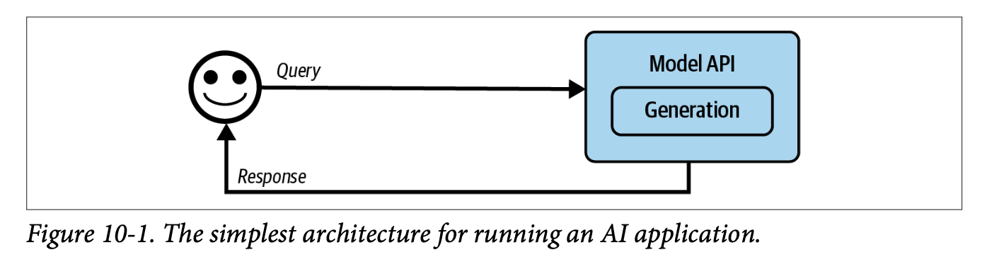
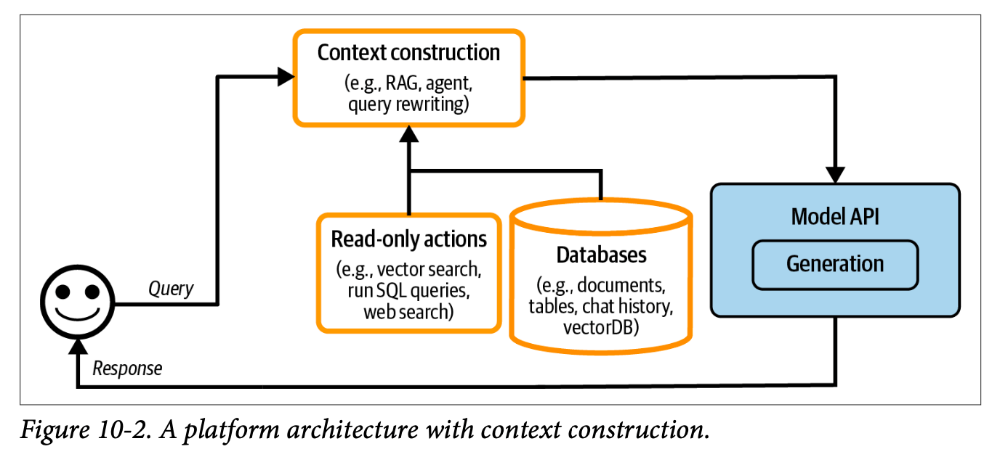
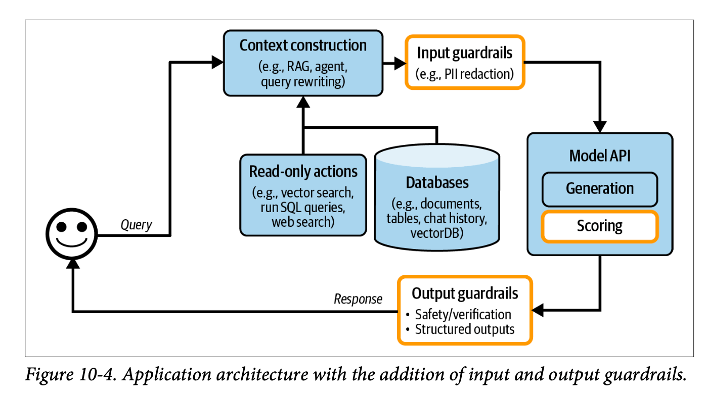
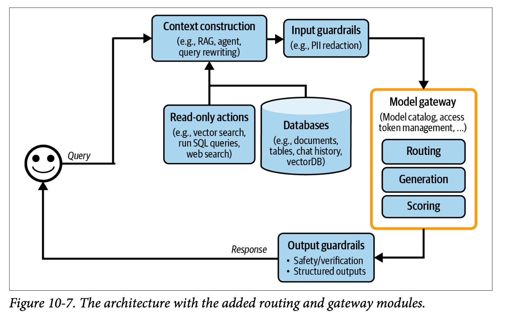
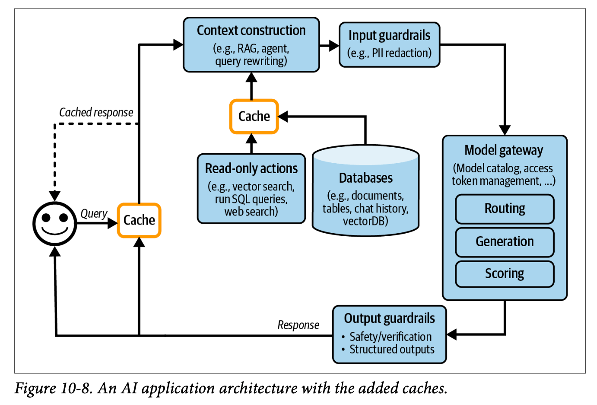
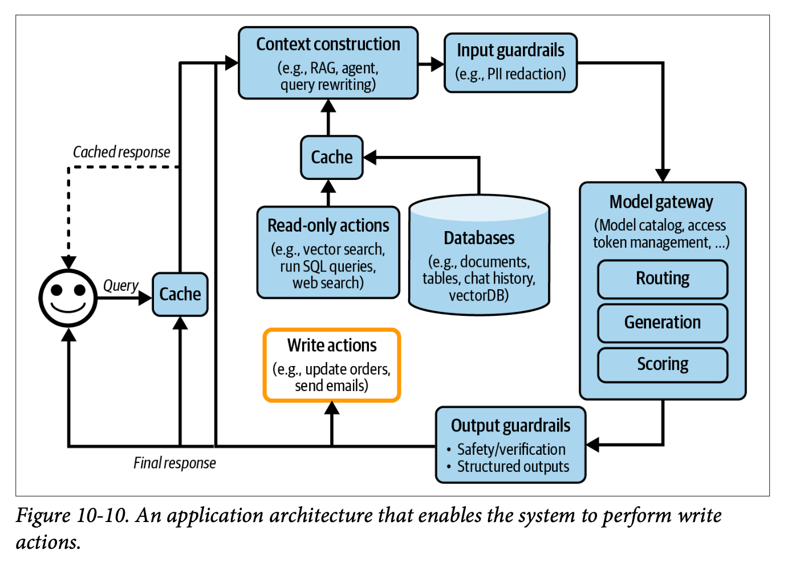

Chapter 10 of Chip Huyen's "AI Engineering," focuses on two fundamental aspects: architectural patterns in AI engineering and methods for gathering and using user feedback. The chapter presents a progressive architectural framework that evolves from simple API calls to complex agent-based systems, while also diving deep into the crucial aspect of user feedback collection and analysis.

## 1. Progressive Architecture Patterns

The evolution of AI engineering architecture typically follows a pattern of increasing complexity and capability. Each stage builds upon the previous one, adding new functionality while managing increased complexity.

### Base Layer: Direct Model Integration

The simplest architectural pattern begins with direct queries to model APIs. While straightforward, this approach lacks the sophistication needed for most production applications.

### Enhancement Layer: Context Augmentation

The first major enhancement comes through **Retrieval-Augmented Generation (RAG)**. This layer enriches model responses by incorporating custom data and sources into LLM queries, significantly improving response quality and relevance.

### Protection Layer: Guardrails Implementation

> **Guardrails**: Protective mechanisms that filter both inputs and outputs to ensure system safety and reliability.

The protection layer implements two types of guardrails:

1. **Input Guardrails**: Filter sensitive information before it reaches the LLM, such as:

   - Personal customer information
   - API keys
   - Other confidential data

2. **Output Guardrails**: Monitor and manage model outputs for:

   - Format compliance (e.g., valid JSON)
   - Factual consistency
   - Hallucination detection
   - Toxic content filtering
   - Privacy protection

### Routing Layer: Gateway and Model Selection

This layer introduces two key components:

> **AI Gateway**: A centralized access point for LLM interactions that manages costs, usage tracking, and API key abstraction.

> **Model Router**: An intent classifier that directs queries to appropriate models based on complexity and requirements.

The routing layer enables cost optimization by directing simpler queries (like FAQ responses) to less expensive models while routing complex tasks to more sophisticated systems.

### Performance Layer: Caching Strategies

The architecture implements two distinct caching approaches:

1. **Exact Caching**:

   - Stores identical queries and their responses
   - Particularly valuable for multi-step operations
   - Requires careful consideration of cache eviction policies:
     - Least Recently Used (LRU)
     - Least Frequently Used (LFU)
     - First In, First Out (FIFO)

2. **Semantic Caching**:

   - Uses embedding-based search to identify similar queries
   - Depends on high-quality embeddings and reliable similarity metrics
   - More prone to failure due to component complexity

> **Security Note**: Cache implementations must carefully consider potential data leaks between users accessing similar queries.

### Agent Layer: Advanced Functionality

The final architectural layer introduces agent patterns, enabling:

- Retry loops for reliability
- Tool usage capabilities
- Action execution (email sending, file operations)
- Complex workflow orchestration

## Monitoring and Observability

The complete architecture requires robust monitoring systems tracking key metrics:

- **Mean Time to Detection (MTTD)**: Time to identify issues
- **Mean Time to Response (MTTR)**: Time to resolve detected issues
- **Change Failure Rate (CFR)**: Percentage of deployments requiring fixes

The monitoring system should track:

- Factual consistency
- Generation relevancy
- Safety metrics (toxicity, PII detection)
- Model quality through conversational signals
- Component-specific metrics (RAG, generation, vector database performance)

### AI Pipeline Orchestration

a discussion of AI pipeline orchestration, addressing the trade-offs between using existing frameworks (Langchain, Haystack, Llama Index) versus custom implementations. This decision should be based on specific project requirements, team expertise, and maintenance considerations.

## 2. User Feedback Systems

The second major focus of the chapter explores comprehensive user feedback collection and utilization strategies.

### Feedback Collection Methods

1. **Direct Feedback**:

   - Explicit mechanisms (thumbs up/down)
   - Rating systems
   - Free-form comments

2. **Implicit Feedback**:

   - Early termination patterns
   - Error corrections
   - Sentiment analysis
   - Response regeneration requests
   - Dialogue diversity metrics

### Feedback Collection Timing

Feedback can be gathered at various stages:

- Initial user preference specification
- During negative experiences
- When model confidence is low
- Through comparative choice interfaces (e.g., ChatGPT's response preference selection)

### Feedback Limitations

> **Feedback Bias**: User feedback systems inherently contain various biases that must be considered when making system improvements.

Key limitations include:

- Negative experience bias (users more likely to report negative experiences)
- Self-selection bias in respondent demographics
- Preference and position biases
- Potential feedback loops affecting system evolution

### Implementation Considerations

The implementation of feedback systems requires careful attention to:

- UI/UX design for feedback collection
- Balance between different user needs
- Monitoring feedback impact on system performance
- Regular inspection of production data
- Detection of system drift (prompts, user behavior, model changes)
