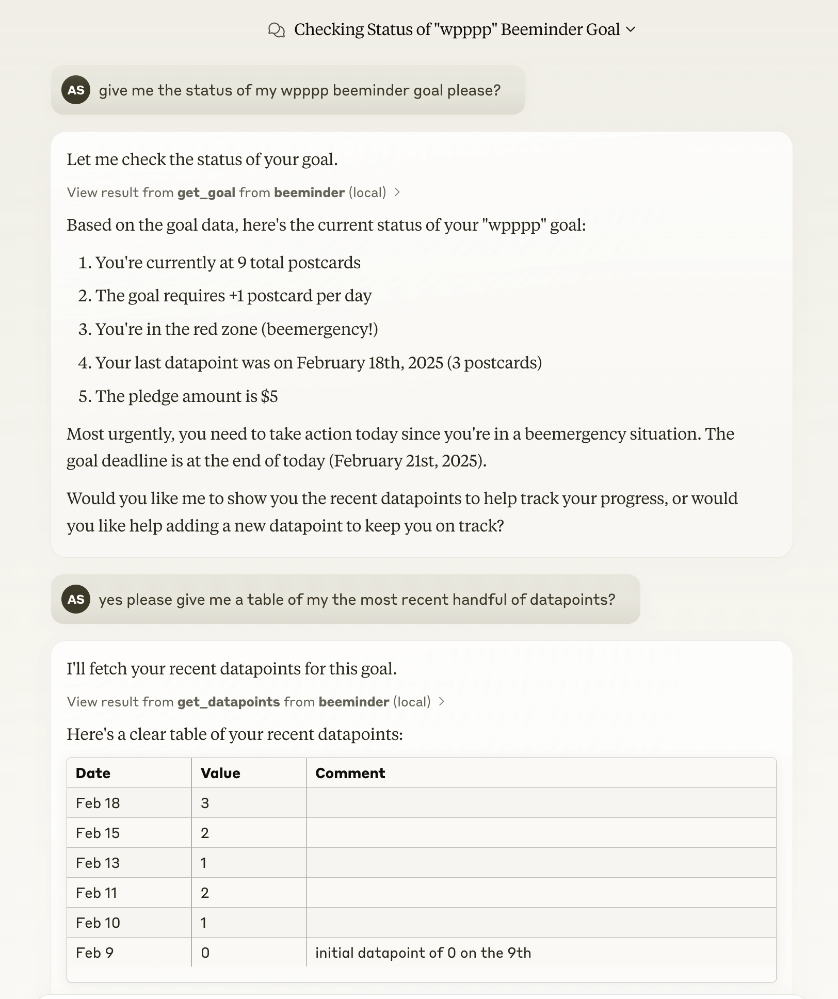

I spent the morning [building an MCP server](https://github.com/strickvl/mcp-beeminder) for [Beeminder](https://www.beeminder.com), bridging the gap between AI assistants and my personal goal tracking data. This project emerged from a practical need — ok, desire :) —  to interact more effectively with my Beeminder data through AI interfaces like Claude Desktop and Cursor.

## Understanding Beeminder

For those unfamiliar with [Beeminder](https://www.beeminder.com), it's a tool that combines self-tracking with commitment devices to help users achieve their goals. The platform draws what they call a "Bright Red Line" – a visual commitment path that shows exactly where you need to be to stay on track. What makes Beeminder unique is its approach to accountability: users pledge real money to stay on their path, and there's a seven-day "akrasia horizon" that prevents immediate goal changes, helping to overcome moments of impulsivity.

I've [written a *lot* about Beeminder](https://www.google.com/search?q=site%3Aalexstrick.com+beeminder) over on my personal blog in the past so do go check that out if you're interested to learn more about how I use it. I can attest that if it clicks with you, you'll find it incredibly valuable. I have used in the past to write books, learn languages, [finish my PhD](https://www.alexstrick.com/blog/2016/8/phd-tools-beeminder) and many many other things.

## The Role of MCP

The [Model Context Protocol (MCP)](https://modelcontextprotocol.io/) serves as a standardised way for AI assistants to interact with various data sources and tools. Think of it as a universal adapter that allows AI systems to directly access and manipulate data in your applications. Instead of copying and pasting information between your AI assistant and Beeminder, MCP creates a secure, direct connection.

This standardisation is particularly valuable because it means you can build one interface that works across multiple AI platforms. Whether you're using Claude Desktop, Cursor, or [other MCP-compatible tools](https://modelcontextprotocol.io/clients), the same server provides consistent access to your Beeminder data.

## Building the Server

The development process was surprisingly straightforward, largely due to two factors: the well-documented MCP specification from Anthropic and an [existing Python client](https://github.com/ianm199/beeminder_api_client) for Beeminder's API by [@ianm118](https://github.com/ianm199). Most of the implementation work involved mapping Beeminder's API endpoints to MCP's expected interfaces and ensuring proper error handling.

And obviously, much of the code was actually written by Claude itself. After providing the initial structure, writing a couple of tools the way I wanted them and providing documentation, I found that Claude could generate the remainder of the code, requiring only minor adjustments and debugging from me.

## Using the Beeminder MCP Server

Having an MCP server for Beeminder opens up several practical possibilities. You can have natural conversations with AI assistants about your goals, analyse patterns in your data, and even update your tracking information – all while the AI has direct access to your actual Beeminder account. This direct connection means the AI can provide more contextual and accurate assistance, whether you're adjusting goal parameters or analysing your progress trends.

I've found that sometimes Claude needs a bit of coaxing to display the information it's getting back from the Beeminder API in appropriate formats, which is to say, in table format. I will probably update my Claude settings so that it knows it should use tables (either Markdown or React components) to display Beeminder results that would benefit from such a presentation.

## Looking Forward

Now that I have my Beeminder MCP server, I also want one for [Omnifocus](https://www.omnigroup.com/omnifocus), my task management app of choice. That'll probably have to wait since it doesn't appear that they offer a REST API, but it'll be great when I can mash up the results of those two tool queries as that's what I currently do manually as part of my process.

The ease of building this MCP server suggests an interesting future where more of our tools and services become directly accessible to AI assistants. The real value isn't in any single connection, but in the potential for creating a network of interconnected tools that AI can help us manage more effectively.

If you're interested in trying this out yourself, you can find the code and
setup instructions in the [GitHub
repository](https://github.com/strickvl/mcp-beeminder). While this
implementation focuses on Beeminder, the same principles could be applied to
create MCP servers for other services and tools.
