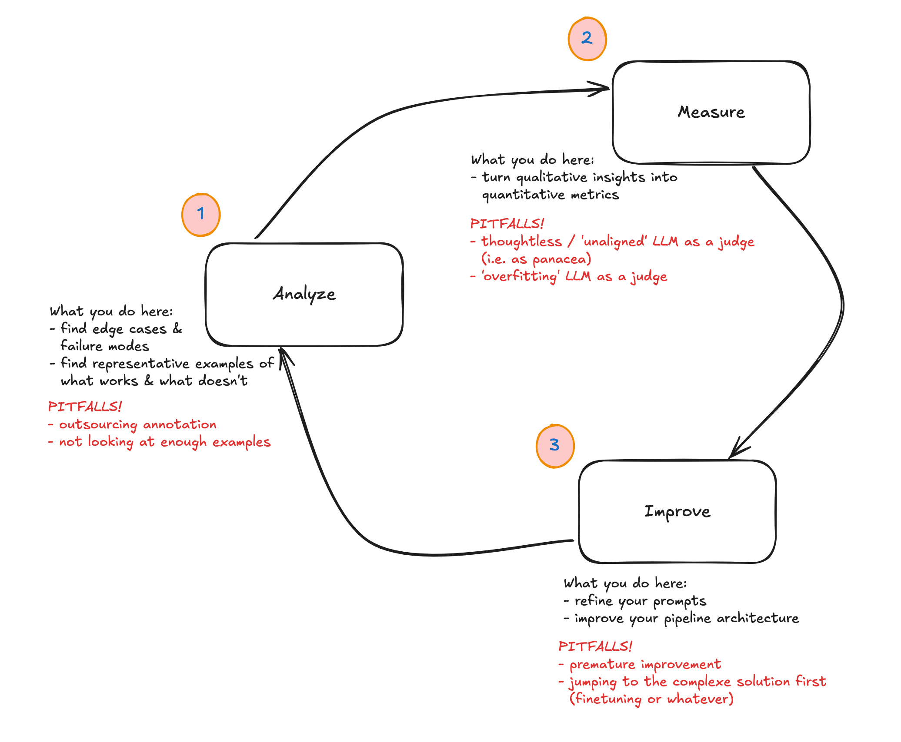

Today was the first session of Hamel + Shreya's course, "[AI Evals for Engineers and PMs](maven.com/parlance-labs/evals/)". The first session was all about mental models for thinking about the topic as a whole, mixed in with some teasers of practical examples and advice.

I'll try to keep up with blogging about what I learn as we go. Most of the actual content will go up online at some point in the future, I'm assuming, so not much point writing up super detailed notes. (There is also a book coming, which I assume will be great, and about which you can [learn more here](https://www.youtube.com/watch?v=OJItZndMUII).) So in general I'll try to be doing the following as I blog along:

- highlight things I found interesting or inspiring based on the formal 'lectures'
- anything that comes up while doing the practical 'homework' (there are some optional exercises assigned to ground everything)
- contextualise or situate things that come up in my own experience having worked on a few LLM-driven projects

Today, fresh out of the first class, I wanted to write about the mental model of the 'three gulfs' that they propose, the improvement loop that they suggest is how to measurably improve your applications, and also prompting through the lens of evals. Finally I'll round off with a bit about what I'll be exploring this week.

## The Three Gulfs: Specification, Generalization and Comprehension

So there's this image that they shared in the book chapter preview discussion that came up again during the lesson today:

(They've shared it already in the YouTube discussion + I see it on Twitter being shared so I think I'm not sharing something I ought not to!)

The course is very practically focused, especially so for application developers, so this diagram is in that context. The diagram offers up a way of thinking about LLM application development that pinpoints the places where you might do your work, and it's also a way of thinking through things systematically, too.

I was especially interested in the differentiation between the gulf of specification and the gulf of generalisation, since these can often feel similar, but actually the way to get out of them is actually slightly different. I'll go into a bit more detail below, but basically with the gulf of specification you might want to be working on your prompts + how specific you are, whereas with the generalisation gulf you might need things like splitting up your tasks or making sure your system is outputting things in a structured way, etc etc.

Note also that the world of tooling also doesn't help you in a specific or targeted way to focus on one aspect of this diagram. Too often the tools try to cover the whole picture and probably also muddy the water by eliding the differences between the different tasks and challenges of each island or the gulf in between. All this is pretty abstract, so let's go through them one by one.

### The Gulf of Comprehension in Practice

This was seen as sort of the starting point for thinking through LLM Application improvement. At this point your big problem is that you're trying to understand the data that comes your way from your users. You're trying to understand the inputs to your application (what your users are typing, assuming that text is the medium of communication / input) and you're trying to understand what the application or LLM is outputting.

The challenge comes because you can't read every single log or morsel of data. You have to filter things down somehow! If this were something more like traditional ML you'd have statistics to help boil down your data, but mostly we're talking about unstructured text data so it's much more unwieldy.

This challenge means that people often get stuck at this point. This is where POC applications live, breathe and eventually die. You have enough sense that things are 'kinda' working, but you don't really know what the failure modes are, so you don't know how to improve it. You've tried out one or two things in a halfway systematic way, but really you have no idea what's working well and what's not.

::: {.callout-tip}
## On Tools vs Process

Hamel made the good point that it's probably not so useful to think about tools too much when thinking at this stage. Generally speaking what's going on is most often actually a process problem and trying to go straight to 'what tool do I need' is probably avoiding the real issue.
:::

### The Gulf of Specification in Practice

This is the place where you are trying to translate intent into precise instructions that the LLM will follow. You're trying to be explicit and specific in the hope that the LLM will do what you want it to do, and not do the things that you don't want it to do.

The obvious manifestation of this is people writing bad prompts. It might seem that it's also present when you try to have an LLM solve one problem when it's either unsuited for that task or the task needs to be broken up and so on, but that's the sister gulf of generalisation. Here, we're focused on how to improve the specificity of your prompts.

When you split things up and highlight the fact that prompts are something that you'll need to work on and to improve, it becomes clear that it's something you wouldn't want to outsource or to skimp time on. Really the prompt writing is the thing that you (at certain moments, and where it's identified as the thing needing focus / improvement) want to be working on in partnership with domain experts.

For small applications, you might be the same person as the domain expert! For bigger projects, you might be working *with* domain experts. Just be aware that often the domain expert might not necessarily be detached enough to be able to figure out what needs the focus, or where the weaknesses of a prompt are. That's what the iterative process / error analysis and everything else that'll be taught in the course is for (see below and see future posts).

Another point Hamel made was about why prompts are actually so important: "you have to express your project taste somewhere". Given that your application might be fully / mostly driven by LLMs, the prompt is actually a really crucial place to express this taste and as such might be thought of as your 'moat'.

I know just from having experienced a variety of LLM-driven applications, it's quite easy to tell the ones where the product team gave their prompts and their specification some real love. It's the difference between POC junk that will die a slow and lonely death and something that delights and solves real user problems.

### Gulf of Generalisation

Shreya didn't really get into the details around the generalisation gulf in practical terms in this lesson, but I think this one can be a sort of place of comfort for the technically-minded to make refuge in. It's one where there's a ton of tools and technologies and techniques to play with, and vendors also live in this space and try to claim that their particular product or special sauce is *the* thing to help you and so on.

## The Improvement Loop for LLM Applications

We also got a high-level overview of the loop that allows you to iteratively improve an LLM application:

There's a lot to unpack in all these different stages, and we didn't really get into the details in the session today but you can see how this offers a really powerful way of thinking through what it means to iteratively improve an LLM application.

Learning how to implement this in a practical way will be the main thing I want to get good at by the end of this course. The process is made up of a bunch of techniques, but in my experience companies or use cases that struggle with improving what they built also lack the scaffold of this loop to orient themselves.

## Prompting through the lens of evals

As we explored above, prompting is sort of the table stakes of improving your LLM application. In order to get good at prompting, it can help to appreciate what they are good at and what they struggle with. So, as Shreya put it, "leverage their strengths and anticipate their weaknesses" (when prompting).

At this point Shreya got into some points around what kinds of things went into a good prompt but I think I'll write a separate blog on that and I don't want to just regurgitate what we listened to. Today was more of a high-level introduction, and in any case it was much more about the outer-loop process instead of the inner loop (where tooling + specific techniques play more of a role.)

So it's great that the course gets into the weeds (esp in the course materials, which include the draft of the book Hamel & Shreya are writing) but I think the really useful thing they're doing is situating the tactical improvements and techniques within the strategic patterns and workflows that teams and individuals should be doing to work on these LLM applications.

At a high level, what are we talking about:

- how to tease out failure scenarios for these applications and their behaviours
- conversely, how to understand exactly which domains it does well for

## Things I want to think about more

There was a ton of really rich discussion around prompting in the Discord. I'm interested in exploring more:

- cross-provider prompting decisions (i.e. how prompting an OpenAI model differs from what you do with a Llama model or whatever)
- prompts that work with reasoning models vs non-reasoning models
- the tradeoffs of whether you put your instructions in system prompts vs user instructions

In general there's been a bunch of noise recently about so-called 'leaked' system prompts from a bunch of LLM API providers and I've mainly been struck by just how detailed they are. I consider myself pretty good at improving and iterating on prompts, but I'll admit I'm not writing these multi-thousand word tomes. I'd like to explore which scenarios it makes sense to do so, and how to calculate at what point it makes sense from a cost or latency perspective to do so.

As I'm sure you can detect, I'm really enthusiastic about the lesson to come and will work in the meanwhile on some of the readings that have been set as well as the homework task of writing a system prompt for a LLM-powered recipe recommendation application!