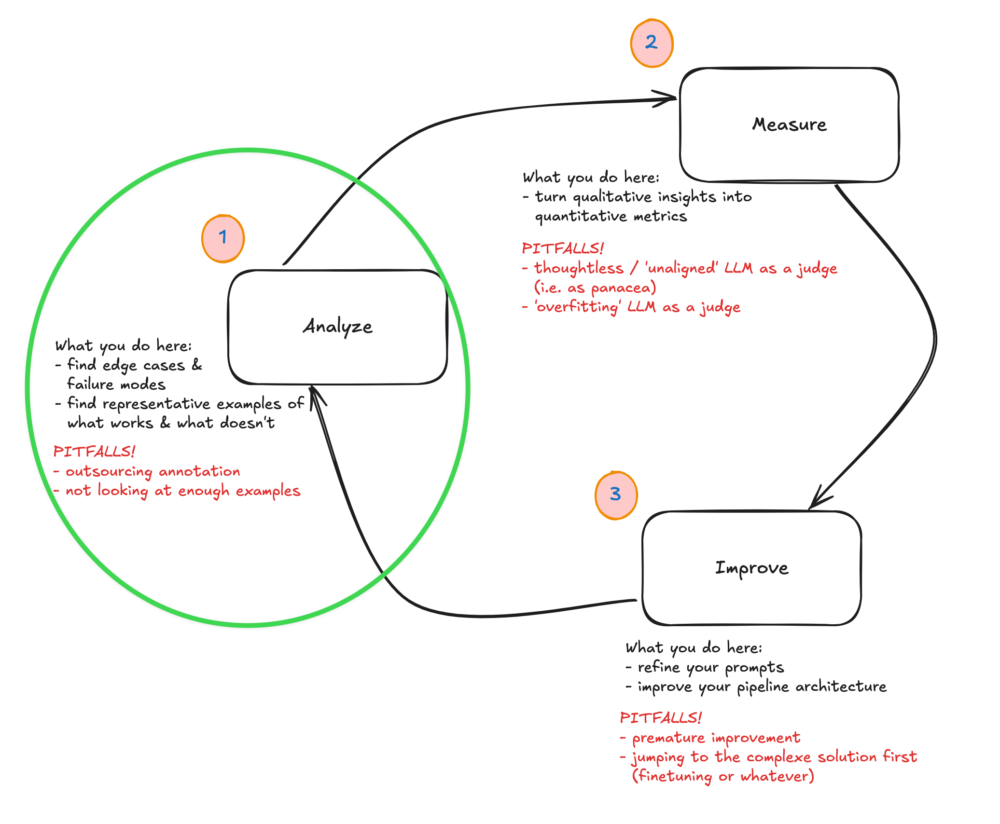

I came across this quote in a happy coincidence after attending the second session of the evals course:

It's obviously a bit abstract, but I thought it was a nice oblique reflection on the topic being discussed. Both the main session and the office hours were mostly focused on the first part of the analyse-measure-improve loop that was introduced [earlier in the week](https://mlops.systems/posts/2025-05-20-how-to-think-about-evals.html).

It was a very practical session in which we even took time to do some live 'coding' (i.e. analysis + clustering) of real data. I'll try to summarise the points I jotted down in my notebook and end with some reflection on how I will be applying this for an application I've been working on.

A quick reminder of the context: we have an application of some kind, and we want to improve it. LLMs have lots of quirks that make them hard to narrow down exactly how they're failing, so we're working through a process that allows you to do just that. This was framed as a five-step process by Hamel + Shreya:

First up, we need to look at some data to better understand the failure modes that our application might suffer from. If this application's been in production for a while, you might well just have production data. If not, we'll want to create a synthetic(-ish) dataset that allows us to get over the cold-start hump.

## 1. Create your initial dataset

This process is fairly technical, but as we were introduced to this process, the aim is to end up with 100 inputs that span across different dimensions of use that your application / system might be exposed to.

Why 100? No reason. As Hamel explained, it's just a magic number to get you started. We're encouraged not to get too focused on the details of the process but rather to trust that we would get to where we wanted if only we had a little faith.

The idea is that we pass these 100 datapoints into our LLM-driven system in order to see what we get out at the other end, we analyse them iteratively until we're not learning anything new by doing the iterative process.

The process is something like the following:

- you want to sample among dimensions or facets of the use that your application could expect to experience, so come up with at least three of these. As a rule of thumb, perhaps think through the lens of features people might use, persona, query complexities or scenarios. It will differ per application, most likely.
- Then generate a number of combinations of these three dimensions. (So as an example: people who want to use a chatbot to buy a product, and these are all non-technical users who actually are non-native English speakers, and who don't necessarily formulate their queries with full sentences because they're being passed in by a voice transcription module). Generate 50 of these. (Then filter out the ones that don't make sense.)
- Then either hand write or use an LLM to help you generate the full 100 realistic queries that would come from any of the particular tuple-combos that we created earlier. (Again, filter out the ones that don't make sense.)

## 2. Look at your data ('open coding')

At this point you'll pass all these queries into your system and then you'll have a pair of the initial query, together with the 'full trace' (which encompasses the final response along with all internal tool calls, retrieval and any other context or metadata).

Here you assemble your traces and you write notes on each one. Basically you are looking at each of the 100 items of data and making observations on what failure modes you observe in the data. In the lesson we did this live through the [Braintrust](https://www.braintrust.dev/) interface, but it was emphasised that custom vibe-coded interfaces were also recommended, especially when you have a lot of metadata and tool calling that you might want to present in a certain way to foreground certain elements etc.

This is where you'll spend 80% of your time and for 100 traces could take something on the order of an hour. Read each trace. Write some brief descriptive notes about the observed problems or actions where things are going wrong or are unexpected.

Importantly, you **let the categories emerge from the data** rather than coming in with pre-conceived ideas of what the categories already are.

For long traces, or ones with complex intermediary steps, focus on either the first upstream failure or the first independent failure that you come across. In the end, this process is an iterative one, so you'll have a chance to repeat this a few times.

Note also that we don't really care about the root cause analysis (i.e. 'why' things are happening). We're doing error analysis so what we care about is just the behaviour and patterns that we observe.

## 3. Cluster your data ('axial coding')

At this point you have a dataset of inputs, outputs and your notes on these 100 items. At this point you switch to a clustering effort where you are structuring the failure modes + merging them. You bring structure into your unstructured data by grouping similar failure modes into a sort of emergent failure taxonomy.

The process: you read the notes and then you cluster similar notes.

It's possible to get some help from an LLM with this, for suggestions on how to group items, but there's no way to automate yourself out of this process. You still need to make the final judgement and call, based on your understanding of the context of the application. "Always manually review, refine and define these failure modes yourself."

One useful guidance was to try to have failure modes that are binary (i.e. observably yes or no) since this will help later on in the process but also it's much easier to have clear definitions for yes and no. (The alternative, where you have grades between 1-5, for example, is too easy to be unclear.)

## 4. Label more traces & iterate

And then you're repeating and iterating! During this process don't be concerned that your failure mode naming or definitions might start to evolve. This is a known thing that happens when you annotate data, i.e. the criteria drifts as you review new outputs, and it's actually something you should welcome because it is a reflection of you better understanding your data.

You'll want to keep looping between open coding + axial coding stages until you are 'saturated' in terms of what you're learning about the failure modes. You'll be refining the definitions, merging similar categories, splitting ones that are different.

## Pitfalls to watch out for

We skipped over this section fairly quickly, but there are a bunch of ways in which you can short-change yourself in this process and that are worth being aware of:

- you might have underspecified or been too narrow in how you defined the tuple-combos at the beginning. i.e. your data that you generated didn't end up covering wide dimensions of usage patterns.
- you might skimp on the work, either only coding a few examples, or half-passing the effort to actually think through what an example or trace really represents
- you might try to automate things too early, delegating your (expert) judgement to a machine that can't represent your interests, at least not at this stage
- you might skip the iteration loop of going back to the open coding after doing some axial coding
- for complex domains, you might skip including experts as part of this process of annotation

## Office hours discussions

There were a few really interesting questions that were asked during the office hours.

One was about how to handle 'complex' pipelines (i.e. ones with many intermediary stages, possibly with lots of tool calling and iteration / reflection loops). Hamel suggested two ways of approaching this complexity:

- building your own data viewer or annotator was one option since it allows you to customise exactly which bits of the complexity you're exposed to. It'll differ per application, but really you should focus on whatever is important to you based on the behaviour of the application, and an off-the-shelf tool — however good — can never be everything to everyone.
- look at the final output instead of getting lost in all the intermediary details. You can see the errors in the output / final behaviour. Since this is an iterative process, if you observe errors in the output, that's actually good enough. You don't need to do a root cause analysis. Just code and cluster based on the failure modes you observe. You could also focus on the error type / pattern that seems most important or burning to you.

In general the emphasis was on finding ways to simplify things and not get lost in all the complexity of your system. This isn't or won't be the last time you see your system's behaviour, so you don't have to catch everything. Either picking the most glaring errors or sticking with upstream failures can be good ways of achieving this. "Find the one error that's swamping out other errors."

Another really interesting prompt from Hamel was to take on the mentality of a detective while working on this analysis stage. Think: "I'm going to find the failure nodes" and this mentality could carry you forward beyond all your doubts or hesitations or unsureness about the process.

And in the end, as both Hamel and Shreya said, it might feel like taking a leap of faith to trust in the process, since it ultimately is quite an open-ended process. Sort of like the well-worn metaphor of driving at night through fog, where you can't see more than ten metres in front of you, but still you are able to make forward progress.

There was also a question about how to generate synthetic inputs when the LLM-driven process to turn the inputs into outputs also involved some human intervention (perhaps human-in-the-loop responses etc). Two suggestions for this: possibly you could have a synthetic persona who could play the role that a human might have played in those cases, but alternative you could just find five real humans and ask them to run through the scenarios or workflows a dozen times each in order to get you enough data generated that you get past the cold-start problem.

## Reflections & what I'll be working on

I was so struck during today's session how much overlap there is in this work of evaluation with the work of a professional historian. The things I did when I wrote books, or my PhD, or just research reports, is really similar to this process. It actually made me a bit sad that there are aren't more ways for people with a humanities background to be involved in the work of LLM application development. Not only are people with humanities backgrounds often trained to be good writers — important in the domain of prompting as we learned on Tuesday — but they have spent their whole career trying to find ways to get their heads around unwieldy unstructured data.

I have a project which is an agentic workflow / pipeline to ingest primary source or raw data from newspapers or books and iteratively improve and populate a sort of wikipedia based on what gets learned from each source. It's a sister project to my source translation repo, [`tinbox` ('translator in a box')](https://github.com/strickvl/tinbox) and so this one's called `hinbox` (i.e. 'historian in a box'). I have a working prototype but it still needs a bit of work before I'm happy going into more detail about it works. I'll make the repo public soon I hope. Needless to say, I am using this course as a way of developing evals as a way of improving it and iterating on its failure modes.

I might only get round to doing some deep practical work on that next week or the week after, but I'll be sure to keep up the notes and reflections on the course sessions here as we go.