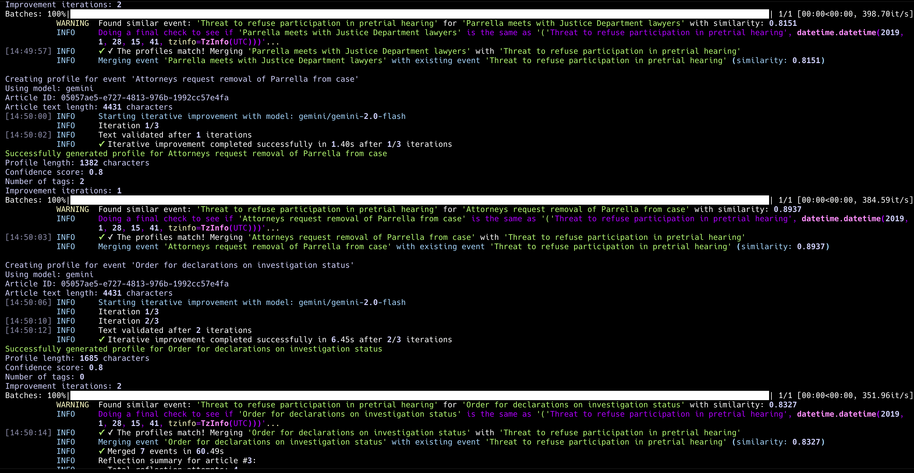

I've been working on a project called [`hinbox`](https://github.com/strickvl/hinbox) - a flexible entity extraction system designed to help historians and researchers build structured knowledge databases from collections of primary source documents. At its core, `hinbox` processes historical documents, academic papers, books and news articles to automatically extract and organize information about people, organizations, locations, and events.

The tool works by ingesting batches of documents and intelligently identifying entities across sources. What makes it interesting is the iterative improvement aspect: as you feed more documents into the system, entity profiles become richer and more comprehensive. When `hinbox` encounters a person or organization it's seen before, it updates their profile with new information rather than creating duplicates. I've been testing it extensively with Guantánamo Bay media sources - a domain where I have deep expertise from my previous career as a historian - which allows me to rigorously evaluate the quality of its extractions.

Right now, `hinbox` isn't ready for broader use. The prompt engineering needs significant refinement, and the entity merging logic requires more sophisticated iteration loops. But that's actually the point - I've been participating in Hamel and Shreya's [AI evals course](https://mlops.systems/#category=evals-course), and I wanted a concrete project where I could apply the systematic evaluation and improvement techniques we're learning. 

This project originally came together over a few intense days about two months ago, then sat dormant while work [got](https://www.linkedin.com/feed/update/urn:li:activity:7333405837433999360/?updateEntityUrn=urn%3Ali%3Afs_updateV2%3A%28urn%3Ali%3Aactivity%3A7333405837433999360%2CFEED_DETAIL%2CEMPTY%2CDEFAULT%2Cfalse%29) [busy](https://www.linkedin.com/feed/update/urn:li:activity:7332696687515205650/?updateEntityUrn=urn%3Ali%3Afs_updateV2%3A%28urn%3Ali%3Aactivity%3A7332696687515205650%2CFEED_DETAIL%2CEMPTY%2CDEFAULT%2Cfalse%29). I've recently resurrected it specifically to serve as a practical laboratory for the evals course exercises. There's something powerful about having a real application with measurable outputs where you can experiment with different approaches to prompt optimization, model selection, and systematic error analysis.

The broader vision is creating a tool that could genuinely help researchers working with large document collections - transforming the traditional manual process of reading, noting, and cross-referencing into something more systematic and scalable. But first, it needs to work reliably, which is where the evals work comes in.

## Why Build This? Personal Research History Meets the Age of Agents

This project connects directly to something I've done before - but under very different circumstances. In the mid-2000s, I founded and ran a media monitoring startup in Afghanistan (RIP [AfghanWire](https://mlops.systems/posts/2024-04-01-publishing-afghanwire-dataset.html)). We had a team of Afghan translators processing daily newspapers and news sources, translating everything into English. Then came my part: reading these translations and manually building what essentially became a structured knowledge database.

The process was methodical but exhausting. Each article mentioning a person required checking our existing profiles - did we know this individual? If not, I'd create a new entry and research their background. If yes, I'd update their existing profile with new information. Over time, we developed detailed profiles for hundreds of key figures in Afghan politics, civil society, and security. The more articles we processed, the richer and more interconnected our database became. We were building a living encyclopaedia of contemporary Afghanistan, one translated news story at a time.

The startup eventually ran out of funding, but the intellectual framework stuck with me. We'd created something genuinely valuable - contextual intelligence that helped outsiders understand the complex landscape of Afghan media and politics. The manual approach worked, but it was incredibly time-intensive and didn't scale beyond what a small team could handle.

### The Academic Reality Check

Since then, I've continued working as a researcher (I have a PhD in War Studies from King's College London and have written several critically-acclaimed books credentials blah blah sorry). This experience has reinforced how common the core challenge actually is across academic and research contexts. Historical research often involves exactly this pattern: you have access to substantial primary source collections - maybe 20,000 newspaper issues covering a decade, or thousands of diplomatic cables, or extensive archival materials - but limited time and resources to systematically extract insights.

The traditional academic approach involves months of careful reading, taking notes in physical notebooks, slowly building up understanding through manual cross-referencing. It's thorough but painfully slow. Most researchers don't have the luxury of unlimited time to spend four hours daily reading through source materials, even though that's often what the work requires.

## Beyond Academic Applications

The potential applications extend well beyond historical research. Intelligence analysis, scientific literature review, market research, legal discovery - anywhere you need to build structured knowledge from unstructured document collections. There's clearly demand for these capabilities, evidenced by the popularity of "second brain" concepts and personal knowledge management tools like Obsidian and Roam.

But most existing PKM tools require manual curation. They're great for organising knowledge you've already processed, less effective for bootstrapping that initial extraction from raw sources. What interests me is the hybrid approach: automated extraction that creates draft profiles and connections, which humans can then review, edit, and approve. Not pure automation, but intelligent assistance that handles the tedious first pass.

### The 'Agentic' Moment

We're entering what feels like a genuinely different phase of AI capability - the emergence of reliable vertical agents that can handle specific, complex workflows end-to-end. `hinbox` represents my attempt to explore what this might look like in practice for research applications. Rather than building with heavy agentic frameworks (which I haven't found necessary yet and which fall in and out of favour too often for my tastes), I'm focusing on the core extraction and synthesis challenge.

This feels like the right moment to experiment with these capabilities. The models are sophisticated enough to handle nuanced entity recognition and relationship mapping, but the tooling is still flexible enough that you can build custom solutions for specific domains. It's an interesting testing ground for understanding both the current state of the art and the practical challenges of deploying AI in knowledge-intensive workflows.

The goal isn't necessarily to "solve" automated research (though that would be nice), but to build something concrete where I can systematically evaluate different approaches to prompt engineering, model selection, and error correction. Sometimes the best way to understand emerging capabilities is to push them against real problems you actually care about solving.

## What can `hinbox` do now?

The system centres around domain-specific configuration - you define the research area you're interested in through a set of configuration files that specify your extraction targets and prompts. For my testing, I've been using Guantánamo Bay historical sources as the test domain since I can rigorously evaluate the quality of extractions in an area where I have deep expertise.

Setting up a new research domain is straightforward: the system generates template configuration files with placeholders for all the necessary prompts. You customise these prompts to focus on the entities most relevant to your research - perhaps emphasising military personnel and legal proceedings for Guantánamo sources, or traders and agricultural cooperatives for Palestinian food history research.

Once configured, `hinbox` processes your document collection article by article, extracting people, organisations, locations, and events according to your specifications. The interesting part is the intelligent merging: rather than creating duplicate entries, the system attempts to recognise when newly extracted entities match existing profiles and updates them accordingly. This iterative enrichment means profiles become more comprehensive as you process additional sources.

The system supports both cloud-based models (Gemini Flash 2.x has been particularly effective) and local processing through Ollama - crucial for researchers working with sensitive historical materials that can't be sent to external APIs. Local models like `gemma3:27b` have proven surprisingly capable for this kind of structured extraction work.

After processing, you get a web-based frontend for exploring the extracted knowledge base. Profiles include source attribution and version history, so you can track how understanding of particular entities evolved as new documents were processed. The entire output can be shared as a self-contained package - useful for collaborative research or creating supplementary materials for publications.

## How I built it

This project became a practical testbed for several development tools I'd been wanting to explore seriously. Claude Code and Cursor proved invaluable for rapid iteration - the kind of back-and-forth refinement that complex NLP applications require would have taken significantly longer with traditional development approaches.

[FastHTML](https://fastht.ml/) deserves particular mention for the frontend work. Building research interfaces without wrestling with JavaScript complexity felt genuinely liberating. The ability to create dynamic, interactive visualisations using primarily Python aligns well with how most researchers already think about data manipulation and presentation.

The current data architecture uses Parquet files throughout - a choice that might raise eyebrows but serves the development phase well. Direct file inspection and manipulation proved more valuable than database abstraction during rapid prototyping. Eventually, I'll likely add SQLite backend options, but the current approach prioritises iteration speed over architectural elegance.

The entity merging logic required the most sophistication. The system combines simple string matching with embedding-based similarity search, then uses an LLM as final arbiter when potential matches are identified. A candidate profile gets compared against existing entities first through name similarity, then through vector comparison of full profile text. If similarity exceeds certain thresholds, both profiles are sent to the model with instructions to determine whether they represent the same entity and how to merge them if so.

This multi-stage approach handles the nuanced judgment calls that pure algorithmic matching struggles with - distinguishing between John Smith the journalist and John Smith the military contractor, or recognising that "Captain Rodriguez" from one article is the same person as "Maria Rodriguez" from another. The complexity here suggests this merging pipeline will be a primary focus for systematic evaluation and improvement as the project matures.

## What's up next?

This blog post represents the softest possible launch - really more of a "here's what I'm working on" update than any kind of formal announcement. `hinbox` isn't ready for broad adoption yet, though I'd certainly welcome contributions and feedback from anyone interested in the problem space.

The immediate technical improvements are fairly straightforward. Right now, everything runs synchronously - each article gets processed sequentially to avoid the complexity of concurrent profile updates. Adding parallel processing would require implementing proper queuing or database locking mechanisms. Similarly, moving from Parquet files to a SQLite backend would provide better data management and enable more sophisticated querying patterns. Both changes would improve performance but add architectural complexity I haven't needed while focusing on core functionality.

I'm also eager to expand beyond newspaper articles to different document types - academic papers, book chapters, research reports, archival materials. Each format likely requires prompt refinements and possibly different extraction strategies. If this is going to be genuinely useful across research domains, it needs to handle the full spectrum of source materials historians and researchers actually work with.

### The Real Work: Systematic Evaluation and Improvement

But the most interesting next phase involves applying systematic evaluation techniques from the AI evals course I mentioned earlier. This is where the project becomes genuinely educational rather than just another NLP application. I'll be implementing structured approaches to:

- **Error analysis**: Understanding exactly where and why entity extraction fails
- **Prompt optimization**: Systematic testing rather than intuitive iteration  
- **Model comparison**: Rigorous evaluation across different architectures and providers
- **Merging accuracy**: Quantifying the quality of entity deduplication decisions

The goal is documenting this improvement process in detail through subsequent blog posts. Rather than abstract discussions of evaluation methodology, I want to show concrete examples of how these techniques apply to a real system with measurable outputs. What does systematic prompt engineering actually look like in practice? How do you design effective test suites for complex agentic pipelines? When do local models outperform cloud APIs for specific tasks?

### Context for Future Technical Content

Honestly, the main reason for writing this overview wasn't to launch anything - it was to establish context. I wanted a reference point for future technical posts that dive deep into evaluation methodology and iterative improvement without needing to repeatedly explain what hinbox is or why I'm working on it. The interesting content will be showing how systematic AI development practices apply to concrete research problems.

This feels like the right kind of project for exploring these questions: complex enough to surface real challenges, focused enough to enable rigorous evaluation, and personally meaningful enough to sustain the extended iteration cycles that proper system improvement requires. Plus, having worked extensively in the domain I'm testing makes it much easier to distinguish between genuine improvements and superficial metrics optimisation.

More technical deep-dives coming soon as the evals work progresses. The real learning happens in the systematic refinement process, not the initial build.

---

*The hinbox repository is available on [GitHub](https://github.com/strickvl/hinbox) for anyone interested in following along or contributing. All feedback welcome as this evolves from prototype to something genuinely useful for research applications.*