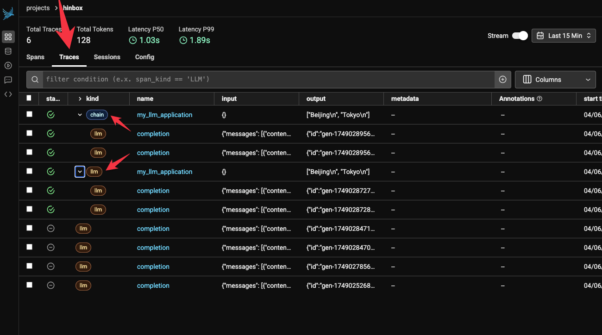

It's important to instrument your AI applications! I hope this can more or less be taken as given just as you'd expect a non-AI-infused app to capture logs. When you're evaluating your LLM-powered system, you need to have capture the inputs and outputs both at an end-to-end level in terms of the way the user experiences things as well as with more fine-grained granularity for all the internal workings.

My goal with this blog is to first demonstrate how Phoenix and `litellm` can work together, and then to make sure that we are able to group all spans together under a single trace.

I'll write the blog as I work so at this point I'm not sure exactly how this will turn out.

## Basic logging with litellm + phoenix

As a reminder, here's how we make an LLM call with `litellm`:

```python
import litellm

completion_response = litellm.completion(
    model="openrouter/google/gemma-3n-e4b-it:free",
    messages=[
        {
            "content": "What's the capital of China? Just give me the name.",
            "role": "user",
        }
    ],
)
print(completion_response.choices[0].message.content)
# prints 'Beijing'
```

The Phoenix docs explain how to set up basic logging for litellm:

- install the following pip packages:
	- `arize-phoenix-otel`
	- `openinference-instrumentation-litellm`
	- (`litellm`, obviously)
- set up the necessary environment variables with API key etc to ensure that traces get sent to the right account and endpoint

Let's assume we're using the hosted Phoenix Cloud version for now. Then we can rerun our example, with some slight tweaks:

```python

import litellm
from phoenix.otel import register

# configure the Phoenix tracer
tracer_provider = register(
    project_name="hinbox",  # Default is 'default'
    auto_instrument=True,  # Auto-instrument your app based on installed OI dependencies
)


completion_response = litellm.completion(
    model="openrouter/google/gemma-3n-e4b-it:free",
    messages=[
        {
            "content": "What's the capital of China? Just give me the name.",
            "role": "user",
        }
    ],
)
print(completion_response.choices[0].message.content)
```

So we first register the Phoenix tracer, specify the project (already set up in Phoenix Cloud) and then run our litellm `completion` as previously. In the terminal we see he following logs:

```shell
🔭 OpenTelemetry Tracing Details 🔭
|  Phoenix Project: hinbox
|  Span Processor: SimpleSpanProcessor
|  Collector Endpoint: https://app.phoenix.arize.com/v1/traces
|  Transport: HTTP + protobuf
|  Transport Headers: {'api_key': '****', 'authorization': '****'}
|  
|  Using a default SpanProcessor. `add_span_processor` will overwrite this default.
|  
|  ⚠️ WARNING: It is strongly advised to use a BatchSpanProcessor in production environments.
|  
|  `register` has set this TracerProvider as the global OpenTelemetry default.
|  To disable this behavior, call `register` with `set_global_tracer_provider=False`.

Beijing
```

So immediately there are a lot of things to consider. It seems that we'll want to use the `BatchSpanProcessor` that it suggests, and also it seems like I might not want to set this as the global tracing provider, too.

In Phoenix Cloud, I see this:


As you can see, we've captured the input and output messages for the completion, it's tracked the latency of the call (1.16s, which seems pretty slow actually!). There is also some sort of an annotation interface though I'll explore that down the line maybe. I immediately notice that I'm missing things like the system attributes for where the call was made, also metadata like the temperature and other settings. I'd also like to see things like token counts (which you *can* get in Phoenix but they're sort of buried) as well as the estimated cost of the call(s) and so on. We can see about adding some of that down the line.

## `BatchSpanProcessor` for production usage

Let's next move on to adding `BatchSpanProcessor` as the message suggested, which is as simple as adding `batch=True` to the tracer provider registration code. What this does is make sure that spans are processed in batches before they're exported to Arize. This takes away some of the network costs that you incur when sending the spans one by one. I've also made sure to turn off the registration of this tracing provider as the global one:

```python

import litellm
from phoenix.otel import register

# configure the Phoenix tracer
tracer_provider = register(
    project_name="hinbox",  # Default is 'default'
    auto_instrument=True,  # Auto-instrument your app based on installed OI dependencies
    set_global_tracer_provider=False,
    batch=True,
)


completion_response = litellm.completion(
    model="openrouter/google/gemma-3n-e4b-it:free",
    messages=[
        {
            "content": "What's the capital of China? Just give me the name.",
            "role": "user",
        }
    ],
)
print(completion_response.choices[0].message.content)
```

And I get this in the terminal:

```shell
🔭 OpenTelemetry Tracing Details 🔭
|  Phoenix Project: hinbox
|  Span Processor: BatchSpanProcessor
|  Collector Endpoint: https://app.phoenix.arize.com/v1/traces
|  Transport: HTTP + protobuf
|  Transport Headers: {'api_key': '****', 'authorization': '****'}
|  
|  Using a default SpanProcessor. `add_span_processor` will overwrite this default.

Beijing
```

It's actually somehow a bit annoying to still see a message about the fact that I'm using a default `SpanProcessor`. It's unclear to me why I need to care that this is a default one. The message is taking up real estate in the logs and it seems important (otherwise why would they have included it?) but it's also unclear to me what the alternative is and why I'd want to overwrite the default. I think for now I'll leave it.

## Using the litellm callbacks as an alternative

If we stray away from the official supported way to handle tracing with Phoenix, there's also [the community-supported in-built litellm option](https://docs.litellm.ai/docs/observability/phoenix_integration):

```python
import litellm

litellm.callbacks = ["arize_phoenix"]

completion_response = litellm.completion(
    model="openrouter/google/gemma-3n-e4b-it:free",
    messages=[
        {
            "content": "What's the capital of China? Just give me the name.",
            "role": "user",
        }
    ],
    metadata={"PROJECT_NAME": "hinbox"},
)
print(completion_response.choices[0].message.content)
```

This achieves a similar result, though I was unable to get the trace to land anywhere other than the `default` project. [Arize's docs](https://arize.com/docs/phoenix/sdk-api-reference/python-pacakges/arize-phoenix-otel) mention a `PHOENIX_PROJECT_NAME` environment variable but it seems this isn't respected or used by the `litellm` implementation. Indeed when I look at [the implementation](https://github.com/BerriAI/litellm/blob/main/litellm/integrations/arize/arize_phoenix.py), I don't see this being used anywhere, so it seems that the community-driven implementation isn't really the way forward.

I just wanted to mention it, however, since some of the 'callback' integrations for tracing in litellm are really nicely implemented (like the one for Langfuse, e.g.) so I wanted to try it out at least.

## One trace, multiple spans

For anything beyond a simple LLM call, which means most real-world LLM applications, we'll want to be capturing multiple spans as part of a single trace.

### LLM Tracing Tools' Naming Conventions (June 2025)

Side-note: I dug into how some of the major LLM tracing providers name their primitives. I was reassured that we seem to have coalesced around 'trace -> span' and that the OpenTelemetry way seems to have been adopted by most.


### Grouping spans under a single trace

I updated the code such that we now have a function that makes two separate LLM calls. I'd want them to both be registered as spans under the same trace:

```python
import litellm
from phoenix.otel import register

tracer_provider = register(
    project_name="hinbox",  # Default is 'default'
    auto_instrument=True,  # Auto-instrument your app based on installed OI dependencies
    set_global_tracer_provider=False,
    batch=True,
)


def query_llm(prompt: str):
    completion_response = litellm.completion(
        model="openrouter/google/gemma-3n-e4b-it:free",
        messages=[
            {
                "content": prompt,
                "role": "user",
            }
        ],
    )
    return completion_response.choices[0].message.content


def my_llm_application():
    query1 = query_llm("What's the capital of China? Just give me the name.")
    query2 = query_llm("What's the capital of Japan? Just give me the name.")
    return (query1, query2)


if __name__ == "__main__":
    print(my_llm_application())
```

But these just get registered as two separate traces/calls. The key bit of the documentation is [the 'Using Phoenix Decorator' section](https://arize.com/docs/phoenix/tracing/how-to-tracing/setup-tracing/instrument-python), it seems. If I add a decorator on top of my function and get the specific tracer, it seems I *am* able to start to group things together:

```python
import litellm
from phoenix.otel import register

tracer_provider = register(
    project_name="hinbox",  # Default is 'default'
    auto_instrument=True,  # Auto-instrument your app based on installed OI dependencies
    set_global_tracer_provider=False,
    batch=True,
)
tracer = tracer_provider.get_tracer(__name__)


def query_llm(prompt: str):
    completion_response = litellm.completion(
        model="openrouter/google/gemma-3n-e4b-it:free",
        messages=[
            {
                "content": prompt,
                "role": "user",
            }
        ],
    )
    return completion_response.choices[0].message.content


@tracer.llm
def my_llm_application():
    query1 = query_llm("What's the capital of China? Just give me the name.")
    query2 = query_llm("What's the capital of Japan? Just give me the name.")
    return (query1, query2)


if __name__ == "__main__":
    print(my_llm_application())
```

This works and I see this in the Phoenix Cloud dashboard:


See how it's taken the function name as the name of the span. And it's grouped those two LLM calls that happen within the function as we wanted. We can also update the decorator to denote different kinds of spans that we want to capture:


I'm immediately a bit confused by the interface again, because when you click on the 'Traces' tab in Phoenix Cloud you actually still just see 'spans':



In the documentation it isn't clear to me how to create a trace that includes an `llm` span and an `embedding` span, for example. What's even more frustrating is that the `tracer` decorator object doesn't implement *all* the span types, just `agent`, `chain` and `llm` it seems. I tried something [like this](https://gist.github.com/strickvl/3e682c28278eeb850e9bf195a2b2cb44) but it just ended up producing 3 separate traces in Phoenix Cloud.

I looked at [the documentation for using base OTEL](https://arize.com/docs/phoenix/tracing/how-to-tracing/setup-tracing/custom-spans) instead of the Phoenix decorators, but there was also nothing in there on how to denote the trace instead of just the span.

I was wondering if [their 'Sessions' primitive](https://arize.com/docs/phoenix/tracing/how-to-tracing/setup-tracing/setup-sessions) was the way forward here, but they're pretty clear in stating that a `Session` is a "sequence of traces".

So I'm at a bit of a dead end with Phoenix for now. I might return to Braintrust or Langfuse since these seem to have better support for what I'm trying to do (i.e. group spans together underneath a trace). I'm really reluctant to try to instrument `hinbox` with Phoenix when I'm unable even to get this basic grouping working properly with some dummy code.

## Update: solution from the Arize team

I posted this blog on the Arize slack and they got back to me with a solution:

```python
import litellm
from phoenix.otel import register

tracer_provider = register(
    project_name="hinbox",  # Default is 'default'
    auto_instrument=True,  # Auto-instrument your app based on installed OI dependencies
    set_global_tracer_provider=False,
)
tracer = tracer_provider.get_tracer(__name__)


@tracer.llm
def query_llm(prompt: str):
    completion_response = litellm.completion(
        model="openrouter/google/gemma-3n-e4b-it:free",
        messages=[
            {
                "content": prompt,
                "role": "user",
            }
        ],
    )
    return completion_response.choices[0].message.content


@tracer.agent
def query_agent(prompt: str):
    return "I am an agent."


@tracer.chain
def my_llm_application():
    query1 = query_llm("What's the capital of China? Just give me the name.")
    query2 = query_llm("What's the capital of Japan? Just give me the name.")
    agent1 = query_agent("Who are you?")
    return (query1, query2, agent1)


if __name__ == "__main__":
    print(my_llm_application())
```

And you can see how this looks in the Phoenix Cloud dashboard:


Judging from the code it seems like the way the span is constructed simply depends on how you assemble the hierarchy of spans. For instance, if I wanted to consider the top-level entity for this 'trace' (i.e. a grouping of spans) then I could use this code:

```python
import litellm
from phoenix.otel import register

tracer_provider = register(
    project_name="hinbox",  # Default is 'default'
    auto_instrument=True,  # Auto-instrument your app based on installed OI dependencies
    set_global_tracer_provider=False,
    # batch=True,
)
tracer = tracer_provider.get_tracer(__name__)


@tracer.llm
def query_llm(prompt: str):
    completion_response = litellm.completion(
        model="openrouter/google/gemma-3n-e4b-it:free",
        messages=[
            {
                "content": prompt,
                "role": "user",
            }
        ],
    )
    return completion_response.choices[0].message.content


@tracer.agent
def query_agent(prompt: str):
    return "I am an agent."


@tracer.tool(name="query_embedding", description="Query embedding")
def query_embedding(prompt: str):
    return [0.1, 0.2, 0.3]


@tracer.agent
def my_llm_application():
    query1 = query_llm("What's the capital of China? Just give me the name.")
    query2 = query_llm("What's the capital of Japan? Just give me the name.")
    agent1 = query_agent("Who are you?")
    embedding1 = query_embedding("What's the capital of China? Just give me the name.")
    return (query1, query2, agent1, embedding1)


if __name__ == "__main__":
    print(my_llm_application())
```

And now instead of this trace being of kind 'chain', it's now of kind 'agent', which some internal spans also being of kind 'agent'. In a conversation in the Arize Slack I got the following clarification:

> "Traces as the concept under "signals" is basically a unique identifier of spans (think "span" of time). See https://opentelemetry.io/docs/concepts/signals/traces/
> In most cases if you filter spans by "roots" (e.g. spans that don't have parents) and or look at the collective set of "traces" they will roughly look the same.
> Most of the time this is the view you want when looking at telemetry. Spans are too noisy to be looking at in isolation.
> While the two tabs feel largely overlapping, it's a bit intentional as there's actually no real object called a trace - it's just a series of spans.
> You will see these abstractions in most observability platform."

The line that:

> "there's actually no real object called a trace - it's just a series of spans"

Was extremely clarifying, actually. It explains the fuzziness between the spans and traces tab in the Phoenix dashboard.

I also got some clarification around the missing `@tracer.embbeding` and `@tracer.reranker` decorators:

> "We emit spans for embedding text to vectors (like "adda"), guardrailing via thinks like guardrals or content moderation, and reranking things via things like cohere.
> However it's sorta rare for people to manually write these. We will have decorators for them but right now they are typically emitted from autoinstrumentors like langgraph where there are common patterns for these things.
> We will have decorators for them very soon - but things like reranking are much more complex than things like tool calling so we are codifying these primitives now."

So there you have it! Some clarity. I'll have to play around to see whether I go with the Langfuse route or the Phoenix route and which feels most ergonomic in the `hinbox` codebase. Appreciate the quick feedback from the Phoenix team, though!