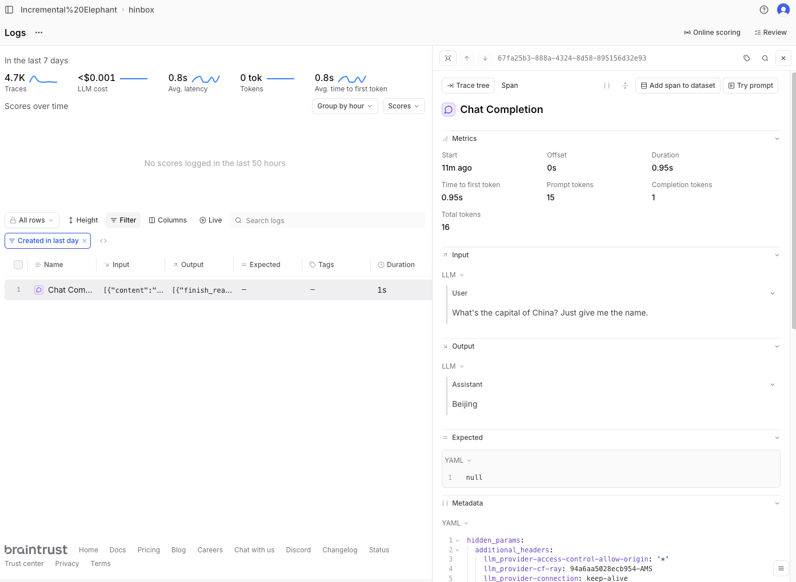
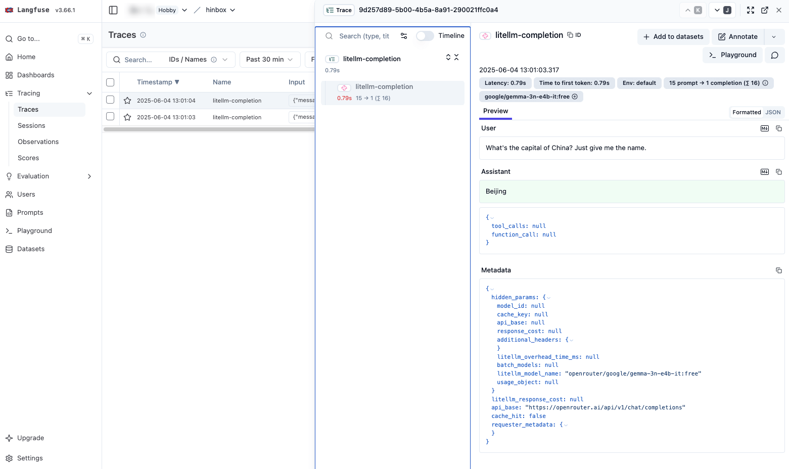
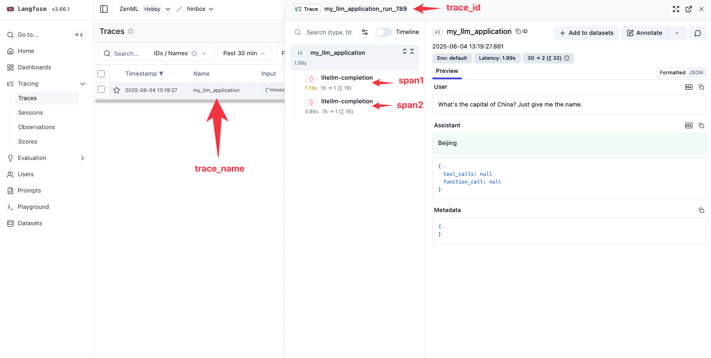
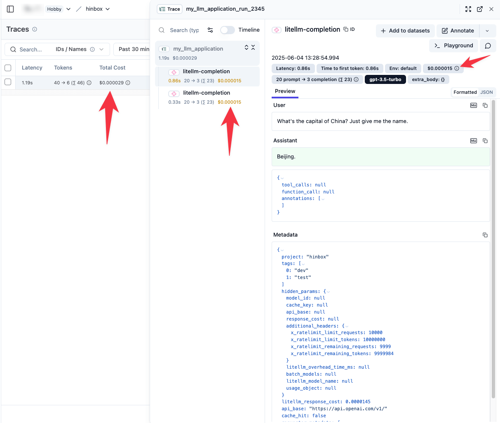

I [previously tried (and failed)](https://mlops.systems/posts/2025-06-04-instrumenting-an-agentic-app-with-arize-phoenix-and-litellm.html) to setup LLM tracing for hinbox using Arize Phoenix and litellm. Since this is sort of a priority for being able to follow along with the [Hamel / Shreya evals course](https://maven.com/parlance-labs/evals) with my practical application, I'll take another stab using a tool with which I'm familiar: [Braintrust](https://www.braintrust.dev/). Let's start simple and then if it works the way we want we can set things up for `hinbox` as well.

## Simple Braintrust tracing with litellm callbacks

Callbacks are listed [in the litellm docs](https://docs.litellm.ai/docs/observability/braintrust) as the way to do tracing with Braintrust. So we can do something like this:

```python
import litellm

litellm.callbacks = ["braintrust"]

completion_response = litellm.completion(
    model="openrouter/google/gemma-3n-e4b-it:free",
    messages=[
        {
            "content": "What's the capital of China? Just give me the name.",
            "role": "user",
        }
    ],
    metadata={
        # "project_id": "1235-a70e-4571-abcd-234235",
        "project_name": "hinbox",
    },
)
print(completion_response.choices[0].message.content)
```

You can pass in a `project_id` or a `project_name` and the traces will be routed there. Here's what it looks like in the Braintrust dashboard:



Note how you can't see which model was used for the LLM call, nor any cost estimates. The docs mention that you *can* pass metadata into Braintrust using the `metadata` property:

> "`braintrust_*` - any metadata field starting with `braintrust_` will be passed as metadata to the logging request" ([link](https://docs.litellm.ai/docs/observability/braintrust#full-api-spec))

This seems a bit rudimentary, however. If we take a look at the full tracing documentation on the Braintrust docs we can see that they seem to recommend wrapping the `OpenAI` client object instead:

```python
import os

from braintrust import init_logger, traced, wrap_openai
from openai import OpenAI

logger = init_logger(project="hinbox")
client = wrap_openai(OpenAI(api_key=os.environ["OPENAI_API_KEY"]))


# @traced automatically logs the input (args) and output (return value)
# of this function to a span. To ensure the span is named `answer_question`,
# you should name the function `answer_question`.
@traced
def answer_question(body: str) -> str:
    prompt = [
        {"role": "system", "content": "You are a helpful assistant."},
        {"role": "user", "content": body},
    ]

    result = client.chat.completions.create(
        model="gpt-3.5-turbo",
        messages=prompt,
    )
    return result.choices[0].message.content


def main():
    input_text = "What's the capital of China? Just give me the name."
    result = answer_question(input_text)
    print(result)


if __name__ == "__main__":
    main()
```

This indeed does label the span as `answer_question` but it doesn't do much else. Even the model name isn't captured here. Instrumenting a series of calls to handle 'deeply nested code' (as [their docs](https://www.braintrust.dev/docs/guides/traces/customize#deeply-nested-code) puts it) even didn't log the things it was supposed to:

```python

import os
import random

from braintrust import current_span, init_logger, start_span, traced, wrap_openai
from openai import OpenAI

logger = init_logger(project="hinbox")
client = wrap_openai(OpenAI(api_key=os.environ["OPENAI_API_KEY"]))


@traced
def run_llm(input):
    model = "gpt-4o" if random.random() > 0.5 else "gpt-4o-mini"
    result = client.chat.completions.create(
        model=model, messages=[{"role": "user", "content": input}]
    )
    current_span().log(metadata={"randomModel": model})
    return result.choices[0].message.content


@traced
def some_logic(input):
    return run_llm("You are a magical wizard. Answer the following question: " + input)


def simple_handler(input_text: str):
    with start_span() as span:
        output = some_logic(input_text)
        span.log(input=input_text, output=output, metadata=dict(user_id="test_user"))
        print(output)


if __name__ == "__main__":
    question = "What's the capital of China? Just give me the name."
    simple_handler(question)
```

This is adapted from the example they pasted in their docs as their one isn't even a functional code example on its own.

It is seeming increasingly clear that Braintrust isn't going to be the right choice, at least as long as I want to keep using `litellm`. I know that Langfuse has a very nice integration with `litellm`, so I think I'll pivot over to that now.

## Basic tracing with Langfuse and `litellm`

Simple tracing is easy:

```python
import litellm

litellm.callbacks = ["langfuse"]


def query_llm(prompt: str):
    completion_response = litellm.completion(
        model="openrouter/google/gemma-3n-e4b-it:free",
        messages=[
            {
                "content": "What's the capital of China? Just give me the name.",
                "role": "user",
            }
        ],
    )
    return completion_response.choices[0].message.content


def my_llm_application():
    query1 = query_llm("What's the capital of China? Just give me the name.")
    query2 = query_llm("What's the capital of Japan? Just give me the name.")
    return (query1, query2)


print(my_llm_application())
```

We specify `langfuse` for the callback and each llm call is logged as a separate trace + span. Here you can see what this looks like in the dashboard:



The [litellm docs](https://docs.litellm.ai/docs/observability/langfuse_integration) include information on how to specify custom metadata and grouping instructions for Langfuse. Notably, we can specify (as of June 2025, at least!) things like a `session_id`, tags, a `trace_name` and/or `trace_id` as well as custom trace metadata and so on. So we can get most of what we want to specify in the following way:

```python
import litellm

litellm.callbacks = ["langfuse"]


def query_llm(prompt: str, trace_id: str):
    completion_response = litellm.completion(
        model="openrouter/google/gemma-3n-e4b-it:free",
        messages=[
            {
                "content": "What's the capital of China? Just give me the name.",
                "role": "user",
            }
        ],
        metadata={
            "trace_id": trace_id,
            "trace_name": "my_llm_application",
            "project": "hinbox",
        },
    )
    return completion_response.choices[0].message.content


def my_llm_application():
    query1 = query_llm(
        "What's the capital of China? Just give me the name.",
        "my_llm_application_run_789",
    )
    query2 = query_llm(
        "What's the capital of Japan? Just give me the name.",
        "my_llm_application_run_789",
    )
    return (query1, query2)


if __name__ == "__main__":
    print(my_llm_application())
```

This looks like this in the Langfuse dashboard:



This is honestly most of what I'm looking for in terms of my tracing. If I were to use a non-OpenRouter model, moreover, I'd also get full costs in the Langfuse dashboard, e.g.:



As such, I can monitor costs from within OpenRouter and have the option to keep track of costs in Langfuse by passing custom metadata should I wish.

I'll make a separate blog where I actually go into how I set up + instrumented `hinbox` for this kind of tracing while continuing to use `litellm`.