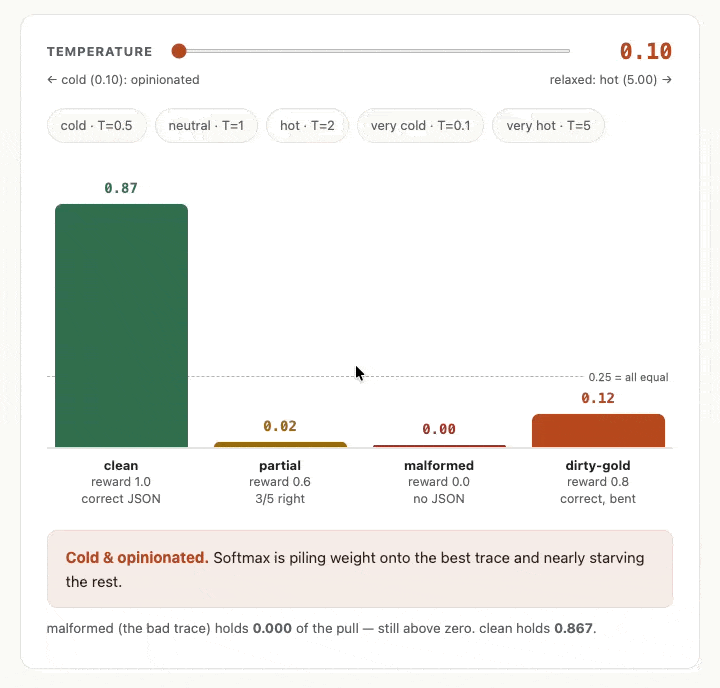

Today's the day I finally managed to start to put things into practice. [So far](https://alexstrick.com/technical.html#category=agentic-rl) I've mainly looked at the RL process at a high level, sticking to things like [the main stages of the process](https://alexstrick.com/posts/2026-06-16-rl-stages.html) and [some of the tools that exist](https://alexstrick.com/posts/2026-06-19-reading-rl-environment-landscape.html). I went into this all with the idea that I'd try to get my hands dirty so today I did some work with what happens to the data we feed into the training process, and I also used `verifiers` to construct my first RL environment.

## Shifting from Labels to Rewards

Let's take a step back for a moment. One of the unique characteristics of RL is that we're working with rewards rather than labels directly. I wanted to bridge the gap between these two positions, in part as a way of motivating the work we're going to do practically with RL, so I spent a bit of time today exploring two intermediate positions that one could try to improve performance when using SFT.

We can use my familiar example of the ISAF press releases as a way of grounding this. Currently I have [a labelled dataset](https://huggingface.co/datasets/strickvl/isafpressreleases), but when we shift to RL, we're going to be getting an LLM or an agent to extract structured data from press releases, and we're going to get a mix of good and bad ones back. We'll have way of checking how well it's going (see [this blog for more](https://alexstrick.com/posts/2026-06-17-rl-terms-rewards.html)) but there are some nuances to be aware of.

Let's specify some cases that will make all of this clear:

```python
traces = [
    {
        "task_id": "clean-hit",
        "reward": 1.00,
        "output": {
            "province": "kandahar", "eventtype": "detention",
            "targetgroup": "taliban", "minkilled": 0, "mincaptured": 3,
        },
    },
    {
        "task_id": "partial",
        "reward": 0.60,
        "output": {
            "province": "helmand", "eventtype": "airstrike",
            "targetgroup": "haqqani", "minkilled": 1, "mincaptured": 0,
        },
    },
    {
        "task_id": "malformed",
        "reward": 0.00,
        "output": "I think this was a detention near Kabul.",
    },
    {
        "task_id": "dirty-gold",
        "reward": 0.80,
        "output": {
            "province": "paktia", "eventtype": "detention",
            "targetgroup": "haqqani", "minkilled": 0, "mincaptured": 1,
        },
    },
]
```

If we tabulate this all out we'll see the following:

| `task_id` | reward | why |
|---|---|---|
| `clean-hit` | 1.00 | all five fields match |
| `partial` | 0.60 | 3 of 5 right (wrong group + kill count) |
| `malformed` | 0.00 | output is prose, not a dict — the guard catches it |
| `dirty-gold` | 0.80 | model spelled "paktia" right; gold says "paktya" — the ruler is bent |

Some naive approaches that can help us with these different results:

### Filtering

We can just drop any data that doesn't satisfy some criteria or rubric that we define. So we could just say "let's just only take tasks that had an output that gave us a score `>=1.0`. From the above examples, that would mean we'd only take the `clean-hit` datapoint. This has some obvious limitations:

- you might end up not having enough data to signal your model to update in the right way
- you actually end up *dropping* a bunch of signal because not only do you want to nudge your model in the direction of when it did good work, but you also want to nudge it *away* from bad work, and you might also want to offer partial rewards for work where you got somethings right and so on.

This is even more important for things like agents with long trajectories, where it might often be the case that for hard problems the agent didn't get the right answer, but it did good work for the first part until it hit some roadblock or whatever.

What does this look like in code for our traces above?

```python
# APPROACH 1 — Filter (rejection-sampling SFT)
# Hard cut: keep only traces above the threshold. Everything below
# is thrown away — the model never sees it.
def keep_above(traces, threshold = 1.0):
    return [t for t in traces if t["reward"] >= threshold]
    
filtered = keep_above(traces, threshold=0.8)
# At 0.8: 'partial' (0.60) and 'malformed' (0.00) are dropped.
# 'dirty-gold' (0.80) survives — even though the model wrote 'paktia'
# and the gold label is misspelled 'paktya'. Filtering trusts the grader.
```

It could literally be this simple to filter things out.

### Weighting

Another approach is to weight the traces. So basically you could pass in a score along with the traces and say to the model (in this dreadfully anthropomorphised re-imagination of the training process) "this answer was not so great, so make sure not to learn any bad lessons from it please".

So here we're keeping all the data but we only nudge the model in proportion to the reward assigned to each data point. Think of it as a sort of volume knob on the signal from each item.

Let's look at it in code:

```python
import math

# APPROACH 2a — Weight (reward-weighted regression, simple form)
# Soft volume knob: keep all traces but scale each one's training
# pull by its reward. A 0.0 trace goes quiet; it's never pushed against.
def weight_by_reward(traces):
    return [{**t, "weight": t["reward"]} for t in traces]

# malformed (i.e. not even proper JSON) → weight 0.00: silenced, but not aimed at
```

**Approach 2a — weight equals reward.** Here we just use the reward as a weight. The weight column is just a copy of the reward, so nothing surprising falls out, but we can see the consequence of this: `malformed` gets a weight of exactly `0.00`, so the model is told to learn nothing from it.

| `task_id` | reward | weight |
|---|---|---|
| `clean-hit` | 1.00 | 1.00 |
| `partial` | 0.60 | 0.60 |
| `malformed` | 0.00 | 0.00 |
| `dirty-gold` | 0.80 | 0.80 |

```python
# APPROACH 2b — Weight (softmax variant)
# Exponentiate then normalise so all weights sum to 1.0.
# Because exp(0) = 1 (not 0), the malformed trace can NEVER be fully
# silenced — it gets a small but nonzero weight (~0.13 at T=1).
def weight_softmax(traces, temperature=1.0):
    exps = [math.exp(t["reward"] / temperature) for t in traces]
    total = sum(exps)
    return [{**t, "weight": e / total} for t, e in zip(traces, exps)]

# malformed → weight ≈ 0.129  (nonzero — softmax can quiet but not silence)
# clean-hit  → weight ≈ 0.350  (highest pull)
```

**Approach 2b — softmax.** This was a bit of a curveball that my (heavily-agent-driven) course suggested to me as we worked on problems that I had to work on from scratch. I had vague recollections of softmax from FastAI course days, but had forgotten completely how it worked. Also I have code completion turned off in Zed (my IDE of choice these days) so it was hard to know how to get started with this.

Let's look at the implementation first. We raise `e` to the power of each reward (`exp(reward)`) and then divide by the total, so all the weights sum to `1.0`. Two things to notice. First, `malformed` can no longer be fully silenced: because `exp(0) = 1` (not `0`), it keeps a small but non-zero weight of `0.13`. Second, the gaps get stretched — `clean-hit` ends up with the largest single share of the pull.

| `task_id` | reward | `exp(reward)` | weight |
|---|---|---|---|
| `clean-hit` | 1.00 | 2.72 | 0.35 |
| `partial` | 0.60 | 1.82 | 0.23 |
| `malformed` | 0.00 | 1.00 | 0.13 |
| `dirty-gold` | 0.80 | 2.23 | 0.29 |
| **sum** | — | 7.77 | 1.00 |

So with softmax what's happening is that we're able to really boost the signal of 'good' examples vs 'bad' examples, but we still see that bad examples still retain some signal. Moreover, the signal is positive, not negative (more on this below).

In the case of our worked example above, we saw that the `dirty-gold` example scores high because it's almost correct in our rewards that we specified, but this means we're still somehow giving some signal that it's ok to misspell province names. So we have to be careful with this!

Some other things I explored or learned while working with the softmax implementation:

- the raising of `e` to the power of the reward is important because it stretches out the gaps between rewards. We normalise them (by dividing by the sum of the values) since I think this helps the signal for training.
- The floor is never zero. When a trace has a reward of `0.0`, softmax still computes `exp(0)` to equal `1` and not `0`. So even a completely wrong trace still contributes a `1` signal which (in our case) ends up being normalised to ~0.13 of the total. So I learned here that softmax can quieten the signal of a bad trace, but never silence it completely. Only a hard filter (or the pushing away of RL) can bring it to zero.
- I didn't mention the temperature yet in my explanation of the code above, but it's basically a way how to dial up the signal even more, relative to the other data. By default the temperature is `1` so no change happens normally, but as you can see from the GIF below, a low temperature value amplifies the gaps. It's sort of like a soft filter. And a high temperature value shrinks all the rewards towards zero before we take the exponent, so the weights all then drift towards being the same value.



- Somehow in my mind I'd expected that higher temperature would mean more variance between the values (a little like how a higher temperature value for LLM inference can often mean more variance in the outputs) but the chart showed me the opposite was going on. A high T value flattens the bars towards each other. The reason for this is that there are two things going on here. The high T value flattens the *probabilities*, but actually the turbulence and variance that I had imagined *does* live on when you sample or draw from those probabilities. For our purposes right now, we're not sampling from the weights. We're just using softmax to weight the traces and so use the values directly.
- Somehow when I saw the temperature values changing and the distribution shifting, it seemed to me like maybe we might want to use the temperature starting at one end of the scale and ending at the other. This turns out to be called 'scheduling' and is also relating to 'annealing'. A value that changes *during* training is called a *schedule*; a gradual decrease is *annealing*. (This is from metalwork where a slowly cooling metal allows the structure to set more reliably. 
	- usually what happens is that (if you use scheduling at all here) you'd go from hot to cold. So intuitively you'd start off with small experiments which allow you to explore different parts of the territory, and then the further you get in the training process you'd turn up the signal of the 'do it this way' values. But as far as I understand, this isn't really something that is tweaked so much. Rather, it's the learning rate that is the knob that gets scheduled.
- I also took a guess that this might be a thing and apparently it has a name ("softmax with temperature' and is what is used in something called *advantage-weighted regression (AWR)*: it weights training examples by `exp(advantage / β)`, where β is exactly the temperature dial.
- I had another idea that maybe we could first filter values and *then* use softmax to boost the survivors with weighted values, but this continues to suffer from the flaw that it trusts the grader's results too much.

### Full RL

With full RL, we actually are able to use a *negative* gradient where we can specify that we actively don't want behaviour like whatever it was that produced a certain bad result.

The filtering and weighting approaches can thus only push towards good outputs, but what RL adds is the ability to push away or to push downwards. (And even all of this is still in the realm of the datasets, mind... we still haven't moved any weights yet.)

## My first environment with `verifiers`

Let's get into the good stuff now, though! As we previously saw, there are three parts that make up an environment and we'll translate them all into concepts that make sense for `verifiers` library:


We can look at this directly in code:

```python
import asyncio, json
import verifiers as vf
from datasets import Dataset

FIELDS = ["province", "eventtype", "targetgroup", "minkilled", "mincaptured"]

# The reward function
async def extraction_reward(completion, answer) -> float:
    text = completion[-1]["content"]   # the model's last message
    try:
        pred = json.loads(text)
        if not isinstance(pred, dict):
            return 0.0
    except (json.JSONDecodeError, TypeError):
        return 0.0

    gold = json.loads(answer)
    hits = sum(
        1 for f in FIELDS
        if str(pred.get(f)).strip().lower() == str(gold.get(f)).strip().lower()
    )
    return hits / len(FIELDS)   # e.g. 3 of 5 fields matched → 0.60

def build_env() -> vf.SingleTurnEnv:
    rows = [{
        "question": "Extract the ISAF incident as JSON: 'detained 3 Taliban in Kandahar, no casualties.'",
        "answer": json.dumps({
            "province": "kandahar", "eventtype": "detention",
            "targetgroup": "taliban", "minkilled": 0, "mincaptured": 3,
        }),
    }]
    dataset = Dataset.from_dict({k: [r[k] for r in rows] for k in rows[0]})

    rubric = vf.Rubric(funcs=[extraction_reward])
    env    = vf.SingleTurnEnv(dataset=dataset, rubric=rubric)
    return env

my_first_env = build_env()
```

This is all fairly easy to understand.

| RL concept | `verifiers` equivalent (in the code above) |
|---|---|
| **Task** (stage 1) — a prompt plus the gold answer to grade against | a row in the `dataset`, built with `Dataset.from_dict(...)` |
| **Harness** (stage 2) — the thing that runs one model turn per task | the `vf.SingleTurnEnv` class |
| **Reward** (stage 4) — scores how good the output was | the `extraction_reward` function, wrapped in `vf.Rubric(funcs=[...])` |

Note that we're leaving out the trainer stage completely. `verifiers` is an *environment* library.

## Questions and bigger picture reflection

So I got to the point now where I have a (very simple) environment constructed. I know the pieces that I have to put together. I guess I'll soon move to uploading my full non-toy environment to the Environments Hub. I'm really looking forward to that as a little mini stage in my learning.

I'm also curious to take a look around the environments that *do* exist already. I see that [Hugging Face](https://huggingface.co/spaces?category=agent-environment&sort=created) and [OpenRewards](https://openreward.ai/environments) also have places to upload RL environments. Mainly interested about the range of complexity that exist with the public environments. Are they mostly single turn envs or are we seeing multi-turn ones already?

I'm also very curious to look at [the `Rubric` object](https://docs.primeintellect.ai/verifiers/reference#rubric-classes) from `verifiers`, since that is sort of at the core of what I'll be working on (i.e. defining rewards of various kinds).